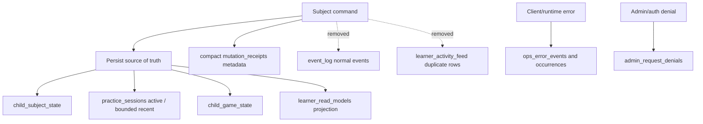

# D1 Write-Amplification Hardening

## Summary

Reduce Cloudflare D1 storage growth and per-command compute by changing normal gameplay writes from history/audit-heavy persistence to source-of-truth persistence only. Player progress, current sessions, rewards, and error reporting must remain intact; redundant normal-operation history, duplicate activity rows, and full response receipts should stop growing.

---

## Problem Frame

The previous production quota incident was caused by `mutation_receipts.response_json` retaining full command responses, including large subject read models, until D1 reached the 500 MB limit. The later retention hotfix shortened the non-admin receipt window, but the same shape still exists: every subject command can write source state, session history, event history, derived activity rows, projection rows, a mutation receipt, rate-limit buckets for demo traffic, and revision rows.

The latest read-only production check showed the current database is not near quota, but the growth pattern is still normal-gameplay data rather than error data:

| Table | Current production signal | Concern |
| --- | ---: | --- |
| `event_log` | 6,904 rows, about 4.34 MB JSON | normal answer/session events are appended indefinitely |
| `practice_sessions` | 1,432 rows | completed and abandoned sessions accumulate |
| `learner_activity_feed` | 982 rows | duplicates a public subset of events |
| `mutation_receipts` | 184 rows, about 2.06 MB JSON | still stores command response bodies during the retention window |
| `ops_error_events` / occurrences / denials | 11 total rows | not the source of D1 growth |

This plan treats error-only logging as valuable and normal-operation append history as the waste to remove.

---

## Requirements

**Player Experience**

- R1. Subject progress must survive reloads and cross-device sync through `child_subject_state`.
- R2. Active practice state must survive reloads where the user is in the middle of a session.
- R3. Rewards, stars, monster codex state, and celebration eligibility must remain correct through `child_game_state` and the command projection path.
- R4. Existing command responses must keep returning the read models the client needs for the immediate UI update.

**D1 Write Reduction**

- R5. Normal subject commands must not persist full `subjectReadModel` payloads into `mutation_receipts.response_json`.
- R6. Normal subject commands must not append public learner activity into both `event_log` and `learner_activity_feed`.
- R7. Normal subject command event history must stop growing unless an event is needed for a live gameplay source of truth, admin audit, or error diagnosis.
- R8. Completed or abandoned practice-session history must be bounded without deleting the active session needed for resume.
- R9. Demo command protection must reduce repeated D1 rate-limit writes while preserving abuse protection.

**Operations and Safety**

- R10. `ops_error_events`, `ops_error_event_occurrences`, and `admin_request_denials` must continue to record real errors and access denials.
- R11. Production cleanup must be backup-first and bounded; code must stop future writes before old normal-history rows are purged or tables are dropped.
- R12. Capacity telemetry and tests must prove the new command path lowers `d1RowsWritten`, query count, and receipt payload bytes without hiding failures.
- R13. Cloudflare deploy and D1 operations must keep using the repository OAuth-safe package scripts or `scripts/wrangler-oauth.mjs`.

---

## Key Technical Decisions

- KTD1. Source-of-truth writes stay; normal history writes go. The application still writes current learner state, active session state, game state, revisions, and true error records. It stops writing append-only normal gameplay history where that history is not needed to reconstruct the current product experience.
- KTD2. Compact idempotency replaces full response replay for subject commands. `mutation_receipts` should prove the request was applied and protect request-id reuse, but it should not store the whole read model. Duplicate command replay can return a compact replay response or force a client refresh, provided stale-write and retry semantics remain clear.
- KTD3. Parent/admin history becomes derived or bounded. Parent Hub can continue showing recent sessions from `practice_sessions`, but long-lived activity timelines should not depend on an unbounded `event_log` or `learner_activity_feed`.
- KTD4. Projection read models are kept because they remove hot-path reads. `learner_read_models` is small, bounded per learner, and improves command compute. It should remain unless implementation proves it is redundant after removing event persistence.
- KTD5. Rate limiting should avoid D1 write fan-out on demo command traffic. The current demo command path consumes multiple D1 limiter buckets per command. The fix should collapse buckets or move low-risk counters to a cheaper boundary while preserving sensible abuse limits.
- KTD6. Cleanup follows deployment, not the other way round. Dropping or purging tables before deployed code stops writing them risks data loss or runtime errors. The safe order is code first, deploy and smoke, remote backup, bounded cleanup, then optional drop migration.

---

## High-Level Technical Design

The command route remains stateful for the product. The change is not "no D1 writes"; it is "no D1 writes for redundant normal-operation history".

---

## Implementation Units

### U1. Compact subject command receipts

- **Goal:** Stop storing full command response bodies in subject-command `mutation_receipts`.
- **Files:** `worker/src/repository.js`, `worker/src/mutation-repository.js`, `worker/src/subjects/command-contract.js`, `src/platform/runtime/subject-command-client.js`, `src/platform/core/repositories/api.js`.
- **Pattern References:** `subject_content.put` already uses `receiptResponse` and `replayResponse` to compact stored receipt payloads while reconstructing live replay output.
- **Test Scenarios:**
  - `tests/worker-subject-runtime.test.js` verifies duplicate subject command request IDs remain idempotent and no longer store `subjectReadModel` in `response_json`.
  - `tests/worker-query-budget.test.js` verifies the normal command path still returns the full response to the client but receipt payload bytes are bounded.
  - Add a regression asserting stored subject-command receipt JSON is below a small cap for grammar, punctuation, and spelling commands.
- **Verification:** Duplicate request with the same request ID returns a safe replay result; duplicate request with a different payload still returns `idempotency_reuse`.

### U2. Remove duplicate learner activity feed writes

- **Goal:** Stop writing `learner_activity_feed` from normal subject events and migrate Parent Hub activity away from the duplicate table.
- **Files:** `worker/src/repository.js`, `worker/src/read-models/learner-read-models.js`, `src/platform/hubs/api.js`, `src/surfaces/hubs/ParentHubSurface.jsx`, `tests/worker-read-model-capacity.test.js`, `tests/worker-history-api.test.js`.
- **Pattern References:** `readParentRecentSessions` already provides bounded recent practice history from `practice_sessions`.
- **Test Scenarios:**
  - Parent Hub loads without `learner_activity_feed` rows.
  - Existing accounts with old activity rows do not break reads during the transition.
  - Normal subject command writes no rows to `learner_activity_feed`.
- **Verification:** Parent Hub remains usable and recent session display still works.

### U3. Stop normal subject event-log persistence

- **Goal:** Remove append-only normal command event writes while preserving data needed by rewards, projections, admin-only actions, and true error paths.
- **Files:** `worker/src/repository.js`, `worker/src/subjects/spelling/commands.js`, `worker/src/projections/events.js`, `worker/src/projections/rewards.js`, `worker/src/row-transforms.js`, `tests/worker-projections.test.js`, `tests/worker-projection-hot-path-write.test.js`, `tests/worker-punctuation-runtime.test.js`, `tests/worker-grammar-subject-runtime.test.js`.
- **Pattern References:** Command projection stores a bounded token ring in `learner_read_models`; current hot-path tests already assert zero `event_log` reads after the projection exists.
- **Test Scenarios:**
  - Spelling, grammar, punctuation, reading, arithmetic, and reasoning commands update subject state and rewards without inserting normal rows into `event_log`.
  - Monster reward dedupe remains stable across repeated commands and reloads.
  - Admin audit paths that intentionally append events still work or are explicitly moved to compact audit receipts.
- **Verification:** Command response remains unchanged for the client while D1 row writes drop.

### U4. Bound practice-session retention without harming resume

- **Goal:** Keep active sessions and a small recent completed window while pruning completed/abandoned session history.
- **Files:** `worker/src/repository.js`, `worker/src/cron/retention-sweep.js`, `worker/migrations`, `tests/worker-cron-retention-sweep.test.js`, `tests/worker-history-api.test.js`.
- **Pattern References:** Existing cron sweeps use bounded `DELETE ... WHERE rowid IN (SELECT ... LIMIT ?)` for D1-safe retention.
- **Test Scenarios:**
  - Active sessions are never deleted by the retention sweep.
  - Completed sessions older than the configured window are deleted in bounded batches.
  - Parent recent sessions still returns the expected latest records.
- **Verification:** Sweep is idempotent and safe on partial migrations.

### U5. Collapse demo command rate-limit write fan-out

- **Goal:** Reduce per-demo-command D1 limiter writes while retaining practical abuse protection.
- **Files:** `worker/src/demo/sessions.js`, `worker/src/rate-limit.js`, `tests/worker-demo-session.test.js`, `tests/worker-rate-limit-ipv6-propagation.test.js`, `tests/worker-tts.test.js`.
- **Pattern References:** `consumeRateLimit` centralises D1-backed limiter buckets and already has opportunistic cleanup.
- **Test Scenarios:**
  - A demo command consumes fewer limiter buckets than today.
  - IPv6 /64 bucketing still applies.
  - Rate-limit responses still include `Retry-After`.
  - TTS and parent-hub demo limits keep their existing protections unless explicitly changed.
- **Verification:** Production classroom demo probe shows lower command `queryCount` and `d1RowsWritten`.

### U6. Stop authenticated GET account upserts

- **Goal:** Avoid write-capable UPSERT work for authenticated read routes when the account row is unchanged.
- **Files:** `worker/src/repository.js`, `worker/src/app.js`, `worker/src/auth.js`, `tests/worker-auth.test.js`, `tests/worker-bootstrap-capacity.test.js`, `tests/worker-query-budget.test.js`.
- **Pattern References:** `auth.requireSession()` already reads `adult_accounts`; `ensureAccount()` should be create-or-repair only, not a per-request heartbeat.
- **Test Scenarios:**
  - Existing account GET `/api/bootstrap` does not write `adult_accounts.updated_at`.
  - New or partial account sessions still get a usable account row.
  - Platform role, account type, and selected learner behaviour remain unchanged.
- **Verification:** Bootstrap remains `d1RowsWritten = 0`.

### U7. Backup-first remote cleanup and optional table removal

- **Goal:** Remove old redundant production data only after code stops future writes.
- **Files:** `scripts/d1-backup.mjs`, `worker/src/cron/retention-sweep.js`, `worker/migrations`, `docs/operations/capacity.md`, `docs/plans/james/hotfixes`.
- **Pattern References:** The previous D1 quota hotfix backed up remote D1 before bounded cleanup and recorded size evidence after each sweep.
- **Test Scenarios:**
  - Cleanup SQL is bounded and table-missing safe.
  - A dry-run or read-only proof reports counts and byte estimates before destructive cleanup.
  - Optional drop migration is only added for tables the deployed code no longer writes or reads.
- **Verification:** Remote cleanup is backed by a timestamped SQL backup and post-cleanup `size_after` evidence.

### U8. Capacity evidence and release verification

- **Goal:** Prove the player experience is unchanged and D1 pressure is reduced before shipping.
- **Files:** `tests/worker-query-budget.test.js`, `tests/worker-capacity-round1.test.js`, `tests/worker-read-model-capacity.test.js`, `tests/worker-cron-retention-sweep.test.js`, `scripts/classroom-load-test.mjs`, `docs/operations/capacity.md`.
- **Pattern References:** `npm run capacity:classroom` and `meta.capacity` are the existing D1/compute evidence surfaces.
- **Test Scenarios:**
  - Focused unit tests cover command responses, replay, projections, parent hub reads, retention sweeps, and bootstrap capacity.
  - `npm test` and `npm run check` pass before deploy.
  - Production smoke creates a demo session, runs bootstrap, runs at least one subject command, and verifies no 5xx or capacity signals.
- **Verification:** Report before/after values for `queryCount`, `d1RowsRead`, `d1RowsWritten`, response bytes, and D1 `size_after`.

---

## Scope Boundaries

- This work does not remove persistence for learner progress, active gameplay state, monster rewards, account state, sessions needed for auth, or true error records.
- This work does not promote any higher classroom capacity claim by itself; capacity status changes require separate evidence governance.
- This work does not weaken same-origin checks, auth checks, stale-write handling, or admin audit requirements.
- This work does not perform destructive production cleanup before the deployed code has stopped writing the target data.

---

## System-Wide Impact

The change affects command persistence, parent hub history, demo protection, retention sweeps, and production operations. It should reduce D1 row writes and stored bytes on the highest-frequency route family, but it also changes replay and history assumptions. Tests must therefore cover both runtime state correctness and operational safety rather than only checking lower counts.

---

## Risks & Dependencies

- **Idempotency replay drift:** Compact receipts may not replay byte-for-byte identical full responses. Mitigation: define a compact replay contract and refresh path, then test duplicate command retry behaviour.
- **Reward dedupe regression:** Removing event persistence may expose hidden reliance on historical events. Mitigation: preserve projection token-ring behaviour and run dense command-loop tests.
- **Parent Hub history loss:** Activity timeline may shrink or change source. Mitigation: keep recent sessions and make any removed activity-only UI explicit in tests.
- **Cleanup risk:** Remote purge/drop operations are irreversible without backup. Mitigation: deploy code first, run `npm run db:backup:remote`, perform bounded cleanup, and capture post-cleanup proof.
- **Rate-limit weakening:** Collapsing demo limiter buckets can open a small abuse window. Mitigation: keep an IP bucket plus one account/session bucket and verify IPv6 propagation tests.

---

## Acceptance Examples

- AE1. Given a learner completes a grammar answer, when the command returns and the page reloads, then grammar progress and rewards remain visible, but no normal `grammar.answer-submitted` row is appended to `event_log`.
- AE2. Given a command transport retry repeats the same request ID, when the stored compact receipt is found, then the server returns a safe replay result or refresh instruction without storing a full read model.
- AE3. Given Parent Hub opens for a learner with no `learner_activity_feed` rows, when recent history loads, then recent sessions still display from bounded session data.
- AE4. Given the daily retention sweep runs, when completed sessions and non-admin receipts are older than the configured window, then only bounded stale rows are deleted and active sessions remain.
- AE5. Given a production demo classroom probe runs, when command capacity metadata is inspected, then `d1RowsWritten` and `queryCount` are lower than the current grammar command probe while status remains 200 and capacity signals remain empty.

---

## Documentation / Operational Notes

Update `docs/operations/capacity.md` with the new persistence contract and any new cleanup command. Record production backup path, cleanup batches, final `size_after`, and live smoke evidence in a completion report under `docs/plans/james/hotfixes/` or the current system-hardening plan area.

---

## Sources / Research

- `docs/plans/james/hotfixes/archive/4. d1-quota-receipt-retention-hotfix-0510/completion-report.md` documents the previous D1 quota root cause and backup-first cleanup pattern.
- `worker/src/repository.js` owns `ensureAccount`, subject command mutation, subject runtime persistence, event-log writes, activity-feed writes, projection writes, and parent history reads.
- `worker/src/cron/retention-sweep.js` contains bounded D1 retention patterns for receipts, request limits, sessions, and denials.
- `worker/src/demo/sessions.js` shows the current multi-bucket demo command limiter.
- `worker/src/read-models/learner-read-models.js` shows the small persisted projection and activity feed transforms.
- `docs/operations/capacity.md` defines the current capacity telemetry and evidence gates.
