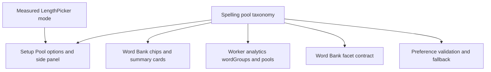

# Spelling Pool Taxonomy and Measured Selector Refactor

## Summary

Refactor Spelling pool/category handling so Setup, Word Bank, Worker analytics, and facet counts all read from one taxonomy. Restore the Pool selector's sliding affordance with measured geometry so long labels and wrapped mobile rows stay aligned.

---

## Problem Frame

The recent Word Bank and Pool hotfixes fixed production counts and sidebar copy, but they exposed a structural issue: pool/category definitions are duplicated across the setup selector, Word Bank chips, side-panel copy, client stats mapping, Worker analytics groups, and Word Bank facets. That duplication makes future pools fragile because each new category can drift in count, label, visibility, or stats key.

The Pool selector has a separate UI issue. The shared `LengthPicker` slider assumes equal-width options, while Spelling pools include variable-width labels such as `Secure vocabulary` and can wrap on mobile. The hotfix made the control usable by turning the Pool selector into chips, but that regressed the sliding segmented-control feel.

---

## Requirements

**Pool taxonomy**

- R1. Define one Spelling pool taxonomy that carries category IDs, labels, ordering, visibility, stats keys, and match rules for `core`, `y3-4`, `y5-6`, `secure-extension`, and `extra`.
- R2. Generate Setup Pool options, setup side-panel copy, Word Bank category chips, Word Bank summary cards, Worker analytics groups, and Word Bank facets from the taxonomy.
- R3. Support future basic pools through taxonomy/content metadata without editing JSX chip lists or hand-written facet maps.
- R4. Preserve the Extra expansion contract: Extra stays independent from Years 3-4, Years 5-6, core statutory completion, SATs Test wording, and Phaeton progress.

**Selector behaviour**

- R5. Restore a sliding selected indicator for the Pool selector that follows the selected option's actual x/y/width/height, including variable-width labels and wrapped mobile layouts.
- R6. Keep the existing fixed-width `LengthPicker` behaviour for round length and other subject surfaces unless a caller opts into measured slider mode.
- R7. Provide a stable fallback before measurement completes so the selected Pool is still visibly active during hydration, reduced motion, and test rendering.

**Compatibility and state**

- R8. Keep existing serialised IDs and API query values compatible: `all`, `core`, `y3-4`, `y5-6`, `secure-extension`, and `extra`.
- R9. Collapse stale or unknown persisted pool filters to the same safe defaults as today instead of rendering orphan chips or sending unsupported Worker queries.
- R10. Keep Word Bank rows server-filtered and paged; taxonomy-driven facets describe the full authorised matching universe, not only loaded rows.

**Verification**

- R11. Add regression coverage that proves Setup, Word Bank, Worker analytics, and client fallbacks stay in sync for every taxonomy category.
- R12. Add browser-level verification for desktop and mobile Pool selector alignment, including Secure vocabulary selected and Extra selected.

---

## Key Technical Decisions

- KTD1. Use a shared taxonomy module rather than another view-model map. A pure module under `shared/spelling/` keeps category definitions importable by Worker, client read-models, and React components without making UI code depend on Worker service internals.
- KTD2. Store match rules as serialisable descriptors, not arbitrary functions. Rules such as `core`, `yearBand: "3-4"`, `coverageTier: "secure-extension"`, and `spellingPool: "extra"` let each runtime evaluate words in its own context while sharing the same category contract.
- KTD3. Make measured slider mode opt-in on `LengthPicker`. The default `--selected-index` path remains unchanged for round length, Grammar, and Punctuation; Spelling Pool passes a mode/class that enables geometry measurement.
- KTD4. Treat taxonomy as display and filtering metadata, not content truth. Content still decides whether a word is statutory, secure-extension, or enrichment-extra; taxonomy only names how those words are grouped and surfaced.
- KTD5. Keep facets authoritative and rows paged. Category and status counts should come from the full server-side query universe, while visible groups remain the current result page.

---

## High-Level Technical Design

The taxonomy becomes the category contract. The UI should not independently know that Secure vocabulary exists; it should ask the taxonomy which categories are visible for Setup and Word Bank, then render those categories.

---

## Implementation Units

### U1. Shared Spelling Pool Taxonomy

- **Goal:** Introduce the single source of truth for pool/category definitions and safe lookup helpers.
- **Files:** `shared/spelling/pool-taxonomy.js`, `src/subjects/spelling/components/spelling-view-model.js`, `src/subjects/spelling/service-contract.js`, `tests/spelling-pool-taxonomy.test.js`.
- **Patterns:** Follow the small pure-module style used by `src/subjects/spelling/content/taxonomy.js`; keep exports serialisable and dependency-light.
- **Test Scenarios:**
  - Every taxonomy entry has a stable `id`, `label`, `statsKey`, `order`, visibility flags, and one supported match descriptor.
  - Lookup helpers return categories in display order and reject duplicate IDs, duplicate stats keys, or unsupported match descriptors.
  - Existing IDs are preserved for `core`, `y3-4`, `y5-6`, `secure-extension`, and `extra`.
  - A test-only future category can be passed through helper functions without adding JSX-specific code.

### U2. Worker Analytics and Word Bank Facets From Taxonomy

- **Goal:** Make server-side category groups and facet counts derive from the taxonomy rather than hard-coded arrays.
- **Files:** `shared/spelling/service.js`, `worker/src/content/spelling-read-models.js`, `tests/server-spelling-engine-parity.test.js`, `tests/spelling-content-api.test.js`.
- **Patterns:** Preserve the recent facet separation from `docs/plans/spelling-word-bank-facet-counts-hotfix-2026-06-05.md`: rows are the page, facets are the universe.
- **Test Scenarios:**
  - `analytics.wordGroups` includes the same visible Word Bank categories as the taxonomy and no extra hand-coded category.
  - `analytics.pools` exposes stats for each taxonomy category using the taxonomy `statsKey`.
  - `/api/subjects/spelling/word-bank?year=all` reports category facets for every visible Word Bank category.
  - `/api/subjects/spelling/word-bank?year=extra` returns Extra rows while sibling category facets stay non-zero where content exists.
  - Secure vocabulary and Extra still use their existing eligibility rules and counts.

### U3. Client Setup and Word Bank Taxonomy Consumption

- **Goal:** Remove duplicated category lists and setup side-panel copy maps from React surfaces.
- **Files:** `src/subjects/spelling/components/SpellingSetupScene.jsx`, `src/subjects/spelling/components/SpellingWordBankScene.jsx`, `src/subjects/spelling/components/spelling-view-model.js`, `src/subjects/spelling/client-read-models.js`, `tests/react-spelling-surface.test.js`, `tests/smoke.test.js`.
- **Patterns:** Keep `renderAction` and `spelling-set-pref` unchanged; use view-model helpers to keep JSX focused on rendering.
- **Test Scenarios:**
  - Setup Pool options render from taxonomy order and select `secure-extension` through the existing preference action.
  - Setup side panel shows category-specific eyebrow, total label, fresh label, and Word Bank footer for Secure vocabulary and Extra.
  - Word Bank category chips render from taxonomy order and display authoritative facet counts.
  - The client stats fallback maps taxonomy `statsKey` values without a hand-written `yearFilter` switch.
  - Legacy responses without the new taxonomy/facet shape still render using conservative fallbacks.

### U4. Measured Slider Mode for Variable-Width Pickers

- **Goal:** Restore the sliding selected indicator for the Pool selector without relying on equal-width options.
- **Files:** `src/platform/ui/LengthPicker.jsx`, `styles/app.css`, `tests/platform-length-picker.test.js`, `tests/react-spelling-surface.test.js`.
- **Patterns:** Keep the existing `LengthPicker` DOM rhythm: the `.length-slider` span remains the visual indicator, and option buttons keep their action/data attributes.
- **Test Scenarios:**
  - Default `LengthPicker` still emits `--selected-index` and keeps current round-length markup.
  - Measured mode emits geometry variables or inline styles for selected option x/y/width/height after measurement.
  - Secure vocabulary selected produces a slider width matching the button width, not the equal-width slot.
  - Mobile wrapping updates the slider y-position and height when the selected option moves to a second row.
  - Reduced-motion styling keeps state visible while avoiding animated movement.

### U5. Preference Validation and Remote Action Compatibility

- **Goal:** Ensure taxonomy IDs are accepted, persisted, queried, and safely defaulted through local and remote flows.
- **Files:** `src/subjects/spelling/optimistic-prefs.js`, `src/subjects/spelling/module.js`, `src/subjects/spelling/remote-actions.js`, `src/subjects/spelling/service-contract.js`, `tests/spelling-remote-actions.test.js`, `tests/spelling-core.test.js`.
- **Patterns:** Reuse the existing `yearFilter` preference contract and avoid introducing a new preference key.
- **Test Scenarios:**
  - Known taxonomy IDs persist through local optimistic prefs and remote sync.
  - Unknown setup `yearFilter` values collapse to `core`; unknown Word Bank category filters collapse to `all`.
  - Smart Review starts from the selected taxonomy category when it is practice-eligible.
  - SATs Test remains core-only and never starts from Extra.

### U6. End-to-End Regression and Production Verification

- **Goal:** Prove the refactor did not regress the production fixes that triggered it.
- **Files:** `tests/smoke.test.js`, `tests/spelling-remote-actions.test.js`, `tests/spelling-content-api.test.js`, `docs/plans/2026-06-05-001-refactor-spelling-pool-taxonomy-and-selector-plan.md`.
- **Patterns:** Keep production-sensitive verification aligned with `AGENTS.md`: `npm test`, `npm run check`, `npm run deploy`, then logged-in production browser smoke.
- **Test Scenarios:**
  - Word Bank `All` shows Extra as 52 in the current production content set.
  - Word Bank `Extra` selected keeps sibling category chip counts populated.
  - Setup Pool selected states survive Core -> Secure vocabulary -> Extra -> Core.
  - Desktop Pool slider aligns with the selected option.
  - Mobile Pool slider wraps and aligns without horizontal overflow.

---

## Scope Boundaries

In scope:

- Refactor category definition, display metadata, server facets, and client consumption around one taxonomy.
- Restore sliding Pool selector behaviour using measured geometry.
- Preserve current content, learner progress, monster progression, API route names, and preference key names.

Out of scope:

- Adding a new production pool in this change.
- Changing secure vocabulary or Extra content.
- Reworking the spelling content CMS, draft/publish workflow, SATs Test model, or monster reward thresholds.
- Redesigning the whole Spelling setup screen.

---

## System-Wide Impact

- **Client bundle:** The taxonomy module must stay pure and small so importing it into React does not pull Worker service code or full content data.
- **Worker contract:** Word Bank responses may gain richer taxonomy metadata, but existing query parameters and response fallbacks must stay compatible.
- **Remote sync:** Persisted learner preferences keep using `yearFilter`; only validation source changes.
- **Deployment cache:** The existing stylesheet cache-busting path should ensure selector CSS updates reach production browsers.

---

## Risks and Mitigations

- **Risk:** A shared taxonomy module accidentally imports heavy content or service code into the browser bundle. **Mitigation:** Keep taxonomy serialisable and test import boundaries with client bundle audit.
- **Risk:** Match descriptors become too generic and allow ambiguous future categories. **Mitigation:** Start with a small finite rule set and fail tests on unsupported descriptors.
- **Risk:** Measured slider geometry is flaky under wrapping, font load, or resize. **Mitigation:** use `ResizeObserver`, font-ready remeasurement where available, and a selected-chip fallback before measurement.
- **Risk:** Server facets and client fallbacks drift. **Mitigation:** pin each taxonomy category in Worker API tests and React tests, including legacy response fallback.
- **Risk:** Future pools become visible in practice before their scheduling rules are ready. **Mitigation:** taxonomy entries must carry separate `visibleInWordBank`, `visibleInSetup`, and `practiceEligible` flags.

---

## Acceptance Examples

- AE1. Given a learner opens Spelling setup, when Secure vocabulary is selected, then the Pool slider aligns under `Secure vocabulary` and the side panel uses Secure vocabulary copy and counts.
- AE2. Given a mobile viewport, when the Pool options wrap, then the slider moves to the selected option's wrapped row without horizontal overflow.
- AE3. Given the Word Bank is opened with `All`, when category chips render, then Extra shows its full facet count and not the first-page row count.
- AE4. Given the Word Bank is opened with `Extra`, when category chips render, then Years 3-4, Years 5-6, and Secure vocabulary counts do not collapse to zero.
- AE5. Given a test-only taxonomy category is registered in a unit test, when Setup or Word Bank option helpers run, then the category appears through helper output without adding JSX-specific chip code.
- AE6. Given a stale stored category ID, when the app normalises preferences or Word Bank filters, then setup falls back to Core and Word Bank falls back to All.

---

## Sources and Existing Patterns

- `docs/brainstorms/2026-04-22-spelling-extra-expansion-requirements.md` establishes Extra as an independent non-statutory pool.
- `docs/plans/spelling-word-bank-facet-counts-hotfix-2026-06-05.md` separates authoritative facets from paged display rows.
- `docs/plans/spelling-secure-vocabulary-pool-selector-hotfix-2026-06-05.md` records the current hotfix and the trade-off that removed the slider from Pool.
- `src/platform/ui/LengthPicker.jsx` is the shared picker whose default equal-width slider should remain compatible.
- `src/subjects/spelling/components/spelling-view-model.js` currently hosts `YEAR_FILTER_OPTIONS` and Word Bank filter ID sets.
- `src/subjects/spelling/components/SpellingWordBankScene.jsx` currently has duplicated category chips and fallback counts.
- `shared/spelling/service.js` currently builds `analyticsWordGroups` from a hard-coded category array.
- `worker/src/content/spelling-read-models.js` owns the remote Word Bank read-model and facet response.
