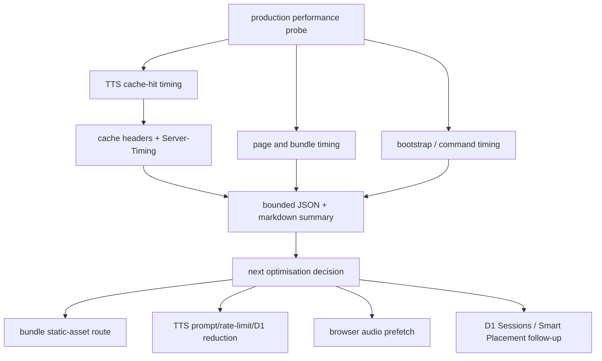

# perf: Production Performance Attribution and TTS Page-Load Optimisation

## Summary

Build a measured production performance attribution slice for KS2 Mastery before attempting broader Cloudflare, D1, R2, or browser refactors. The first implementation should expose enough request, cache, route, and browser timing evidence to decide whether the next optimisation belongs in Worker CPU, D1, R2, Static Assets routing, or client audio playback.

---

## Problem Frame

The TTS primary R2 cache migration made the intended cache path work and reduced R2 lookup count, but production TTS cache hits still show client header waits around the two-second range. Online Cloudflare research points to several plausible optimisation levers - Static Assets routing, Worker placement, D1 read replication sessions, Workers Cache API, and R2 custom-domain CDN cache - but they have different costs and failure modes. The next change must therefore improve attribution first, then make only low-risk changes that the new evidence can verify.

---

## Requirements

**Evidence and Measurement**

- R1. Add a repeatable production performance probe that measures browser-observable page, bundle, bootstrap, command, and TTS cache-hit timings without depending on manual DevTools reading.
- R2. Preserve the ability to run the probe against a real logged-in production session via an operator-supplied cookie, because demo-only smoke has previously misrepresented the real learner path.
- R3. Capture TTS response headers, `Server-Timing`, `x-ks2-request-id`, cache state, cache source, content type, bytes, header time, body time, and total wall time.
- R4. Capture page-load-sensitive static asset headers for the shipped app bundle path, including `Cache-Control`, `cf-cache-status` when present, content type, and response timing.
- R5. Produce bounded JSON and markdown summaries that report p50, p95, maximum, sample count, and notable warnings, without persisting cookies, request bodies, learner names, prompt tokens, or raw audio bodies.

**TTS Attribution**

- R6. Add narrowly scoped TTS phase timings for cache lookup requests so a cache hit can be split into prompt resolution, rate-limit protection, R2 lookup, response construction, and residual Worker overhead.
- R7. Preserve existing TTS cache correctness: primary hits, legacy fallback lazy migration, word-only key invariants, provider fallback, demo guards, and rate limiting must remain unchanged.
- R8. Keep any new timing headers non-sensitive and bounded; do not expose prompt text, slug, learner id, account id, SQL details, or provider keys.

**Page Load Attribution**

- R9. Detect whether production bundles are served through the intended immutable Static Assets path or through `/src/bundles/*` Worker-first routing.
- R10. Do not move bundle output paths, change `run_worker_first`, enable Smart Placement, or add R2 public custom domains in this first slice unless the measurement script first proves the existing route is the bottleneck and tests lock the new routing contract.

**Operational Safety**

- R11. Keep Cloudflare operations on existing package scripts and `scripts/wrangler-oauth.mjs`; do not introduce raw Wrangler deploy or D1 commands.
- R12. Add focused tests for the probe, timing parsing, TTS timing headers, and audit expectations, then run the existing package-level checks before deployment.

---

## Scope Boundaries

- No D1 Sessions/read-replica adoption in this PR. That requires a separate plan once query duration and consistency needs are measured.
- No Smart Placement change in this PR. Placement can trade Worker-to-D1 latency against user-to-Worker latency and must be evaluated after static asset routing is separated from Worker execution.
- No R2 public bucket or custom-domain audio serving in this PR. TTS audio is authenticated and learner-scoped at the request boundary, even when cache objects are cross-account reusable.
- No Workers Cache API layer for authenticated TTS in this PR. Cloudflare documents the Workers Cache API as local to the data centre, so it is not a first choice until phase timing proves repeated R2 latency is dominant.
- No broad `repository.js` refactor. Any refactor must be a small extraction needed for timing, not a structural cleanup.
- No relaxation of SEO, CSP, production audit, TTS smoke, or capacity gates.

---

## Key Technical Decisions

- KTD1. Measurement first, optimisation second: the known symptom is a two-second TTS header wait, but the known R2 primary lookup is already far smaller. The first slice therefore instruments phases before changing architecture.
- KTD2. Use `Server-Timing` for bounded TTS phase attribution: it is a standard response header that browser tooling and scripts can parse without adding JSON payload weight or child-visible UI fields.
- KTD3. Keep `x-ks2-request-id` as the join key: the client TTS telemetry already logs it, Worker capacity logs already carry request IDs, and production probes can report it without storing sensitive inputs.
- KTD4. Treat bundle routing as a page-load hypothesis, not an assumed fix: Cloudflare Static Assets are designed to serve assets directly, while `run_worker_first` intentionally invokes Worker code for matched paths. The repo currently emits bundles under `/src/bundles/*`, so the probe must verify whether that route adds cost before a path migration is attempted.
- KTD5. Keep D1 and R2 platform features as follow-up candidates: D1 Sessions, Smart Placement, R2 custom domains, and Workers Cache API are plausible, but each changes operational semantics. They should follow evidence, not lead it.

---

## High-Level Technical Design

The probe should be useful before and after each optimisation. It should report what was measured, what was not measured, and which bottleneck class is currently most likely.

---

## Implementation Units

### U1. Production performance probe harness

- **Goal:** Add a script that repeatedly probes production page, bundle, bootstrap, command, and TTS paths and writes bounded evidence.
- **Requirements:** R1, R2, R3, R4, R5, R11
- **Files:**
  - Create: `scripts/production-performance-probe.mjs`
  - Create: `tests/production-performance-probe.test.js`
  - Modify: `package.json`
  - Create: `reports/performance/.gitignore`
- **Patterns to follow:** `scripts/spelling-audio-production-smoke.mjs`, `scripts/probe-production-bootstrap.mjs`, `scripts/lib/production-smoke.mjs`, `scripts/classroom-load-test.mjs`.
- **Approach:** Support `--origin`, `--iterations`, `--cookie-env`, `--json-output`, `--markdown-output`, and `--timeout-ms`. Use a stub server in tests. Redact cookies and prompt tokens from all outputs. When no operator cookie is present, the script should still measure public page and bundle paths and clearly mark authenticated probes as skipped.
- **Test scenarios:**
  - Happy path: a stub origin with page, bundle, bootstrap, command, and TTS responses produces p50/p95 summaries.
  - Edge case: missing cookie skips authenticated probes but still reports public page and bundle timing.
  - Error path: non-2xx TTS or bootstrap responses produce bounded warnings without storing response bodies.
  - Redaction: cookie, prompt token, learner id, and request body material are absent from JSON and markdown outputs.
- **Verification:** `node --test tests/production-performance-probe.test.js` passes and the script can run against `https://ks2.eugnel.uk` for public-only probes.

### U2. TTS cache-hit phase timing

- **Goal:** Add `Server-Timing` details to `/api/tts` cache lookup responses so the probe can split cache-hit latency by server phase.
- **Requirements:** R3, R6, R7, R8, R12
- **Files:**
  - Modify: `worker/src/tts.js`
  - Modify: `worker/src/app.js`
  - Modify: `tests/worker-tts.test.js`
- **Patterns to follow:** `worker/src/tts.js` TTS R2 lookup telemetry, `worker/src/logger.js` bounded capacity fields, existing `x-ks2-tts-*` response headers.
- **Approach:** Record monotonic durations around prompt resolution, lookup protection, R2 lookup, audio-budget protection, and response construction. Emit only rounded millisecond values in `Server-Timing`; keep existing cache headers unchanged. Keep timing collection best-effort and non-throwing.
- **Test scenarios:**
  - Happy path: cache lookup hit includes `Server-Timing` entries and existing TTS cache headers.
  - Edge case: cache miss and cache unavailable responses include safe timing where available and keep existing 204 semantics.
  - Error path: timing collection failures do not fail audio responses.
  - Security: `Server-Timing` contains no learner id, account id, slug, prompt token, SQL, provider key, or transcript.
- **Verification:** Focused worker TTS tests pass and production audit remains green.

### U3. TTS probe integration and before/after report

- **Goal:** Teach the performance probe to parse TTS `Server-Timing` and classify likely TTS bottlenecks.
- **Requirements:** R1, R3, R5, R6
- **Files:**
  - Modify: `scripts/production-performance-probe.mjs`
  - Modify: `tests/production-performance-probe.test.js`
  - Modify: `docs/operations/capacity.md`
- **Patterns to follow:** `docs/operations/capacity-cpu-d1-evidence.md`, `reports/capacity/evidence/*-tail-correlation.json`, `scripts/join-capacity-worker-logs.mjs` if present.
- **Approach:** Parse `Server-Timing` into named phase fields and classify samples as `r2-dominated`, `prompt-validation-dominated`, `rate-limit-dominated`, `client-network-or-platform-overhead`, or `mixed`. Keep classifications diagnostic-only.
- **Test scenarios:**
  - Happy path: synthetic timing headers classify a known R2-dominated sample correctly.
  - Edge case: missing `Server-Timing` results in `unclassified-insufficient-timing`.
  - Error path: malformed timing header is ignored with a bounded warning.
- **Verification:** Generated report shows p50/p95 TTS header/body/wall and phase timing fields for measured samples.

### U4. Static asset route audit for page load

- **Goal:** Add checks that make bundle route/cache behaviour visible before any bundle path migration.
- **Requirements:** R4, R9, R10, R12
- **Files:**
  - Modify: `scripts/production-bundle-audit.mjs`
  - Modify: `tests/bundle-audit.test.js`
  - Modify: `scripts/production-performance-probe.mjs`
- **Patterns to follow:** existing cache-split checks in `scripts/production-bundle-audit.mjs`, `_headers`, `wrangler.jsonc`.
- **Approach:** Record whether the shipped HTML references `/src/bundles/*` or `/assets/bundles/*`, then verify the referenced bundle has immutable caching and the expected content type. Report Worker-first risk as a warning unless a later unit deliberately migrates paths.
- **Test scenarios:**
  - Happy path: immutable bundle cache headers pass.
  - Edge case: `/src/bundles/*` reference emits a warning but does not fail unless cache headers are unsafe.
  - Error path: bundle served as HTML or `no-store` fails production audit.
- **Verification:** Bundle audit remains green against production and the performance probe reports bundle route/cache status.

### U5. Operator documentation and decision record

- **Goal:** Document how to run the new probe and how to interpret the first measurements.
- **Requirements:** R5, R10, R11
- **Files:**
  - Modify: `docs/operations/capacity.md`
  - Create: `docs/operations/performance-probes.md`
- **Patterns to follow:** `docs/operations/capacity-cpu-d1-evidence.md`, `docs/spelling-word-audio.md`.
- **Approach:** Document command examples, cookie handling, redaction guarantees, report locations, and the decision rule for follow-up work. Keep platform-feature candidates explicitly gated on measured evidence.
- **Test scenarios:** Documentation examples reference package scripts and repo-relative output paths.
- **Verification:** Docs do not include secrets, absolute local paths, or claims unsupported by measurements.

---

## Acceptance Examples

- AE1. Given no operator cookie is configured, when `npm run perf:production -- --iterations 2` runs, then it records public page and bundle timing, marks authenticated routes skipped, and exits successfully unless public checks fail.
- AE2. Given a valid operator cookie is configured, when the probe measures TTS cache hits, then the report includes cache source, request id, header/body/wall timing, and parsed `Server-Timing` phases.
- AE3. Given a TTS cache hit spends most of its server time in prompt validation or rate-limit protection, when the report is generated, then it classifies the sample away from R2 so the next optimisation does not target R2 again.
- AE4. Given production HTML references a bundle route that is served as HTML or `no-store`, when `npm run audit:production` runs, then the audit fails before deployment is considered healthy.

---

## Risks and Dependencies

- The real logged-in path needs an operator-supplied cookie. The probe must make missing credentials explicit rather than silently falling back to demo-only evidence.
- `Server-Timing` is visible to browsers. Values must stay numeric and generic.
- Cloudflare headers such as `cf-cache-status` may be absent depending on response lane. The probe must treat absence as evidence to report, not as a parser failure.
- Probe outputs can become noisy if they store raw response bodies. The report must store summaries only.
- If `run_worker_first` is part of source-path lockdown, any future bundle migration must preserve direct source denial tests.

---

## Sources and Research

- `worker/src/tts.js` contains TTS cache lookup, lazy legacy-to-primary migration, and cache headers.
- `src/subjects/spelling/tts.js` logs client cache-hit timing with `x-ks2-request-id`.
- `scripts/spelling-audio-production-smoke.mjs` is the existing production TTS cache contract probe.
- `scripts/production-bundle-audit.mjs` and `tests/bundle-audit.test.js` own production bundle and SEO audit gates.
- `wrangler.jsonc` currently routes `/src/*` through `run_worker_first` and binds Static Assets from `dist/public`.
- `_headers` currently gives immutable caching to `/assets/bundles/*`, while the shipped app bundle path needs measurement before migration.
- `docs/solutions/learning-spelling-audio-cache-contract.md` documents the TTS R2 key contract and smoke expectations.
- `docs/operations/capacity-cpu-d1-evidence.md` documents diagnostic-only attribution and request-id joins.
- Cloudflare Workers Cache API docs: https://developers.cloudflare.com/workers/runtime-apis/cache/
- Cloudflare R2 public bucket and custom-domain docs: https://developers.cloudflare.com/r2/data-access/public-buckets/
- Cloudflare D1 read replication and Sessions docs: https://developers.cloudflare.com/d1/best-practices/read-replication/
- Cloudflare Static Assets headers docs: https://developers.cloudflare.com/workers/static-assets/headers/
- MDN `HTMLMediaElement.play()` docs: https://developer.mozilla.org/en-US/docs/Web/API/HTMLMediaElement/play
- MDN `PerformanceResourceTiming` docs: https://developer.mozilla.org/en-US/docs/Web/API/PerformanceResourceTiming
