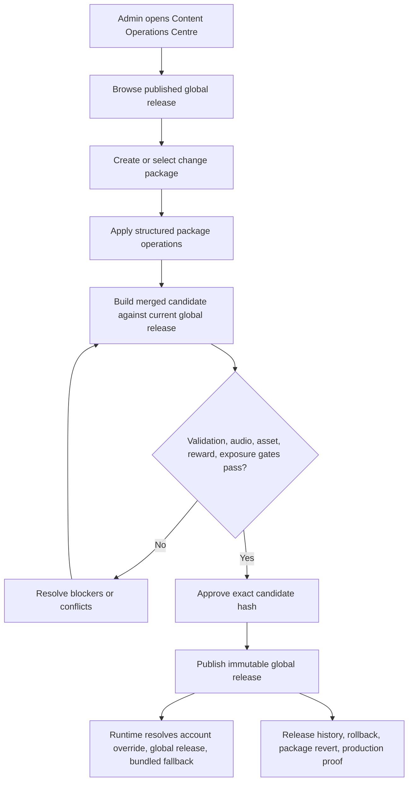
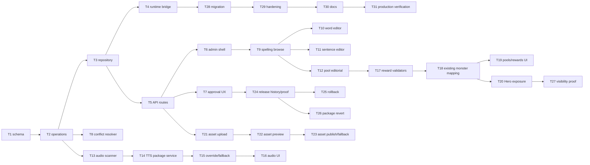

# feat: Content Operations Centre

## Overview

Build a full Admin Console Content Operations Centre for English Spelling content, audio readiness, spelling pools, reward tracks, monster bindings, monster image assets, and Hero / Codex exposure.

The implementation must be treated as one product and data contract, split into epics and tickets for delivery. The central constraint is that every learner-facing content operation must flow through one package-scoped edit, validation, approval, publish, audit, and recovery model. Delivery order may be staged, but no ticket should create a disconnected surface that cannot later join the same release package.

This plan uses `docs/brainstorms/2026-06-10-content-operations-centre-requirements.md` as the origin contract.

## Problem Frame

Current English Spelling content has a useful model, validation helpers, publish helpers, runtime snapshots, and generated bundle fallbacks. The current Admin Console surface is still thin: import, export, publish, reset, and quality status. Real editorial work still depends on engineering edits to seed data, generated runtime files, deployment, and separate audio cache operations.

The current remote storage model is also not the right foundation for the full manager. `account_subject_content` is account-scoped and stores a whole subject bundle. The new centre needs global product content, optional future account overrides, multiple concurrent change packages, conflict-aware merges, immutable global releases, release history, rollback, and package-level revert. Building the full manager directly on the existing account-scoped whole-bundle API would leave the largest operational gap in the first ticket.

The correct foundation is a platform-level content operations layer that wraps the existing spelling content bundle and runtime fallback. The spelling engine should not be rewritten. The new layer should own packages, operations, releases, approvals, audio readiness, reward configuration, asset references, visibility, and audit.

## Requirements Trace

| Origin requirements | Plan coverage | Implementation area |
| --- | --- | --- |
| R1-R9 | Package model, base release hash, validation against merged candidate, optimistic rebase, conflict blocking, immutable global release | E1, E2, E7 |
| R10-R17 | Approval, capability modelling, lifecycle states, audit events, safe export/redaction | E2, E7, E8 |
| R18-R28 | Spelling lists, pools, words, word-family variants, sentence entries, parity, visibility, hard delete vs retirement | E3 |
| R29-R40 | Audio requirement profiles, word and sentence lanes, TTS generation, R2 provenance, strict gate, fallback exception | E4 |
| R41-R49 | Pool model, reward tracks, monster bindings, threshold templates, progression, learner-history preservation | E5 |
| R50-R56 | Monster image upload, validation, draft assets, previews, runtime asset readiness | E6 |
| R57-R61 | Hero exposure as configuration over reward tracks and monsters, hidden/scheduled/flagged visibility | E5, E7 |
| R62-R65 | Global default, optional account override, bundled fallback, runtime resolution order | E1, E7 |
| R66-R73 | Content Operations Centre IA, package-first mutations, browse-without-package, conflict resolver, large-read discipline | E2, E3, E4, E5, E6 |
| R74-R78 | Release history, whole-release rollback, package revert, R2 retention, production proof | E7, E8 |
| AE1-AE14 | Acceptance examples are used as test scenarios and ticket exit criteria | All epics |

## Scope Boundaries

In scope:

- Global product content management for English Spelling.
- Package-scoped edits and publish workflow for words, word-family variants, sentence entries, pools, audio requirements, reward tracks, monster bindings, Hero / Codex exposure, and monster image assets.
- TTS-generated word and sentence audio operations stored in R2.
- Monster image upload and validation for V1 asset upload.
- Runtime resolution from optional account override to global release to bundled fallback.
- Whole-release rollback and package-level revert.
- Admin proof and audit evidence.

Out of scope:

- A general CMS for all subjects.
- Manual audio upload.
- A rewrite of the spelling engine, scheduler, answer marking, or learner progress model.
- Making account-scoped content the primary V1 operator workflow.
- Hard deletion of published learner-facing content or R2 audio as part of ordinary editorial removal.
- Upload support for non-monster asset categories in V1.
- Changing existing learner progress or reward history without an explicit package operation and validation.

## Context and Research

### Current Repo Surfaces

- `docs/spelling-content-model.md` documents the existing spelling bundle, sentence-entry model, word-family variants for Extra words, draft validation, publish, runtime snapshot, and `account_subject_content`.
- `src/subjects/spelling/content/model.js` already normalises words, `variants`, `sentenceEntryIds`, pools, releases, and runtime projections. This is the starting point for editorial validation.
- `src/subjects/spelling/content/service.js` exposes read, write, validate, publish, portable import/export, runtime snapshot, and reset operations over the current bundle.
- `src/subjects/spelling/content/repository.js` currently stores local content in browser storage or remote content through `/api/content/spelling`.
- `worker/migrations/0005_spelling_content_model.sql` creates `account_subject_content`, which is account-scoped and unsuitable as the primary global release table.
- `worker/src/app.js` currently serves `/api/content/spelling` and generic admin asset routes for `monster-visual-config`.
- `worker/src/repository.js` currently exports, writes, and resolves subject content, reads spelling runtime content, builds admin overview signals, and owns existing Monster Visual Config persistence.
- `src/surfaces/hubs/AdminContentSection.jsx` currently provides Content overview, spelling status/import controls, quality signals, and the Asset & Effect Registry.
- `src/platform/hubs/admin-asset-registry.js` provides the asset registry and handler capability pattern currently used by `monster-visual-config`.
- `docs/spelling-word-audio.md` documents the existing `npm run spelling:audio-cache` path, TTS generation, R2 audio cache, content-addressed keys, word and sentence lanes, and production caution points.
- `docs/monster-visual-config.md` documents the existing monster visual config review, fallback, preview, and renderer compatibility model.

### Institutional Constraints

- The Worker bundle has been under size pressure before. Public runtime paths must not load full admin datasets or large content blobs into the public client bundle.
- `account_subject_content` has had large-row runtime constraints. Global release storage should be explicit and compact on read paths, with published snapshots projected into runtime shapes.
- Monster assets already have generated manifests and renderer contracts. New image upload must integrate with those contracts rather than bypass them.
- Admin safe-copy and operational redaction rules are production-sensitive; release history and package export must avoid leaking learner or account personal data.

## Key Technical Decisions

1. **Introduce a global content operations layer.** Create new D1 tables for content operations releases, change packages, package operations, approvals, events, audio jobs, and asset uploads. Keep `account_subject_content` for compatibility and future account override support, but do not use it as the primary global product-content store.

2. **Keep the spelling bundle as the canonical snapshot payload.** The current spelling content bundle remains the data shape that validation and runtime projection understand. The new layer stores package operations and global releases around that bundle instead of rewriting the spelling engine.

3. **Use structured operations for package diffs.** Each mutation becomes a normalised operation with `entityType`, `entityId`, `fieldPath`, `action`, `beforeHash`, `afterHash`, payload, actor, and timestamp. Conflict detection is based on same entity plus same field path, with entity-level guards for deletes, retirements, and structural moves.

4. **Approve exact merged candidate hashes.** Approval records the base release id, current release id, package operations hash, merged candidate hash, validation summary, audio readiness summary, asset readiness summary, and any fallback exceptions. Any package mutation or conflict resolution invalidates approval.

5. **Runtime reads only published releases.** Learner-facing routes resolve optional account override, then global published release, then bundled fallback. Draft packages and candidate releases are admin-only.

6. **Audio is generated through TTS only.** The admin centre can scan, queue, generate, regenerate, and override TTS audio. It must not provide audio file upload. R2 keys and provenance should remain content-addressed and must include lane, voice, pace, model, prompt/profile version, and source identity.

7. **Audio requirements are profile-driven.** Do not hard-code four audio outputs for every entity. Store `audioRequirementProfile` by lane. Default word lane is male/female natural or normal pace. Default sentence dictation lane is male/female normal and slow pace.

8. **Reward tracks are separate from monsters.** Pools bind to zero or more reward tracks. Each reward track binds to one monster and defines progression mode, threshold template, optional overrides, active state, and labels. Hero / Codex exposure reads reward tracks and monsters; it does not create a second creature model.

9. **Monster image assets use package draft and asset registry patterns.** Uploaded monster images are draft package assets until publish. They are validated, previewed in renderer contexts, and referenced by package operations. Audio is deliberately excluded from upload assets.

10. **Delivery must be contract-first.** Tickets can ship in sequence, but all schema, API, UI, validation, audit, and runtime contracts must point to the same final model from the first foundation ticket.

## High-Level Technical Design

### Domain Model

The schema should be introduced in the next available migration number after `worker/migrations/0019_capacity_drop_write_amplifying_indexes.sql`.

Proposed tables:

- `content_operation_releases`
  - Immutable global releases.
  - Fields: `release_id`, `subject_id`, `status`, `snapshot_json`, `snapshot_hash`, `base_release_id`, `package_id`, `published_at`, `published_by_account_id`, `rollback_of_release_id`, `proof_json`, `created_at`.
  - Current published release is the latest `status = 'published'` row per subject, unless a rollback marks another release as active.

- `content_operation_packages`
  - Draft-to-publish package lifecycle.
  - Fields: `package_id`, `subject_id`, `template_id`, `title`, `description`, `base_release_id`, `base_release_hash`, `state`, `created_by_account_id`, `updated_by_account_id`, `created_at`, `updated_at`, `approved_at`, `published_at`, `superseded_by_package_id`.

- `content_operation_package_operations`
  - Structured package diff.
  - Fields: `operation_id`, `package_id`, `operation_order`, `entity_type`, `entity_id`, `field_path`, `action`, `before_hash`, `after_hash`, `payload_json`, `created_by_account_id`, `created_at`.

- `content_operation_package_candidates`
  - Cached merged candidate output for validation and approval.
  - Fields: `candidate_id`, `package_id`, `base_release_id`, `current_release_id`, `operations_hash`, `candidate_hash`, `candidate_snapshot_json`, `validation_json`, `audio_scan_json`, `asset_scan_json`, `reward_scan_json`, `visibility_scan_json`, `conflicts_json`, `created_at`.

- `content_operation_package_approvals`
  - Approval records.
  - Fields: `approval_id`, `package_id`, `candidate_id`, `candidate_hash`, `approved_by_account_id`, `approved_at`, `notes`, `audio_fallback_json`, `asset_summary_json`, `validation_summary_json`.

- `content_operation_events`
  - Audit trail.
  - Fields: `event_id`, `package_id`, `release_id`, `subject_id`, `event_type`, `actor_account_id`, `event_json`, `created_at`.

- `content_operation_audio_jobs`
  - TTS generation queue and provenance.
  - Fields: `job_id`, `package_id`, `candidate_id`, `lane`, `entity_type`, `entity_id`, `voice_id`, `pace_id`, `model_id`, `profile_version`, `content_key`, `status`, `r2_key`, `error_json`, `requested_by_account_id`, `completed_at`, `created_at`.

- `content_operation_asset_uploads`
  - Monster image draft assets and validation.
  - Fields: `asset_upload_id`, `package_id`, `monster_id`, `branch_id`, `stage_id`, `asset_kind`, `r2_key`, `content_type`, `byte_size`, `width`, `height`, `validation_json`, `preview_json`, `status`, `created_by_account_id`, `created_at`.

- `content_operation_account_overrides`
  - Reserved override support.
  - Fields: `override_id`, `account_id`, `subject_id`, `release_id`, `reason`, `active`, `created_by_account_id`, `created_at`, `ended_at`.
  - V1 uses this for diagnostics or special programme support only, not the main UI path.

### Operation Entity Types

Use stable entity types so conflict detection and UI diffing are predictable:

- `spelling.word`
- `spelling.wordVariant`
- `spelling.sentenceEntry`
- `spelling.wordList`
- `spelling.pool`
- `spelling.audioRequirementProfile`
- `spelling.rewardTrack`
- `spelling.monsterBinding`
- `spelling.monsterAsset`
- `spelling.heroExposure`
- `spelling.visibilityRule`

### Runtime Resolution

Runtime read order:

1. Active account override for `subject_id = 'spelling'`, if present.
2. Latest active global published release for `subject_id = 'spelling'`.
3. Bundled fallback snapshot generated from the repo.

The runtime service should return the same shape expected by existing spelling routes, word bank routes, Hero read-models, and Codex projections. Draft packages, approvals, audio jobs, and admin scans must remain admin-only.

### API Shape

Introduce new admin routes under `/api/admin/content-operations`:

- `GET /api/admin/content-operations/subjects/spelling/overview`
- `GET /api/admin/content-operations/subjects/spelling/releases`
- `GET /api/admin/content-operations/subjects/spelling/releases/:releaseId`
- `POST /api/admin/content-operations/subjects/spelling/packages`
- `GET /api/admin/content-operations/packages`
- `GET /api/admin/content-operations/packages/:packageId`
- `PATCH /api/admin/content-operations/packages/:packageId`
- `POST /api/admin/content-operations/packages/:packageId/operations`
- `DELETE /api/admin/content-operations/packages/:packageId/operations/:operationId`
- `POST /api/admin/content-operations/packages/:packageId/rebase`
- `POST /api/admin/content-operations/packages/:packageId/validate`
- `POST /api/admin/content-operations/packages/:packageId/scan-audio`
- `POST /api/admin/content-operations/packages/:packageId/generate-audio`
- `POST /api/admin/content-operations/packages/:packageId/upload-monster-asset`
- `POST /api/admin/content-operations/packages/:packageId/approve`
- `POST /api/admin/content-operations/packages/:packageId/publish`
- `POST /api/admin/content-operations/releases/:releaseId/rollback`
- `POST /api/admin/content-operations/packages/:packageId/create-revert`

Keep `/api/content/spelling` as a compatibility route during transition. It can eventually read from the global release and write through a restricted compatibility package, but the primary Admin UI should use the new routes.

### Admin UI Information Architecture

Add a Content Operations Centre under the existing Admin Console Content area. Top-level tabs:

- Overview
- Packages
- Spelling
- Audio
- Pools & Rewards
- Monsters & Assets
- Hero / Codex
- Approvals
- Release History

Browse pages can show the current published global release without an active package. Any mutation must prompt the admin to choose an existing package or create a new package. Package detail pages reuse the same domain tabs scoped to that package.

### Validation Gates

The merged candidate must pass:

- Existing spelling bundle validation.
- Word-family and progress-key validation.
- Pool and statutory parity validation.
- Audio requirement profile scan.
- Reward-track threshold and progression validation.
- Monster binding and asset readiness validation.
- Hero / Codex exposure and visibility validation.
- Runtime projection validation.
- Bundle/capacity guardrails for public surfaces.
- Approval hash and state validation.

### Recovery Model

Whole-release rollback is an approved high-risk operation that marks a prior release active and records proof. Package revert creates a new inverse package that follows the same validation, approval, and publish workflow. Neither path deletes R2 audio objects.

## Epic and Ticket Breakdown

| Epic | Tickets | Outcome |
| --- | --- | --- |
| E1. Global Content Operations Foundation | T1-T4 | D1 schema, operation model, repository layer, runtime resolution bridge |
| E2. Package Workflow and Admin Shell | T5-T8 | Admin package list/detail, lifecycle API, validation, approval, publish, audit |
| E3. Spelling Editorial Manager | T9-T12 | UI and APIs for words, word-family variants, sentence entries, lists, pools, retirements |
| E4. Audio Operations | T13-T16 | Requirement profiles, audio scan, TTS generation, R2 provenance, fallback warnings |
| E5. Pools, Reward Tracks, Hero Exposure | T17-T20 | Pool reward-track model, monster bindings, Hero / Codex exposure, learner-history safety |
| E6. Monster Image Assets | T21-T23 | Monster image upload, validation, preview, package publish integration |
| E7. Release Safety and Recovery | T24-T27 | release history, visibility proof, rollback, package-level revert |
| E8. Hardening, Migration, Documentation | T28-T31 | compatibility, capacity, security, production runbooks, live verification |

## Implementation Units

### E1. Global Content Operations Foundation

#### T1. Add global content operations D1 schema

**Goal:** Create the persistent foundation for global releases, packages, operations, candidates, approvals, audit events, audio jobs, monster asset uploads, and reserved account overrides.

**Covers:** R1-R5, R9, R16, R62-R65, AE13.

**Primary files:**

- `worker/migrations/0020_content_operations_centre.sql` or next available migration number.
- `worker/src/repository.js`
- `tests/content-operations-repository.test.js`

**Approach:**

- Add the tables listed in the domain model section.
- Add indexes for subject release lookup, package state lookup, package operation ordering, event history, and audio job status.
- Keep `account_subject_content` intact for compatibility.
- Store JSON as compact strings; only hydrate large snapshots on admin or runtime paths that need them.

**Exit criteria:**

- Repository tests can create packages, append operations, create candidates, approve, publish releases, read latest published release, and read audit events.
- Account override rows exist but are not used by the primary UI.
- Migration is idempotent and follows current D1 migration conventions.

#### T2. Build shared operation and candidate model

**Goal:** Define the JS domain helpers that normalise package operations, apply them to a base snapshot, compute hashes, and detect conflicts.

**Covers:** R5-R8, R14-R15, R71.

**Primary files:**

- `src/subjects/spelling/content/operations-model.js`
- `src/subjects/spelling/content/package-operations.js`
- `src/subjects/spelling/content/model.js`
- `tests/content-operations-merge.test.js`
- `tests/spelling-content-operations-model.test.js`

**Approach:**

- Define operation entity types and actions.
- Apply operations to the existing spelling content bundle, not generated runtime files.
- Compute stable hashes with deterministic serialisation.
- Detect same entity plus same field conflicts.
- Treat deletion/retirement/move operations as structural conflicts against any child-field edits.
- Invalidate candidate and approval hashes when operations change.

**Exit criteria:**

- Unrelated packages auto-rebase cleanly.
- Same-field edits block publish.
- Retire/delete conflicts with child edits are blocked.
- Existing spelling validation still catches malformed entries after operations are applied.

#### T3. Add repository methods for packages, candidates, approvals, releases, and audit

**Goal:** Expose a worker-side persistence API that route handlers can use without leaking SQL or storage details into UI-facing code.

**Covers:** R3-R17, R74.

**Primary files:**

- `worker/src/repository.js`
- `tests/content-operations-repository.test.js`
- `tests/admin-production-evidence.test.js`

**Approach:**

- Add methods to create and update packages.
- Append operations and audit events atomically where possible.
- Build and persist candidate rows.
- Approve exact candidates.
- Publish approved candidates into immutable releases.
- Read release history summaries without loading full snapshots by default.

**Exit criteria:**

- Package mutation after approval clears approval.
- Publish fails if candidate hash differs from approval hash.
- Release history summary includes package, actor, validation, audio, asset, and proof summaries.
- Admin safe-copy redaction still holds for operational views.

#### T4. Bridge runtime resolution to global release with fallback

**Goal:** Route spelling runtime reads through optional account override, global published release, and bundled fallback while preserving current learner behaviour.

**Covers:** R62-R65, R72-R73, AE13.

**Primary files:**

- `worker/src/repository.js`
- `worker/src/app.js`
- `src/subjects/spelling/content/service.js`
- `tests/worker-subject-runtime.test.js`
- `tests/spelling-content-api.test.js`
- `tests/bundle-audit.test.js`

**Approach:**

- Add a global release reader that returns the same runtime snapshot shape currently used by spelling routes.
- Keep bundled fallback when global release lookup fails or is missing.
- Preserve compatibility for existing `/api/content/spelling` consumers while the new admin UI moves to content operations routes.
- Keep public bundle and Worker bundle size under existing guardrails.

**Exit criteria:**

- Existing spelling runtime tests pass unchanged or with intentional fixture updates.
- Missing D1 release falls back to bundled content.
- Draft package content cannot leak into learner runtime.
- Large content data does not move into public React bundles.

### E2. Package Workflow and Admin Shell

#### T5. Add admin content operations API routes

**Goal:** Expose the package, candidate, validation, approval, publish, and release-history API under `/api/admin/content-operations`.

**Covers:** R1-R17, R66-R74.

**Primary files:**

- `worker/src/app.js`
- `worker/src/content-operations/routes.js`
- `worker/src/content-operations/serialisers.js`
- `tests/content-operations-api.test.js`
- `tests/admin-safe-copy.test.js`

**Approach:**

- Gate all routes behind the existing admin session and role checks.
- Keep edit, approve, and publish capability names separate in code while mapping all three to the current `admin` role.
- Return compact summaries for list pages.
- Require explicit package ids for mutations.
- Return structured conflict, validation, audio, asset, reward, and exposure blockers.

**Exit criteria:**

- Non-admin sessions cannot access routes.
- Admin can create a package, add operations, validate, approve, and publish through API tests.
- Approval and publish are separate route actions even when the same admin account performs both.

#### T6. Build Content Operations Centre shell

**Goal:** Add the operator-facing home, tab structure, package list, and package detail container.

**Covers:** R66-R70.

**Primary files:**

- `src/surfaces/hubs/AdminContentSection.jsx`
- `src/surfaces/hubs/AdminContentOperationsSection.jsx`
- `src/platform/hubs/admin-content-operations.js`
- `src/platform/hubs/api.js`
- `src/main.js`
- `styles/app.css`
- `tests/admin-content-operations-v2.test.js`
- `tests/admin-content-overview-characterisation.test.js`

**Approach:**

- Add a Content Operations Centre card or tab inside the existing Admin Console Content section.
- Provide overview lanes for blocked packages, ready-for-approval packages, approved pending publish packages, recent releases, and audio/asset warnings.
- Build package list and package detail views before deep editors.
- Allow browsing without a package; prompt for package selection before mutation.

**Exit criteria:**

- The UI can load package summaries and release summaries.
- Package detail tabs are present even before all editors are feature-complete.
- Existing Admin Content overview and Asset & Effect Registry still render.

#### T7. Implement validation, approval, publish, and audit UX

**Goal:** Make package lifecycle safe and reviewable from UI.

**Covers:** R10-R17, R54-R56, R74.

**Primary files:**

- `src/surfaces/hubs/AdminContentOperationsSection.jsx`
- `src/platform/hubs/admin-content-operations.js`
- `worker/src/content-operations/routes.js`
- `tests/content-operations-approval.test.js`
- `tests/admin-content-operations-v2.test.js`

**Approach:**

- Add action buttons for validate, submit for approval, approve, publish, reject, and mark blocked.
- Show exact candidate hash, base release, current release, validation status, audio summary, asset summary, and visibility impact.
- Invalidate approval visually and in API when package operations change.
- Record notes for approval, fallback allowance, and publish proof.

**Exit criteria:**

- Publish is blocked without approval.
- Approval is blocked when candidate has unresolved validation, conflict, asset, reward, or visibility blockers, unless the relevant fallback exception is explicitly supported.
- Approval notes and summaries appear in release history.

#### T8. Add conflict resolver

**Goal:** Provide the UI needed to resolve same-field package conflicts without last-write-wins.

**Covers:** R6-R8, R71, AE4, AE5.

**Primary files:**

- `src/surfaces/hubs/AdminContentOperationsSection.jsx`
- `src/subjects/spelling/content/package-operations.js`
- `worker/src/content-operations/routes.js`
- `tests/content-operations-merge.test.js`
- `tests/admin-content-operations-v2.test.js`

**Approach:**

- Auto-rebase unrelated operations when current release changes.
- Display conflicts by entity and field path.
- Support keeping package value, keeping current release value, or editing a merged value.
- Persist conflict resolution as new package operations and invalidate approval.

**Exit criteria:**

- Conflict resolver produces a new candidate hash.
- Same-field conflicts cannot publish until resolved.
- Unrelated concurrent packages still publish without manual work.

### E3. Spelling Editorial Manager

#### T9. Build spelling browse and read models

**Goal:** Provide fast published-state browsing for words, word-family variants, sentence entries, lists, pools, audio readiness, and reward impact.

**Covers:** R18-R24, R66-R70, R73.

**Primary files:**

- `src/subjects/spelling/content/model.js`
- `src/subjects/spelling/content/editor-read-model.js`
- `src/platform/hubs/admin-content-operations.js`
- `worker/src/content-operations/read-models.js`
- `tests/spelling-content-operations-model.test.js`
- `tests/admin-content-operations-v2.test.js`

**Approach:**

- Build compact server summaries for list pages.
- Provide detailed item reads by slug or id.
- Surface current published state, package draft state, validation state, pool membership, audio readiness, and reward impact.
- Avoid pulling full datasets into initial UI load.

**Exit criteria:**

- Admin can browse spelling content without opening a package.
- Item detail can show current and package-draft values when a package is active.
- Public bundle size remains within guardrails.

#### T10. Implement word and word-family editor operations

**Goal:** Allow admins to add, edit, retire, and validate words and word-family variants from UI.

**Covers:** R18-R23, R25-R28, AE6, AE12.

**Primary files:**

- `src/surfaces/hubs/AdminContentOperationsSection.jsx`
- `src/subjects/spelling/content/package-operations.js`
- `src/subjects/spelling/content/model.js`
- `tests/spelling-content-operations-model.test.js`
- `tests/admin-content-operations-v2.test.js`

**Approach:**

- Add forms for base word, accepted spellings, explanation, tags, source notes, provenance, pool membership, and visibility.
- Add first-class child editing for Extra word-family variants.
- Make progress key explicit: base slug or variant prompt where allowed.
- Enforce statutory parity warnings for core word changes.
- Support hard delete for draft-only words and retirement for published words.

**Exit criteria:**

- A word or variant cannot become learner-visible without sentence references, accepted spellings, explanation, pool assignment, and provenance.
- Core variants remain separate word rows unless a package explicitly documents a parity trade-off.
- Retired words leave audit/history references intact.

#### T11. Implement sentence-entry and list editor operations

**Goal:** Manage sentence entries, sentence references, and word lists without editing generated files.

**Covers:** R18, R24-R28, R72.

**Primary files:**

- `src/surfaces/hubs/AdminContentOperationsSection.jsx`
- `src/subjects/spelling/content/package-operations.js`
- `src/subjects/spelling/content/model.js`
- `tests/spelling-content-operations-model.test.js`
- `tests/spelling-content.test.js`

**Approach:**

- Add sentence-entry create/edit/retire flows with stable ids.
- Link sentences to base words and variants by id.
- Validate sentence word ownership and missing references.
- Support list membership operations without embedding sentence text in word rows.

**Exit criteria:**

- Broken sentence references block validation.
- Sentence retirements are blocked when active visible words still require them.
- Operators never edit `src/subjects/spelling/data/*` for normal content operations.

#### T12. Implement pool metadata and editorial retirement

**Goal:** Manage pool metadata and active/retired lifecycle in the spelling editorial surface, before reward-track details are added in E5.

**Covers:** R23, R26-R28, R41, R59, R61.

**Primary files:**

- `src/subjects/spelling/content/package-operations.js`
- `src/subjects/spelling/content/model.js`
- `src/surfaces/hubs/AdminContentOperationsSection.jsx`
- `tests/spelling-content-operations-model.test.js`

**Approach:**

- Extend beyond current `core` and `extra` assumptions while preserving current pools.
- Add pool metadata: title, type, source notes, active/retired state, visibility state.
- Keep future pool ids stable and validation-friendly.
- Block active learner-facing pool publish until E5 reward requirements are satisfied, unless explicit no-reward exception is approved.

**Exit criteria:**

- New pools can be created as hidden or staged.
- Retired pools disappear from new sessions but remain in release history and learner-history references.
- Extra/future pools do not inflate statutory metrics.

### E4. Audio Operations

#### T13. Add audio requirement profile and readiness scanner

**Goal:** Make audio readiness visible and enforceable for package candidates.

**Covers:** R29-R32, R37, R40, AE7.

**Primary files:**

- `src/subjects/spelling/content/audio-readiness.js`
- `src/subjects/spelling/content/package-operations.js`
- `worker/src/content-operations/audio.js`
- `tests/content-operations-audio-readiness.test.js`
- `tests/build-spelling-word-audio-plan.test.js`

**Approach:**

- Define profile defaults for word and sentence dictation lanes.
- Scan package candidate content for required lane, voice, pace, slug, sentence id, model, and content key.
- Return missing, present, stale, generated, failed, skipped, and override-requested states.
- Keep the profile configurable per package.

**Exit criteria:**

- Word and sentence audio readiness is reported separately.
- Variant-level sentence audio gaps are visible at the variant level.
- Strict publish gate blocks missing required audio by default.

#### T14. Wrap TTS generation as a package service

**Goal:** Reuse the existing TTS/R2 generation path from the Content Operations Centre.

**Covers:** R33-R36, R40, AE8.

**Primary files:**

- `worker/src/tts.js`
- `worker/src/content-operations/audio.js`
- `scripts/build-spelling-word-audio-plan.mjs`
- `scripts/spelling-audio-cache.mjs` or existing audio script entrypoint.
- `tests/worker-tts.test.js`
- `tests/build-spelling-word-audio-generate.test.js`

**Approach:**

- Add a service boundary that can generate selected package audio, batch-generate package audio, or regenerate with override.
- Persist `content_operation_audio_jobs` rows for generation requests and provenance.
- Continue storing generated audio in R2 through the approved path.
- Keep local operator script compatibility for large batch runs if Worker-triggered generation is not suitable for every run.

**Exit criteria:**

- Admin-triggered generation uses TTS, not upload.
- Generated audio provenance includes source identity, lane, voice, pace, model, profile version, generated account id, generated time, and R2 key.
- Failed generation is visible and retryable.

#### T15. Implement audio override and fallback approval

**Goal:** Support high-risk regenerate and fallback decisions without weakening the default strict gate.

**Covers:** R34, R37-R39.

**Primary files:**

- `worker/src/content-operations/routes.js`
- `worker/src/content-operations/audio.js`
- `src/surfaces/hubs/AdminContentOperationsSection.jsx`
- `tests/content-operations-approval.test.js`
- `tests/content-operations-audio-readiness.test.js`

**Approach:**

- Treat regenerate existing audio as an explicit override operation with reason.
- Invalidate package approval after override.
- Allow approval to explicitly permit runtime TTS fallback with notes and affected matrix summary.
- Keep visible warnings on packages/releases until all required audio exists.

**Exit criteria:**

- Fallback is never silent.
- Override cannot publish without re-approval.
- Release history records fallback and override decisions.

#### T16. Add audio operations UI

**Goal:** Give operators package-level and item-level audio controls.

**Covers:** R29-R40, R66-R70.

**Primary files:**

- `src/surfaces/hubs/AdminContentOperationsSection.jsx`
- `src/platform/hubs/admin-content-operations.js`
- `styles/app.css`
- `tests/admin-content-operations-v2.test.js`

**Approach:**

- Add Audio tab with missing matrix, filters, selected generation, batch generation, regenerate, failures, and warnings.
- Show audio state on word, variant, sentence, and package detail surfaces.
- Clearly distinguish strict blockers from approved fallback warnings.

**Exit criteria:**

- James can scan missing word and sentence audio for a package.
- James can generate selected items or batch generate a package scope.
- Already-present audio can be regenerated only via explicit override.

### E5. Pools, Reward Tracks, Hero Exposure

#### T17. Add reward-track schema and validators

**Goal:** Model pool rewards without hard-coding one monster per pool.

**Covers:** R41-R49, AE9.

**Primary files:**

- `src/platform/game/reward-track-config.js`
- `src/subjects/spelling/content/package-operations.js`
- `src/subjects/spelling/content/model.js`
- `tests/spelling-reward-tracks.test.js`
- `tests/hero-contracts.test.js`

**Approach:**

- Add reward track fields: track id, pool id, monster id, progression mode, threshold template, threshold overrides, active state, labels.
- Default progression mode to `parallel`.
- Support `sequentialAfter` with cycle detection.
- Validate thresholds against active pool word counts.
- Block cross-pool dependencies unless explicitly approved.

**Exit criteria:**

- Pool can bind to multiple reward tracks.
- Impossible thresholds block publish.
- Sequential cycles block publish.

#### T18. Map existing spelling monsters into reward tracks safely

**Goal:** Preserve existing learner history while introducing reward tracks.

**Covers:** R43, R48-R49, R57-R58.

**Primary files:**

- `worker/src/repository.js`
- `src/platform/game/monster-visual-config.js`
- `src/platform/game/reward-track-config.js`
- `tests/hero-contracts.test.js`
- `tests/hero-subject-banner-progress.test.js`
- `tests/worker-subject-runtime.test.js`

**Approach:**

- Create a compatibility projection from existing spelling progress and monster state into the new reward-track model.
- Keep current progress keys stable.
- Add migrations or seed release data that represents current pool/monster behaviour as reward tracks.
- Avoid writing learner-progress migrations unless tests prove they are needed.

**Exit criteria:**

- Existing learner monster progress still appears.
- Existing Hero / Codex tests continue to pass or have explicit fixture updates.
- No reward state is reset by the content operations migration.

#### T19. Build pools and rewards UI

**Goal:** Allow operators to configure pools, reward tracks, monster bindings, thresholds, and progression modes.

**Covers:** R41-R49, R66-R70.

**Primary files:**

- `src/surfaces/hubs/AdminContentOperationsSection.jsx`
- `src/platform/hubs/admin-content-operations.js`
- `styles/app.css`
- `tests/admin-content-operations-v2.test.js`
- `tests/spelling-reward-tracks.test.js`

**Approach:**

- Add Pools & Rewards tab.
- Show active pool word counts and threshold validation.
- Provide threshold template selector and override editor.
- Provide monster binding selector.
- Show reward impact and learner-history safety notes before approval.

**Exit criteria:**

- New pool can have multiple reward tracks.
- Existing pool can add, retire, or reorder tracks through package operations.
- UI blocks learner-visible pool without required reward configuration unless approved exception exists.

#### T20. Add Hero / Codex exposure model and UI

**Goal:** Configure how reward tracks and monsters appear in Hero Camp, Hero Quest, Codex, and subject setup.

**Covers:** R57-R61, R78, AE11.

**Primary files:**

- `shared/hero/*`
- `worker/src/hero/*`
- `src/platform/game/reward-track-config.js`
- `src/surfaces/hubs/AdminContentOperationsSection.jsx`
- `tests/hero-contracts.test.js`
- `tests/hero-subject-banner.test.js`
- `tests/playwright/hero-task-indicator.playwright.test.mjs`

**Approach:**

- Add exposure config over reward tracks and monsters.
- Support hidden, visible, scheduled, and rollout-flagged states.
- Ensure hidden/scheduled content can still be previewed by admin and used for audio/asset readiness.
- Keep Hero as an exposure layer, not a duplicate creature model.

**Exit criteria:**

- Scheduled content does not show to learners before its visibility date.
- Admin can preview hidden/scheduled exposure.
- Hero / Codex runtime reads published and currently visible exposure rules.

### E6. Monster Image Assets

#### T21. Add monster image asset upload storage and validation

**Goal:** Let admins upload monster image assets as package draft assets.

**Covers:** R50-R52, R54-R56, AE10.

**Primary files:**

- `worker/src/content-operations/assets.js`
- `worker/src/app.js`
- `src/platform/hubs/admin-asset-registry.js`
- `tests/monster-asset-upload-validation.test.js`
- `tests/admin-asset-preview-url-safety.test.js`

**Approach:**

- Add upload route for monster image assets only.
- Store draft uploads in R2 with package-scoped keys.
- Validate content type, byte size, dimensions, monster id, branch, stage, and renderer compatibility metadata.
- Return safe preview URLs or signed preview handles without exposing private object internals.

**Exit criteria:**

- Non-image and oversized uploads are rejected.
- Uploads cannot target unknown monster ids, branches, or stages.
- Draft upload does not affect learner runtime until package publish.

#### T22. Add monster asset preview and package references

**Goal:** Preview uploaded assets in relevant renderer contexts and bind them to package operations.

**Covers:** R52-R56.

**Primary files:**

- `src/surfaces/hubs/AdminContentOperationsSection.jsx`
- `src/platform/game/monster-visual-config.js`
- `src/platform/game/monster-asset-manifest.js`
- `scripts/generate-monster-assets.mjs`
- `tests/admin-asset-registry-v1.test.js`
- `tests/build-public.test.js`

**Approach:**

- Extend the asset registry pattern beyond `monster-visual-config` to package monster image assets.
- Add preview cards for stage, branch, and target renderer contexts.
- Store package operations that reference validated asset upload ids.
- On publish, promote package asset references into the global release snapshot or published asset manifest reference.

**Exit criteria:**

- Missing required monster images block learner-visible monster binding.
- Admin preview catches renderer compatibility problems before approval.
- Existing monster visual config behaviour remains intact.

#### T23. Publish and fallback monster assets

**Goal:** Make published monster asset references safe for runtime while retaining fallback.

**Covers:** R53-R56, R65.

**Primary files:**

- `worker/src/repository.js`
- `src/platform/game/monster-visual-config.js`
- `src/platform/game/monster-asset-manifest.js`
- `tests/admin-asset-registry-characterisation.test.js`
- `tests/hero-contracts.test.js`

**Approach:**

- Resolve monster asset references from published global release first, then bundled/generated fallback.
- Ensure asset changes do not mutate reward thresholds or progress state unless package operations include those changes.
- Keep old published assets available while new package assets are draft or while rollback is possible.

**Exit criteria:**

- Published asset rollback is possible through release rollback.
- Draft assets never show to learners.
- Runtime falls back if remote published asset reference is unavailable.

### E7. Release Safety and Recovery

#### T24. Build release history and production proof

**Goal:** Make published changes reviewable and auditable.

**Covers:** R74, R78.

**Primary files:**

- `worker/src/content-operations/routes.js`
- `src/surfaces/hubs/AdminContentOperationsSection.jsx`
- `tests/admin-production-evidence.test.js`
- `tests/content-operations-api.test.js`

**Approach:**

- Show releases, packages, changed entities, approver, publisher, publish time, audio fallback, asset changes, and proof status.
- Store proof metadata for learner-facing visibility changes.
- Link proof to Spelling setup, Word Bank, Hero / Codex, and monster rendering surfaces where relevant.

**Exit criteria:**

- Release History can answer what changed, who approved it, who published it, and what proof exists.
- Visibility changes require proof capture after publish.

#### T25. Implement whole-release rollback

**Goal:** Provide emergency recovery by restoring a previous global release.

**Covers:** R47, R75, R77, AE14.

**Primary files:**

- `worker/src/content-operations/routes.js`
- `worker/src/repository.js`
- `src/surfaces/hubs/AdminContentOperationsSection.jsx`
- `tests/content-operations-rollback.test.js`

**Approach:**

- Add approved high-risk rollback action.
- Record rollback target, reason, approver, publisher, and proof requirement.
- Mark active release atomically.
- Do not delete R2 audio or draft assets.

**Exit criteria:**

- Runtime switches to the rollback release.
- Release History records rollback lineage.
- R2 objects remain untouched.

#### T26. Implement package-level revert

**Goal:** Allow ordinary recovery from a specific package without rolling back unrelated later releases.

**Covers:** R48, R76-R77, AE14.

**Primary files:**

- `src/subjects/spelling/content/package-operations.js`
- `worker/src/content-operations/routes.js`
- `tests/content-operations-revert.test.js`
- `tests/content-operations-merge.test.js`

**Approach:**

- Generate inverse operations for a published package against the current release.
- Treat the inverse as a new package with validation, conflict detection, approval, and publish.
- Preserve retired content and asset references as auditable history.

**Exit criteria:**

- Package revert does not undo unrelated later releases.
- Revert can conflict and require manual resolution.
- Revert does not delete R2 audio objects.

#### T27. Add visibility activation proof workflow

**Goal:** Separate publishing content from making it learner-visible, while still proving learner-facing changes.

**Covers:** R44-R46, R58-R61, R78.

**Primary files:**

- `worker/src/content-operations/routes.js`
- `src/surfaces/hubs/AdminContentOperationsSection.jsx`
- `tests/content-operations-api.test.js`
- `tests/worker-subject-runtime.test.js`

**Approach:**

- Track hidden, visible, scheduled, and rollout-flag states.
- Add admin warnings for scheduled content with missing proof after activation.
- Provide proof fields for production checks.
- Ensure runtime enforces visibility at request time.

**Exit criteria:**

- Scheduled publish can be prepared without learner exposure.
- Visibility activation is audited.
- Production proof is visible in Release History.

### E8. Hardening, Migration, Documentation

#### T28. Add compatibility and migration path

**Goal:** Move current spelling content into the new global release model without breaking existing admin or runtime paths.

**Covers:** R62-R65, R72.

**Primary files:**

- `scripts/migrate-spelling-content-to-global-release.mjs`
- `worker/src/repository.js`
- `worker/src/app.js`
- `tests/spelling-content-api.test.js`
- `tests/worker-subject-runtime.test.js`

**Approach:**

- Seed the first global release from current published spelling content or bundled fallback.
- Keep existing import/export/publish controls working until fully replaced.
- Make legacy admin publish either disabled with migration guidance or mapped into a compatibility package.
- Document the cutover clearly.

**Exit criteria:**

- Production can be migrated to a first global release.
- Existing learners continue to receive the same content before and after migration.
- Legacy admin tools cannot silently bypass package approval after cutover.

#### T29. Add capacity, security, and redaction hardening

**Goal:** Protect production-sensitive paths before wider use.

**Covers:** R1, R17, R73, R78.

**Primary files:**

- `tests/bundle-audit.test.js`
- `tests/admin-safe-copy.test.js`
- `tests/admin-asset-preview-url-safety.test.js`
- `tests/content-operations-api.test.js`
- `worker/src/content-operations/routes.js`

**Approach:**

- Add request body limits for package operations and asset uploads.
- Enforce admin-only access and capability checks.
- Ensure release/package exports do not leak learner personal data.
- Keep list endpoints compact.
- Add rate or concurrency controls for audio generation and uploads where needed.

**Exit criteria:**

- Non-admin access is blocked.
- Large package operations fail safely.
- Public bundles and Worker bundle stay within current guardrails.
- Safe-copy tests cover package and release history data.

#### T30. Add documentation and runbooks

**Goal:** Make the new operations model understandable and operable.

**Covers:** R16, R29-R40, R74-R78.

**Primary files:**

- `docs/content-operations-centre.md`
- `docs/spelling-content-model.md`
- `docs/spelling-word-audio.md`
- `docs/monster-visual-config.md`
- `docs/operations/capacity.md`
- `docs/solutions/architecture-patterns/content-operations-centre.md`

**Approach:**

- Document package lifecycle, approval, publish, conflict resolution, audio generation, fallback, asset upload, visibility, rollback, and revert.
- Update spelling content docs to explain global release and package model.
- Update audio docs to cover package-scoped scans and TTS generation.
- Update monster docs to cover uploaded image assets and fallback.

**Exit criteria:**

- Operators can follow a runbook to add a word, add a pool, generate audio, upload a monster image, approve, publish, and recover.
- Documentation reflects the final data model and not only UI behaviour.

#### T31. Add production verification scripts and close-out gates

**Goal:** Provide repeatable proof for releases that affect learners.

**Covers:** R78 and all acceptance examples that affect runtime.

**Primary files:**

- `scripts/verify-content-operations-production.mjs`
- `scripts/verify-spelling-audio-production.mjs`
- `tests/playwright/content-operations-centre.playwright.test.mjs`
- `docs/operations/content-operations-production-proof.md`

**Approach:**

- Add a production smoke script for admin release metadata and public runtime snapshots.
- Verify Spelling setup, Word Bank, Hero / Codex, and monster rendering surfaces after learner-facing visibility changes.
- Keep logged-in browser verification for UI flows that need session state.
- Capture evidence paths in the release history proof field.

**Exit criteria:**

- `npm test` and `npm run check` remain the pre-deploy gates.
- Production proof can be captured and linked after deploy.
- Release History shows proof status for learner-facing changes.

## Ticket Dependency Graph

## System-Wide Impact

- **Admin Console:** Gains a new Content Operations Centre and additional admin-only routes. Existing Admin Content and Asset Registry surfaces must remain usable during migration.
- **Worker/D1:** Adds global content operations tables and new admin routes. Runtime content reads gain global-release lookup while retaining fallback.
- **Spelling:** Existing bundle, validation, variants, sentence-entry references, and runtime projection stay central. New operation helpers layer on top.
- **Audio/R2:** Existing TTS and R2 cache are reused behind package-scoped scan and generation controls. No audio upload path is introduced.
- **Hero/Codex:** Hero reads exposure configuration over reward tracks and monsters. Existing progress must remain stable.
- **Monster assets:** Existing generated/fallback assets remain valid. Uploaded images become package draft assets and then published release references.
- **Testing:** Adds repository, API, merge, UI, audio, reward, asset, rollback, revert, and production proof coverage.
- **Operations:** Release history becomes the primary evidence record for content changes. Git remains source for code, not the only content-change audit.

## Risks and Mitigations

| Risk | Impact | Mitigation |
| --- | --- | --- |
| Building UI before global package foundation | Creates a second partial admin surface that cannot safely publish | Deliver E1 before mutation-heavy UI tickets |
| Large snapshots in public bundles or hot Worker paths | Bundle-size and runtime failures | Keep list endpoints compact, use runtime projection, extend bundle audit tests |
| Account-scoped storage leaking into global workflow | Confusing operator model and unsafe overrides | Make global release primary, reserve account override table for diagnostics |
| Conflict model too coarse | Blocks too many parallel packages | Use same entity plus same field path, with structural guards for retire/delete/move |
| Conflict model too loose | Silent overwrites | Hard block same-field conflicts and invalidate approval after rebase/resolution |
| Audio generation cost or timeout | Failed batch operations | Support selected generation, package batch jobs, retry status, and local operator script bridge |
| Runtime TTS fallback becoming normal | Production quality drift | Strict default gate, explicit approval reason, visible warning until audio is complete |
| Reward-track migration corrupting progress | Learner trust regression | Characterise current Hero/Codex behaviour before mapping, preserve existing keys |
| Asset uploads bypassing renderer contracts | Broken monsters in learner UI | Validate format/dimensions/context preview before publish |
| Rollback deleting or orphaning R2 data | Recovery becomes destructive | Rollback/revert never delete audio; cleanup is separate retention work |

## Verification Strategy

Per-ticket targeted tests:

- Repository and D1: `tests/content-operations-repository.test.js`
- API: `tests/content-operations-api.test.js`
- Merge/conflict: `tests/content-operations-merge.test.js`
- Approval: `tests/content-operations-approval.test.js`
- Editorial model: `tests/spelling-content-operations-model.test.js`
- Admin UI: `tests/admin-content-operations-v2.test.js`
- Audio readiness: `tests/content-operations-audio-readiness.test.js`
- TTS/R2 compatibility: `tests/worker-tts.test.js`, `tests/build-spelling-word-audio-generate.test.js`
- Rewards/Hero: `tests/spelling-reward-tracks.test.js`, `tests/hero-contracts.test.js`, `tests/hero-subject-banner.test.js`
- Assets: `tests/monster-asset-upload-validation.test.js`, `tests/admin-asset-registry-v1.test.js`, `tests/admin-asset-preview-url-safety.test.js`
- Runtime/fallback: `tests/worker-subject-runtime.test.js`, `tests/spelling-content-api.test.js`
- Recovery: `tests/content-operations-rollback.test.js`, `tests/content-operations-revert.test.js`
- Capacity/security: `tests/bundle-audit.test.js`, `tests/admin-safe-copy.test.js`

Release gates:

- Run relevant targeted tests for each ticket.
- Run `npm test` and `npm run check` before deployment.
- When working from a fresh worktree, run `node scripts/worktree-setup.mjs` before test/check commands.
- After deployment, verify `https://ks2.eugnel.uk` with a logged-in admin session when the change affects Admin Console or learner-facing visibility.
- Capture production proof for Spelling setup, Word Bank, Hero / Codex, and monster rendering when a release makes content learner-visible.

## Acceptance Matrix

| Acceptance example | Ticket coverage |
| --- | --- |
| AE1. New spelling pool package validates content, audio, reward, monster, and exposure together | T5, T7, T12, T13, T17, T19, T20, T21 |
| AE2. Post-approval mutation invalidates approval | T3, T7 |
| AE3. Same V1 admin can edit and approve while audit separates actions | T5, T7 |
| AE4. Same-field conflict blocks publish | T2, T8 |
| AE5. Unrelated package auto-rebases | T2, T8 |
| AE6. Variant-level sentence/audio gaps are visible | T9, T10, T13, T16 |
| AE7. Missing slow female sentence audio can publish only with approved fallback warning | T13, T15, T24 |
| AE8. Poor-quality audio replacement regenerates through TTS and R2, not upload | T14, T15 |
| AE9. Multiple reward tracks validate thresholds and sequence cycles | T17, T19 |
| AE10. Monster image validation and preview block learner-visible publish when invalid | T21, T22, T23 |
| AE11. Scheduled visibility hides content from learners but allows admin preview and audio generation | T20, T27 |
| AE12. Published word removal becomes retirement | T10, T11, T12 |
| AE13. Runtime resolves account override, global release, bundled fallback | T4, T28 |
| AE14. Recovery supports whole rollback and package revert without deleting audio | T25, T26 |

## Documentation and Operational Notes

- The first implementation ticket should include a short architecture note in `docs/content-operations-centre.md` so later tickets share terms and table names.
- Existing spelling docs should be updated when global release resolution becomes active, not left describing `account_subject_content` as the effective production path.
- Audio docs should clearly state that Admin UI generation uses TTS and R2 only; audio upload is not supported.
- Monster docs should distinguish existing visual config from uploaded monster image assets.
- Runbooks should show the common operator flows:
  - Add a word and its sentences.
  - Add a word-family variant.
  - Scan and generate missing word audio.
  - Scan and generate missing sentence dictation audio.
  - Create a new pool with multiple reward tracks.
  - Upload a monster image asset.
  - Schedule Hero / Codex exposure.
  - Approve and publish a package.
  - Roll back a release.
  - Create a package-level revert.

## Sources and References

- `docs/brainstorms/2026-06-10-content-operations-centre-requirements.md`
- `docs/spelling-content-model.md`
- `docs/spelling-word-audio.md`
- `docs/monster-visual-config.md`
- `docs/plans/2026-04-22-002-feat-spelling-extra-expansion-plan.md`
- `docs/plans/2026-04-24-002-feat-monster-visual-config-centre-plan.md`
- `docs/plans/2026-04-26-001-feat-spelling-word-audio-cache-plan.md`
- `docs/solutions/learning-spelling-audio-cache-contract.md`
- `docs/solutions/architecture-patterns/admin-console-p6-evidence-integrity-content-ops-maturity-2026-04-29.md`
- `src/subjects/spelling/content/model.js`
- `src/subjects/spelling/content/service.js`
- `src/subjects/spelling/content/repository.js`
- `src/surfaces/hubs/AdminContentSection.jsx`
- `src/platform/hubs/admin-asset-registry.js`
- `worker/migrations/0005_spelling_content_model.sql`
- `worker/src/app.js`
- `worker/src/repository.js`
