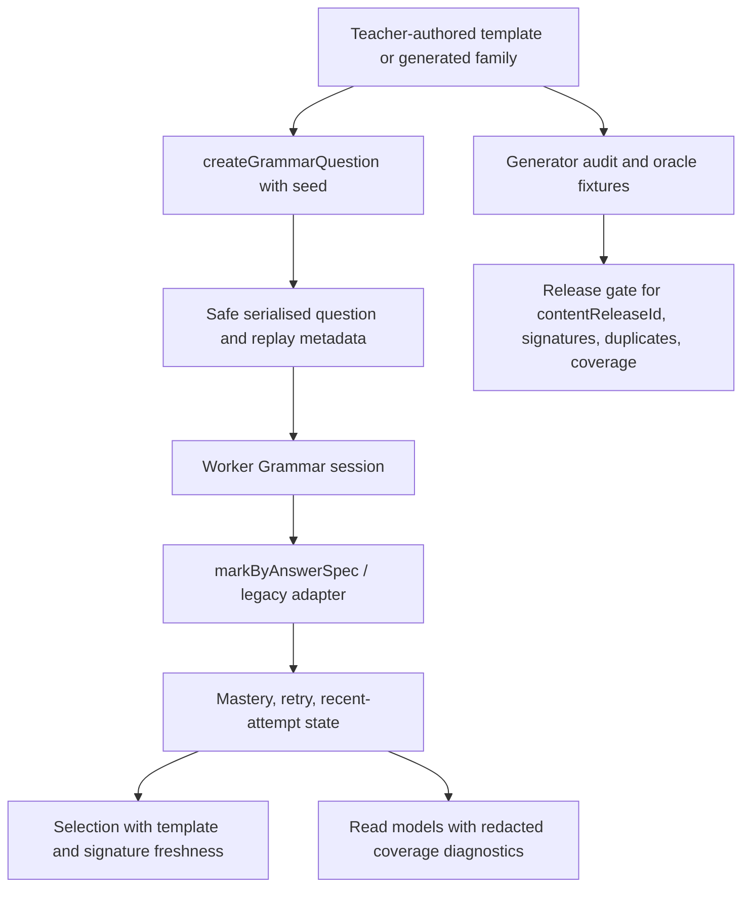

# feat: Grammar deterministic question-generator P1

## Summary

This plan turns the current Grammar question pool into a safer first-class deterministic question-generator lane: executable generator audits, typed answer contracts for new content, a focused thin-pool expansion, selector-aware variation, and release-gated oracle evidence. It extends the existing Worker-owned Grammar runtime and `answerSpec` seams rather than introducing runtime AI or a separate content system.

---

## Problem Frame

Grammar already has the core production shape requested by the origin document: Worker-owned scoring, deterministic templates, safe read models, and no AI-authored score-bearing questions. The remaining question-generator problem is quality and scale: the current pool has 51 templates across 18 concepts, but six concepts are thin-pool and several concepts have only one question type, so repeated practice can drift towards memorisation rather than durable retrieval and transfer.

P1 should therefore make the generator auditable before it makes it large. The first content expansion must prove that generated variants are unique, deterministic, answerable, release-scoped, and selector-friendly.

---

## Assumptions

*This plan was authored without synchronous scope confirmation. The items below are agent inferences that should be reviewed before implementation proceeds.*

- The referenced path `docs/plans/james/grammar/questions-generator/grammar-qg-p1.md` did not exist in this worktree, so this plan creates it as a new Grammar question-generator P1 plan.
- "Question generator" means deterministic teacher-authored generation comparable to the existing Punctuation generator direction, not AI generation at runtime.
- P1 is an implementable first slice: guardrails plus targeted thin-pool expansion, not the full long-term 280-420 item catalogue.
- The existing brainstorm at `docs/brainstorms/2026-04-24-grammar-mastery-region-requirements.md` remains the product source of truth for Grammar scope.

---

## Requirements

- R1. Preserve deterministic score-bearing Grammar questions and marking; AI remains enrichment-only. Origin trace: R2, R6, R8, F1, AE3.
- R2. Preserve the 18-concept Grammar denominator and Worker-owned production boundary while changing content through explicit release-id and oracle-fixture discipline. Origin trace: R2, R18, R19, R20.
- R3. Add executable question-generator audits that report coverage by concept, question type, selected-response / constructed-response balance, generated/fixed split, duplicate prompt/model risk, and signature uniqueness.
- R4. Lift the first thin-pool concepts with deterministic generated variants, prioritising `active_passive` and `subject_object` because they currently have a single question-type shape.
- R5. Require every new score-bearing template to declare a typed answer contract from day one, using the existing `answerSpec` kinds instead of adding new ad hoc marking closures.
- R6. Teach selection and recent-attempt handling to consider generator family or variant signatures, so repeated generated items do not masquerade as varied practice.
- R7. Keep child-facing read models free of hidden answers, accepted answers, raw validators, and generator internals while exposing safe adult/operator coverage diagnostics where useful.
- R8. Verify the expansion through deterministic unit tests, oracle fixture refresh, production-smoke contract checks, and unchanged reward/Star boundaries.

**Origin actors:** A1 KS2 learner, A2 parent or supervising adult, A3 Grammar subject engine, A4 game and reward layer, A5 platform runtime.

**Origin flows:** F1 Grammar practice without game dependency, F2 monster progress as a derived reward, F3 adult-facing evidence.

**Origin acceptance examples:** AE1 due review before secured reward progress, AE2 supported answers carry lower learning gain, AE3 score-bearing questions come from deterministic templates, AE4 adult reporting separates learning evidence from rewards.

---

## Scope Boundaries

- Do not use AI to author, mutate, or mark score-bearing Grammar questions at runtime.
- Do not introduce a Grammar content CMS or admin editing surface in P1.
- Do not build paragraph-level writing scoring or teacher-review workflow in this slice.
- Do not change Grammar monster Star semantics, reward thresholds, or reward event ownership.
- Do not make child surfaces show generator diagnostics, answer contracts, validator names, or debug metadata.
- Do not weaken English Spelling parity, shared subject routing, import/export restoration, learner switching, event publication, or deployment audit guarantees.
- Do not expand every Grammar concept to the long-term target catalogue in P1; this slice establishes the guardrails and lifts the highest-risk thin pools first.

### Deferred to Follow-Up Work

- Full 20-30 item-per-concept catalogue: later content-release phases after P1 guardrails are green.
- Rich context-pack DSL for every Grammar concept: later generator phase once signature and audit contracts exist.
- Free-text explanation/manual-review workflow: later transfer-writing or adult-review phase; P1 may keep free-text explanation out of auto-scored content.
- Admin content-management tooling: separate product decision after deterministic file-based content remains stable.

---

## Context & Research

### Relevant Code and Patterns

- `worker/src/subjects/grammar/content.js` is the current source of truth. Current counts from repo inspection: 51 templates, 31 selected-response, 20 constructed-response, 25 generated, 26 fixed, release id `grammar-legacy-reviewed-2026-04-24`.
- `worker/src/subjects/grammar/answer-spec.js` already provides the six answer-spec kinds: `exact`, `normalisedText`, `acceptedSet`, `punctuationPattern`, `multiField`, and `manualReviewOnly`.
- `worker/src/subjects/grammar/selection.js` already weights due, weak, recent miss, question-type weakness, template freshness, concept freshness, focus, and generated templates.
- `worker/src/subjects/grammar/engine.js` owns session state, response normalisation, current item replay, content release checks, and Worker-owned mutation.
- `worker/src/subjects/grammar/read-models.js` already exposes safe template-count summaries and filters current-release replay metadata before returning read models.
- `tests/grammar-engine.test.js`, `tests/grammar-selection.test.js`, `tests/grammar-learning-flow-matrix.test.js`, `tests/grammar-production-smoke.test.js`, and `scripts/grammar-production-smoke.mjs` are the main verification anchors for content, selector, learning-flow, and production-visible API behaviour.
- `docs/plans/james/grammar/grammar-content-expansion-audit.md` identifies the six thin-pool concepts: `pronouns_cohesion`, `formality`, `active_passive`, `subject_object`, `modal_verbs`, and `hyphen_ambiguity`.
- `docs/plans/james/grammar/grammar-answer-spec-audit.md` classifies every current template's target answer-spec kind and release-id impact.
- `docs/plans/james/punctuation/questions-generator/punctuation-qg-p1.md` is the closest product analogue: it recommends deterministic teacher-authored templates, generator quality guards, signature de-duplication, and scheduler variation instead of runtime AI.

### Institutional Learnings

- `docs/solutions/architecture-patterns/grammar-p5-100-star-evidence-curve-and-autonomous-sdlc-2026-04-27.md` warns that reward display must derive from learning evidence and that independent-evidence gates should be tested adversarially.
- `docs/solutions/architecture-patterns/grammar-p7-quality-trust-consolidation-and-autonomous-sdlc-2026-04-27.md` shows the value of canonical shared taxonomies, redaction contracts, deterministic fixtures, and drift guards before further expansion.
- `docs/solutions/architecture-patterns/punctuation-p7-stabilisation-contract-and-autonomous-sdlc-2026-04-28.md` reinforces the pattern of measuring and proving projection/diagnostic behaviour rather than assuming green tests prove the production path.
- Prior Grammar smoke hardening established that production contract tests must derive answers only from the production-visible option set and scan start, feedback, and summary read models for forbidden answer keys.

### External References

- No external research was used. The repo already has direct local patterns for deterministic generation, marking, selection, content-release fixtures, and production smoke testing.

---

## Key Technical Decisions

- Extend the existing Grammar content runtime rather than introducing a separate generator service: `content.js`, `answer-spec.js`, `selection.js`, and the Worker engine already define the production path that must stay deterministic and replayable.
- Formalise generator signatures before expanding volume: selector and audit tests need a stable way to distinguish genuinely different generated surfaces from repeated item ids with the same learning shape.
- Treat P1 as a content-release phase: adding templates or changing marking behaviour bumps `GRAMMAR_CONTENT_RELEASE_ID`, refreshes oracle fixtures, and updates audit docs in the same PR series.
- Add new templates with typed `answerSpec` declarations from day one: the adapter path remains for legacy templates, but new content should not increase migration debt.
- Prioritise thin-pool variety over raw item count: `active_passive` needs selected-response entry points, `subject_object` needs constructed-response or classify variety, and all six thin-pool concepts need at least one new question-type family.
- Keep read models redacted: safe coverage diagnostics may expose counts, ids, question types, and signature counts, but never accepted answers, raw validators, hidden queues, or learner typed answers beyond existing safe replay fields.
- Use characterisation-first implementation for current generator behaviour before changing templates: existing release fixtures and learning-flow tests are the safety net for a behaviour-visible content phase.

---

## Open Questions

### Resolved During Planning

- Should this be AI-based generation? No. The origin requires deterministic score-bearing questions and AI enrichment only.
- Should the plan replace Grammar's existing content architecture? No. Current Worker content, answer-spec, selector, and read-model seams are the right local patterns to extend.
- Should every concept be expanded in P1? No. P1 should first add guardrails and lift the highest-risk thin-pool concepts, then leave broad catalogue expansion to later release phases.
- Should external research shape this plan? No. Direct repo patterns are stronger and more relevant than generic generator guidance for this codebase.

### Deferred to Implementation

- Exact `GRAMMAR_CONTENT_RELEASE_ID` value for the new content release: decide during implementation so it matches the final content batch date and PR scope.
- Exact new template ids and seed fixtures: choose while editing `content.js`, ensuring no collision with existing `GRAMMAR_TEMPLATES` ids.
- Whether a small helper module should be extracted from `content.js`: only do this if it reduces real generator duplication during implementation; do not create a new abstraction for its own sake.
- Whether P1 lands as one PR or several smaller content PRs: decide from review risk and fixture churn; the plan supports either while preserving release-id/oracle discipline.

---

## High-Level Technical Design

> *This illustrates the intended approach and is directional guidance for review, not implementation specification. The implementing agent should treat it as context, not code to reproduce.*

The central contract is that generation, marking, and replay remain deterministic. The generator audit sits beside production code as a drift detector; it does not become a runtime dependency for the learner path.

---

## Implementation Units

- U1. **Generator Inventory and Audit Gate**

**Goal:** Create the executable inventory that tells the team whether Grammar generated content is varied, balanced, and safe to expand.

**Requirements:** R2, R3, R8; supports origin F1 and AE3.

**Dependencies:** None.

**Files:**
- Create: `scripts/audit-grammar-question-generator.mjs`
- Create: `tests/grammar-question-generator-audit.test.js`
- Modify: `worker/src/subjects/grammar/content.js`
- Modify: `docs/plans/james/grammar/grammar-content-expansion-audit.md`

**Approach:**
- Build the audit from exported Grammar metadata and generated serialised questions, not from duplicated hand-maintained tables.
- Report concept count, template count, generated/fixed split, question-type coverage, SR/CR balance, thin-pool concepts, duplicate prompt signatures, duplicate answer signatures, and templates missing safe generator metadata.
- Keep the initial audit strict for invariants that must never drift, and advisory for long-term catalogue targets that P1 has not yet promised.
- Update the existing content-expansion audit so the prose and executable gate agree.

**Execution note:** Add characterisation coverage before changing template content.

**Patterns to follow:**
- `tests/grammar-content-expansion-audit.test.js` for doc-gate parsing.
- `tests/grammar-engine.test.js` for oracle-count anchoring.
- `scripts/extract-grammar-legacy-oracle.mjs` for release-aware content inspection style.

**Test scenarios:**
- Happy path: the audit reads the current Grammar pool and returns 18 concepts, the current release id, and the expected template metadata without executing learner mutations.
- Happy path: a generated template with multiple seeds produces stable signatures for the same seed and distinct signatures when the visible prompt/model materially changes.
- Edge case: templates that map to multiple concepts are counted once in template totals and once per concept in concept coverage.
- Error path: duplicate template ids or duplicate generated signatures fail the audit with the affected ids named.
- Error path: a published concept with `<= 2` templates is flagged as thin-pool rather than silently passing as healthy.
- Integration: the Markdown audit doc and executable audit agree on the thin-pool concept list.

**Verification:**
- The repo has a deterministic Grammar question-generator audit that can be used as a pre-content-change safety gate.
- Existing 51-template baseline remains characterised before any expansion unit changes behaviour.

---

- U2. **Typed Generator Contract for New Content**

**Goal:** Define the safe metadata and answer-contract requirements that every new generated Grammar template must satisfy.

**Requirements:** R1, R3, R5, R7, R8; supports origin R8, F1, AE3.

**Dependencies:** U1.

**Files:**
- Modify: `worker/src/subjects/grammar/content.js`
- Modify: `worker/src/subjects/grammar/answer-spec.js`
- Modify: `tests/grammar-answer-spec.test.js`
- Modify: `tests/grammar-answer-spec-audit.test.js`
- Modify: `docs/plans/james/grammar/grammar-answer-spec-audit.md`

**Approach:**
- Add or formalise safe metadata for generated templates such as generator family, variant signature, and answer-spec presence. The exact field names are implementation details; the plan requirement is stable semantics.
- Require new P1 templates to use declarative `answerSpec` data for marking, with the existing adapter retained only for legacy templates.
- Ensure the serialised learner question and read models expose only safe replay/diagnostic fields.
- Keep `manualReviewOnly` available for future open-ended transfer work, but avoid adding auto-scored open-ended templates unless accepted variants are deterministic and tested.

**Execution note:** Implement the contract test-first so new templates cannot land without matching answer specs.

**Patterns to follow:**
- `worker/src/subjects/grammar/answer-spec.js` for `validateAnswerSpec` and kind-specific marking.
- `docs/plans/james/grammar/grammar-answer-spec-audit.md` for per-template release-id impact classification.
- `tests/grammar-production-smoke.test.js` for forbidden-answer-key expectations.

**Test scenarios:**
- Happy path: a new selected-response template declares an exact answer contract and marks only the production-visible option value as correct.
- Happy path: a new constructed-response punctuation or rewrite template declares the intended answer-spec kind and accepts the golden response.
- Edge case: `multiField` or `manualReviewOnly` specs validate safely without leaking hidden answer content into the serialised learner item.
- Error path: a new score-bearing template without an answer spec fails the contract gate.
- Error path: an unsupported answer-spec kind fails validation with the template id named.
- Integration: serialised questions and start/feedback/summary read models do not include accepted answers, raw validators, or answer-spec internals.

**Verification:**
- New P1 generated content has a typed answer contract and does not increase legacy inline-marking debt.
- Redaction tests prove the learner API remains safe.

---

- U3. **Thin-Pool P1 Template Expansion**

**Goal:** Add the first deterministic generated variants that lift the most fragile Grammar concepts beyond memorisation-prone shapes.

**Requirements:** R1, R2, R4, R5, R8; supports origin R2, R6, F1, AE3.

**Dependencies:** U1, U2.

**Files:**
- Modify: `worker/src/subjects/grammar/content.js`
- Modify: `tests/grammar-engine.test.js`
- Modify: `tests/grammar-functionality-completeness.test.js`
- Create: `tests/fixtures/grammar-legacy-oracle/grammar-qg-p1-baseline.json`
- Create: `tests/fixtures/grammar-functionality-completeness/grammar-qg-p1-baseline.json`
- Modify: `tests/helpers/grammar-legacy-oracle.js`
- Modify: `docs/plans/james/grammar/grammar-content-expansion-audit.md`
- Modify: `docs/plans/james/grammar/grammar-answer-spec-audit.md`

**Approach:**
- Add a focused P1 batch for the six thin-pool concepts:
  - `active_passive`: add at least one selected-response recognition/agent-identification variant before adding more rewrites.
  - `subject_object`: add at least one constructed-response or classify-table variant so it is not only single-choice identification.
  - `pronouns_cohesion`, `formality`, `modal_verbs`, `hyphen_ambiguity`: add at least one new question-type family each, favouring explain, identify, classify, fix, or build where deterministic marking is safe.
- Keep new content teacher-authored with deterministic slots and seeded variation; avoid broad free-form answers unless marked `manualReviewOnly`.
- Bump `GRAMMAR_CONTENT_RELEASE_ID` for the behaviour-visible content change and add a new current-release oracle fixture while preserving the frozen `legacy-baseline.json` for the old release.
- Keep old-release replay behaviour safe: current-release items should run normally, while stale item submissions should continue to fail closed through the existing release check.

**Execution note:** Land content in small reviewable batches if oracle churn becomes hard to inspect; preserve the same P1 requirements across batches.

**Patterns to follow:**
- Existing generated templates in `worker/src/subjects/grammar/content.js` tagged `generative: true`.
- `docs/plans/james/grammar/grammar-content-expansion-audit.md` new-template idea list for thin-pool concepts.
- `tests/helpers/grammar-legacy-oracle.js` and `tests/grammar-engine.test.js` for fixture replay.

**Test scenarios:**
- Happy path: each new template can generate a serialisable learner question for multiple seeds, with stable item ids and current content release id.
- Happy path: each new template marks its golden response correct and at least one plausible near miss incorrect.
- Happy path: active-passive expansion includes a selected-response path and subject-object expansion includes a non-identify or constructed-response path.
- Edge case: multi-concept templates update concept coverage without double-counting distinct template totals.
- Error path: stale-release submissions for newly generated items are rejected through the existing content-release guard.
- Integration: the old frozen oracle remains readable for the previous release, while the new current-release oracle, completeness fixtures, audit docs, and runtime exported counts all agree after the release bump.

**Verification:**
- The six thin-pool concepts have improved question-type variety, with the highest-risk two no longer locked to one interaction shape.
- The content release bump and fixture refresh make the behaviour-visible change explicit and reviewable.

---

- U4. **Selector Signature Freshness**

**Goal:** Prevent repeated generated surfaces from counting as meaningful variety simply because they have different item ids.

**Requirements:** R3, R4, R6, R8; supports origin R3, R4, R6, F1, AE1.

**Dependencies:** U1, U3.

**Files:**
- Modify: `worker/src/subjects/grammar/selection.js`
- Modify: `worker/src/subjects/grammar/engine.js`
- Modify: `worker/src/subjects/grammar/content.js`
- Modify: `tests/grammar-selection.test.js`
- Modify: `tests/grammar-engine.test.js`
- Modify: `tests/grammar-star-trust-contract.test.js`

**Approach:**
- Carry a safe generator family or variant signature into recent-attempt metadata where available.
- Update selection freshness so it can penalise recent repeats by template id and by signature/family shape.
- Preserve backwards compatibility for existing recent attempts that do not have signature metadata.
- Ensure Star evidence and varied-practice logic only treats generated variants as varied when they represent distinct templates or safe signatures, not repeated surface forms.

**Patterns to follow:**
- Existing recent-template and recent-concept indexes in `worker/src/subjects/grammar/selection.js`.
- Grammar Phase 5 Star evidence tests that guard wrong-only and repeated-template varied-practice inflation.
- Punctuation question-generator recommendation for signature-level de-duplication.

**Test scenarios:**
- Happy path: two generated attempts with different safe signatures can contribute to selector variety and avoid immediate repetition.
- Edge case: two generated attempts with the same signature but different seeds are treated as recently similar for selection penalties.
- Edge case: legacy attempts without signature metadata still participate in template-id freshness and do not throw.
- Error path: malformed signature values are ignored safely rather than poisoning the queue.
- Integration: a learner weak on a thin-pool concept still receives focused practice, but the queue broadens when only repeated generated shapes are available.

**Verification:**
- Smart Practice and Mini Test can use the expanded generator pool without over-crediting repeated generated surfaces as varied practice.
- Existing mastery and reward invariants remain unchanged except for more accurate variety evidence.

---

- U5. **Safe Coverage Diagnostics and Production Smoke Contract**

**Goal:** Make the expanded generator visible to adults/operators and production smoke tests without exposing answer banks or internal validators.

**Requirements:** R3, R7, R8; supports origin F3, AE4.

**Dependencies:** U1, U2, U3, U4.

**Files:**
- Modify: `worker/src/subjects/grammar/read-models.js`
- Modify: `scripts/grammar-production-smoke.mjs`
- Modify: `tests/grammar-production-smoke.test.js`
- Modify: `tests/react-admin-hub-grammar.test.js`
- Modify: `tests/react-parent-hub-grammar.test.js`
- Modify: `docs/full-lockdown-runtime.md`

**Approach:**
- Expose safe generator coverage diagnostics only where adult/admin/debug surfaces already carry subject health information.
- Keep child surfaces focused on practice, confidence, Stars, and next action; do not add generator-health wording to child UI.
- Harden production smoke so it checks current release id, visible option answer derivation, forbidden-key redaction, and at least one generated-template flow.
- Document the post-deploy smoke expectation because Grammar production smoke is currently a manual release gate.

**Patterns to follow:**
- Existing `contentSummary` and safe current-release replay filtering in `worker/src/subjects/grammar/read-models.js`.
- Hardened `scripts/grammar-production-smoke.mjs` pattern that derives answers from production-visible options.
- Adult/admin diagnostic split from Grammar Phase 7.

**Test scenarios:**
- Happy path: adult/admin read models include safe counts for template totals, generated templates, thin-pool warnings, and question-type coverage.
- Happy path: child dashboard/session/summary read models do not include generator diagnostics or answer contracts.
- Error path: forbidden keys such as accepted answers, validators, raw answer specs, or hidden model answers are absent from start, feedback, and summary production smoke models.
- Integration: production smoke can answer a selected-response generated item using only the visible option set.
- Integration: docs name the Grammar generator smoke as a post-deploy release check without wiring it into unrelated scripts.

**Verification:**
- Operators can see whether the generator pool is healthy without compromising child-facing answer secrecy.
- Production smoke proves the deployed API contract rather than a local hidden-answer oracle.

---

- U6. **Release Documentation and Follow-Up Backlog**

**Goal:** Leave the repo with a clear source of truth for what P1 changed and what later generator phases should do next.

**Requirements:** R2, R3, R4, R8; supports origin R15, R16, R20.

**Dependencies:** U1, U2, U3, U4, U5.

**Files:**
- Modify: `docs/plans/james/grammar/grammar-content-expansion-audit.md`
- Modify: `docs/plans/james/grammar/grammar-answer-spec-audit.md`
- Create: `docs/plans/james/grammar/questions-generator/grammar-qg-p1-completion-report.md`
- Modify: `docs/plans/james/grammar/grammar-phase7-invariants.md`
- Modify: `docs/full-lockdown-runtime.md`

**Approach:**
- Record final counts, release id, new template families, answer-spec kinds, oracle fixture paths, and smoke evidence.
- Split remaining work into explicit follow-up phases: full catalogue expansion, context-pack DSL, explanation coverage, manual-review transfer, and optional admin tooling.
- Make clear which invariants remain unchanged: deterministic scoring, AI enrichment-only, child redaction, Worker-owned mutations, and reward/Star derivation boundaries.

**Patterns to follow:**
- Existing Grammar phase completion reports under `docs/plans/james/grammar/`.
- Phase invariant docs that separate product-facing promises from implementation evidence.
- Punctuation P7 completion-report style for per-unit evidence and residual risks.

**Test scenarios:**
- Test expectation: none for the completion report itself; it is documentation. Existing doc-gate tests from U1 and U2 cover machine-checked parts of the audit docs.

**Verification:**
- A future agent can pick up the next generator phase without rediscovering P1 decisions, counts, release-id impact, and residual risks.

---

## System-Wide Impact

- **Interaction graph:** `content.js` generation feeds `engine.js` sessions, `selection.js` queues, `read-models.js` safe projections, production smoke, and reward evidence indirectly through mastery/recent-attempt state.
- **Error propagation:** malformed templates, invalid answer specs, duplicate ids, duplicate signatures, and stale release ids should fail in tests or fail closed in the Worker path, not leak as child-facing runtime ambiguity.
- **State lifecycle risks:** a content release bump changes the meaning of future attempts. Old attempt history must remain readable, while current-release submissions must use the new release id and stale submissions must be rejected.
- **API surface parity:** start, feedback, summary, bootstrap, adult/admin diagnostics, and production smoke must all preserve the same redaction boundary.
- **Integration coverage:** unit tests prove generation/marking/signatures; Worker tests prove session mutation; smoke tests prove production-visible answer derivation and forbidden-key scans.
- **Unchanged invariants:** AI does not author or mark score-bearing questions; Writing Try remains non-scored; Stars remain derived from learning evidence; child UI does not show generator internals; Spelling behaviour is untouched.

---

## Risks & Dependencies

| Risk | Mitigation |
|------|------------|
| Content-release bump invalidates assumptions baked into older fixtures | Preserve frozen legacy/Phase 4 fixtures, add new current-release oracle and completeness fixtures, and keep stale-release rejection tests. |
| New generated variants look different by id but teach the same surface pattern | Add signature audits and selector signature freshness before relying on generated volume. |
| Typed answer specs reject valid KS2 alternatives too aggressively | Require near-miss and accepted-answer tests per new template; avoid open-ended auto-marking unless deterministic equivalence is clear. |
| Production smoke false-passes by reading local hidden answers | Derive selected-response answers only from production-visible options and scan start/feedback/summary models for forbidden keys. |
| Content expansion changes reward/Star semantics by accident | Keep reward tests focused on evidence boundaries and ensure U4 only affects variety evidence where signatures prove distinct practice. |
| `content.js` grows harder to maintain | Allow small extraction only when it removes actual duplication; otherwise keep the P1 diff close to current local patterns. |

---

## Documentation / Operational Notes

- Before deployment, implementation should follow repo verification expectations: `npm test` and `npm run check`.
- After deployment, run the Grammar production smoke against `https://ks2.eugnel.uk` with the logged-in browser/session context when user-facing Grammar flows are affected.
- Use package scripts for Cloudflare operations; do not introduce raw `wrangler` commands or token-dependent deploy paths.
- Treat any content-release bump as production-sensitive because it affects replay, mastery keys, oracle fixtures, and production smoke expectations.

---

## Sources & References

- **Origin document:** [docs/brainstorms/2026-04-24-grammar-mastery-region-requirements.md](docs/brainstorms/2026-04-24-grammar-mastery-region-requirements.md)
- Related product reference: `docs/plans/james/punctuation/questions-generator/punctuation-qg-p1.md`
- Related audit: `docs/plans/james/grammar/grammar-content-expansion-audit.md`
- Related audit: `docs/plans/james/grammar/grammar-answer-spec-audit.md`
- Related code: `worker/src/subjects/grammar/content.js`
- Related code: `worker/src/subjects/grammar/answer-spec.js`
- Related code: `worker/src/subjects/grammar/selection.js`
- Related code: `worker/src/subjects/grammar/engine.js`
- Related code: `worker/src/subjects/grammar/read-models.js`
- Related tests: `tests/grammar-engine.test.js`
- Related tests: `tests/grammar-selection.test.js`
- Related tests: `tests/grammar-production-smoke.test.js`
- Institutional learning: `docs/solutions/architecture-patterns/grammar-p5-100-star-evidence-curve-and-autonomous-sdlc-2026-04-27.md`
- Institutional learning: `docs/solutions/architecture-patterns/grammar-p7-quality-trust-consolidation-and-autonomous-sdlc-2026-04-27.md`
- Institutional learning: `docs/solutions/architecture-patterns/punctuation-p7-stabilisation-contract-and-autonomous-sdlc-2026-04-28.md`
