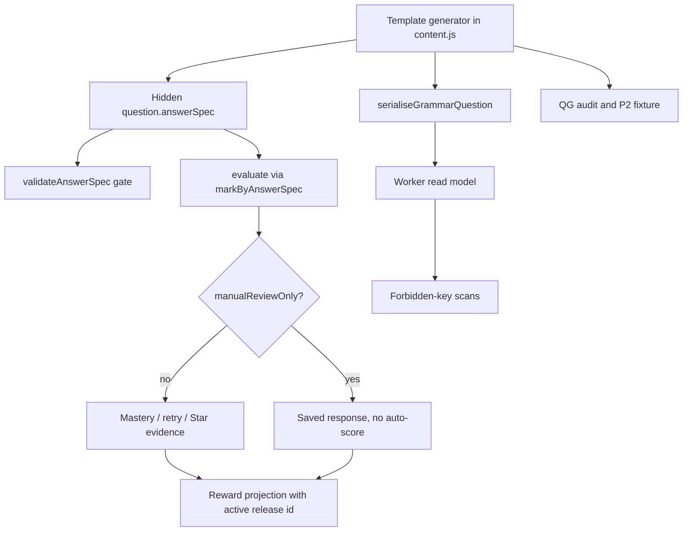
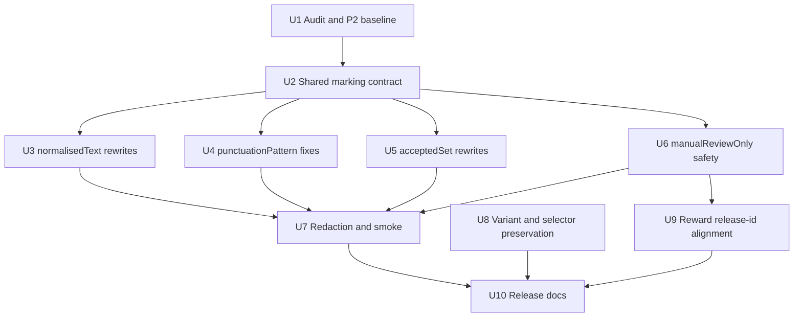

# feat: Grammar QG P2 declarative marking migration

## Summary

Grammar QG P2 migrates every legacy constructed-response Grammar template onto explicit, validated, Worker-private `answerSpec` data while preserving deterministic marking, P1's 57-template denominator, answer-safe generated variant signatures, and child-facing read-model redaction. The plan treats marking governance as the release goal: it bumps the Grammar content release, adds a separate P2 fixture, extends the executable audit, and proves that manual-review-only content cannot award mastery, Stars, or reward progress.

---

## Problem Frame

QG P1 moved Grammar from the legacy 51-template pool to a governed 57-template release with six new deterministic generated templates and typed answer specs for the new content. That release deliberately left the 20 older constructed-response templates on the migration-window adapter path: their `evaluate` closures still rely on inline accepted answers or older ad hoc marking shapes.

P2 closes that trust gap before the team expands the catalogue again. The learner-facing product should stay simple; the engineering change is that every constructed-response template has an explicit declarative marking contract that can be audited, redacted, replayed, and release-scoped.

---

## Requirements

- R1. Preserve the QG P1 denominator unless an explicit P2 release note says otherwise: 18 concepts, 57 templates, 37 selected-response templates, 20 constructed-response templates, 31 generated templates, 26 fixed templates, zero thin-pool concepts, and zero single-question-type concepts.
- R2. Bump `GRAMMAR_CONTENT_RELEASE_ID` for the constructed-response marking migration and keep the P1 fixture immutable.
- R3. Add a separate QG P2 fixture that records the shipped P2 audit state and remains distinct from the QG P1 fixture.
- R4. Require all 20 legacy constructed-response templates to declare explicit `requiresAnswerSpec`, `answerSpecKind`, and hidden emitted `answerSpec` data, unless a template is intentionally `manualReviewOnly`.
- R5. Keep all score-bearing marking deterministic and non-AI; no runtime AI question generation, explanation generation, answer-key generation, or AI marking enters the production scoring path.
- R6. Migrate the five normalised rewrite templates to `normalisedText` with parity tests for intended answers and wrong-target rejections.
- R7. Migrate the nine punctuation-surgery templates to `punctuationPattern` without making punctuation matching overly permissive.
- R8. Migrate the two finite rewrite templates to `acceptedSet` with small teacher-reviewable accepted alternatives and comma-splice / wrong-join rejections.
- R9. Mark genuinely open creative responses as `manualReviewOnly` unless they are redesigned into constrained deterministic responses in a separate reviewed content slice.
- R10. Prove `manualReviewOnly` responses can be collected and replayed without auto-scoring, mastery mutation, secure concept evidence, Star evidence, or reward progression.
- R11. Preserve child-facing redaction: no `answerSpec`, `correctResponses`, accepted answers, generator family ids, variant signatures, hidden correctness flags, or raw validators leak through start, feedback, summary, mini-test, support, AI-enrichment, adult, or admin read models.
- R12. Extend production smoke so each answer-spec family is covered from production-visible data, and the smoke keeps deriving answers from visible options or visible prompts rather than hidden local objects.
- R13. Preserve generated variant governance: stable generator family ids, answer-safe variant signatures, strict QG P1 repeated-variant failures, advisory legacy repeated-variant reporting, and selector freshness.
- R14. Verify Grammar reward and Star paths use the active P2 content release id for new concept-secured and Star-evidence events, while old release data remains readable but cannot be mistaken for current evidence.

**Origin actors:** KS2 learner, parent/adult, Grammar Worker engine, game/reward layer, release operator.

**Origin flows:** Deterministic Grammar practice, production-visible answer derivation, read-model redaction, reward projection from committed learning evidence, content release audit.

**Origin acceptance examples:** QG P1 generated items keep typed hidden answer specs; production smoke answers from visible options only; server-only Grammar keys are scanned across start, feedback, and summary models; reward progress derives from active release evidence.

---

## Scope Boundaries

- Do not add broad new Grammar skills, concepts, modes, dashboard features, reward surfaces, or child-facing generator diagnostics.
- Do not use runtime AI for score-bearing Grammar content or marking.
- Do not expose hidden marking data, accepted alternatives, variant signatures, generator family ids, or correctness flags to child-facing read models.
- Do not alter subject Stars, monster thresholds, or reward semantics except for fixing active release-id alignment where P2 evidence would otherwise use a stale id.
- Do not award mastery for creative open-response templates that cannot be deterministically marked.
- Do not replace subject scheduling or create an external scheduler.
- Do not overwrite the QG P1 baseline fixture in place.
- Do not broaden this phase into explanation coverage, full catalogue expansion, or an admin content CMS.

### Deferred to Follow-Up Work

- Explanation-template expansion for the fourteen concepts that still lack strong explain coverage: QG P3.
- Broader deterministic generated catalogue depth: later QG expansion phase after P2 marking governance is safe.
- Redesigning open creative templates into constrained score-bearing prompts: separate reviewed content-release slice if product value justifies it.
- Automating production Grammar smoke into a release pipeline: follow-up release-gate hardening; P2 keeps the smoke stronger but may remain manual.

---

## Context & Research

### Relevant Code and Patterns

- `worker/src/subjects/grammar/content.js` is the template source of truth. It currently exports `GRAMMAR_CONTENT_RELEASE_ID = 'grammar-qg-p1-2026-04-28'`, `GRAMMAR_TEMPLATE_METADATA`, generated family metadata, answer-safe variant signatures, and the migration-window adapter comments for constructed-response marking.
- `worker/src/subjects/grammar/answer-spec.js` already defines the six answer-spec kinds, `markByAnswerSpec`, and `validateAnswerSpec`. `manualReviewOnly` already returns `correct: false`, `score: 0`, and `maxScore: 0`, but engine-level no-mastery semantics still need explicit integration coverage.
- `scripts/audit-grammar-question-generator.mjs` already reports template counts, generated/fixed split, signature collisions, repeated variants, and answer-spec templates. P2 extends this audit rather than creating a second inventory script.
- `docs/plans/james/grammar/grammar-answer-spec-audit.md` classifies all 57 templates by target answer-spec kind and release-id impact. It is the per-template migration map for P2.
- `tests/grammar-answer-spec.test.js` covers the marker and validator contract for all six kinds.
- `tests/grammar-answer-spec-audit.test.js` currently gates the audit document and validates new opt-in templates. P2 should turn constructed-response coverage from planned inventory into executable migration enforcement.
- `tests/grammar-question-generator-audit.test.js`, `tests/grammar-engine.test.js`, and `tests/grammar-functionality-completeness.test.js` already pin QG P1 denominator, release fixture, answer specs, and generated signatures.
- `scripts/grammar-production-smoke.mjs` and `tests/grammar-production-smoke.test.js` are the API-contract smoke pattern. They derive selected-response answers from the production-visible option set and scan forbidden keys in multiple read-model phases.
- `worker/src/subjects/grammar/engine.js` rejects stale content release attempts, applies marking results to mastery, emits `grammar.answer-submitted`, `grammar.concept-secured`, generator family ids, variant signatures, and content release ids.
- `worker/src/subjects/grammar/commands.js`, `src/subjects/grammar/event-hooks.js`, and `src/platform/game/mastery/grammar.js` are the command/reward boundary for Star evidence and monster progress.
- `tests/helpers/forbidden-keys.mjs` is the shared forbidden-key oracle for Grammar read-model redaction.

### Institutional Learnings

- Grammar production smoke must behave like an API-contract test: answers come from production-visible data, and forbidden-key scans cover start, feedback, and summary models, not only the current item.
- Grammar Star and reward work must use production-faithful Worker state shapes. Idealised fixtures can pass while production displays zero progress or inflates progress.
- Reward state now separates secure concept analytics from Star high-water persistence. P2 must not let manual-review-only or non-scored responses emit either secure concept evidence or Star evidence.
- Content-release changes are production-sensitive: release ids, oracle fixtures, stale-attempt rejection, mastery keys, and production smoke expectations must move together.
- P1 proved that answer-safe variant signatures should not include hidden answer specs or answer ordering; P2 must preserve that split while expanding answer-spec coverage.

### External References

- No external research was used. The repo already has direct local patterns for deterministic marking, answer-spec validation, content-release fixtures, redaction, production smoke, and reward projection.

---

## Key Technical Decisions

- **Extend the existing `answerSpec` seam, not a new marking framework:** P2 should make legacy templates emit the same hidden answer-spec shape that QG P1 templates use, then keep `markByAnswerSpec` as the single marking entry point. This avoids another migration layer and lets existing validator and redaction tests become stronger gates.
- **Treat P2 as one content release with a new fixture:** All 20 constructed-response migrations change the marking contract or scoring semantics, so the release id bump and QG P2 fixture are part of the same release boundary. The QG P1 fixture stays frozen for regression comparison.
- **Use per-family migration units:** Normalised rewrites, punctuation fixes, finite accepted sets, and manual-review-only items have different failure modes. Splitting by answer-spec family keeps review focused and makes test coverage specific rather than padded.
- **Manual-review-only is an engine/reward concern, not only a marker kind:** Returning `correct: false` and `score: 0` is insufficient if the engine still increments mastery nodes, queues retries, or emits Star evidence. P2 must add explicit no-auto-score behaviour at the engine/command boundary for `manualReviewOnly`.
- **Manual-review-only needs a neutral learner presentation:** Existing feedback helpers treat `correct: false` as an incorrect answer. P2 should thread a safe non-scored/manual-review signal through the Worker result/read model so the client renders saved-for-review practice neutrally rather than telling the learner they were wrong.
- **Keep punctuation strict by default:** Quote style, dash spacing, hyphen-minus, final punctuation, and optional comma tolerance can be supported only through explicit `params` on the spec. The default must reject missing target punctuation, wrong punctuation families, and unrelated wording changes.
- **Production smoke grows by answer-spec family:** The smoke should cover at least one template each from `normalisedText`, `punctuationPattern`, `acceptedSet`, `multiField`, `exact`, and `manualReviewOnly`. For constructed-response families, the smoke must derive responses from visible prompt structure or a declared smoke fixture that mirrors production-visible input, never from hidden `answerSpec`.
- **Reward/release-id alignment is an explicit P2 gate:** New concept-secured and Star-evidence paths should prefer the event-level active release id and mastery key. Any fallback release constant remains backward-compatible only, with tests proving active P2 events do not regress to a stale release id.

---

## Open Questions

### Resolved During Planning

- **Should P2 expand Grammar content?** No. P2 keeps the 57-template denominator and focuses on marking governance.
- **Should selected-response templates migrate too?** No active selected-response migration is required in P2. The six QG P1 answer-spec templates remain covered; selected-response exact migration can stay outside this constructed-response phase unless implementation discovers a small additive parity cleanup that is clearly non-behavioural.
- **Should open creative builder templates auto-score through a permissive matcher?** No. They become `manualReviewOnly` unless separately redesigned into constrained deterministic prompts.
- **Should production smoke read hidden answer specs locally for constructed-response probes?** No. The smoke must preserve the production-visible-data principle from QG P1.
- **Should P2 introduce new reward semantics for manual-review writing practice?** No. Manual-review-only items can be collected as practice evidence but must not affect mastery, secure concepts, Stars, or reward progression in this phase.

### Deferred to Implementation

- Exact P2 release id string: choose the landing date when the migration lands.
- Exact helper names and whether `content.js` needs a small local answer-spec builder helper: only extract if it reduces real duplication across migrated templates.
- Whether punctuation `params` need quote-style or hyphen-minus tolerance immediately: decide per template from existing accepted answers and tests; do not broaden globally.
- Whether `standard_fix_sentence` stays `manualReviewOnly` or is redesigned as constrained response: default to `manualReviewOnly`; redesign needs explicit content-review justification.
- Exact smoke probe seeds: choose stable seeds during implementation so visible prompts are deterministic and representative.

---

## High-Level Technical Design

> *This illustrates the intended approach and is directional guidance for review, not implementation specification. The implementing agent should treat it as context, not code to reproduce.*

The key boundary is that `answerSpec` exists only inside Worker-private question objects and tests. Serialised learner items and subject read models must remain redacted. `manualReviewOnly` takes a separate no-auto-score path after marking so the engine can save the response without treating it as wrong mastery evidence.

---

## Implementation Units

- U1. **Audit and P2 Baseline Contract**

**Goal:** Turn the current P2 intent into executable audit output and frozen fixture structure before any template migration changes behaviour.

**Requirements:** R1, R2, R3, R4, R13

**Dependencies:** None

**Files:**
- Modify: `scripts/audit-grammar-question-generator.mjs`
- Modify: `tests/grammar-question-generator-audit.test.js`
- Modify: `tests/grammar-functionality-completeness.test.js`
- Modify: `tests/helpers/grammar-legacy-oracle.js`

**Approach:**
- Extend the audit JSON with constructed-response migration fields: answer-spec template count, constructed-response template count, constructed-response rows without explicit answer specs, legacy-adapter template count, manual-review-only template count, answer-spec kind counts, and a boolean P2 migration-complete flag.
- Keep QG P1 fixture readers intact and add P2 reader support rather than repointing the existing helper to a different file. The final P2 fixture contents land in U10 after the migration units have completed.
- Make the audit fail only when P2 is in migration-complete mode, or when a template explicitly opts in but fails validation. This lets U1 land the shape before all U3-U6 template migrations are complete.
- Add baseline tests that preserve the QG P1 denominator and assert the future P2 target: 57 total templates, 20 constructed-response templates, 26 answer-spec templates or higher if deliberately documented, and no constructed-response templates without explicit answer specs at release gate.

**Execution note:** Start with characterisation coverage for QG P1 counts before enabling the stricter P2 release gate.

**Patterns to follow:**
- `scripts/audit-grammar-question-generator.mjs` existing `buildAnswerSpecAudit` and signature audit structure.
- `tests/grammar-functionality-completeness.test.js` QG P1 baseline assertions.
- `tests/helpers/grammar-legacy-oracle.js` existing frozen-fixture helper pattern.

**Test scenarios:**
- Happy path: current QG P1 audit still reports 18 concepts, 57 templates, 37 selected-response templates, 20 constructed-response templates, 31 generated templates, 26 fixed templates, and six answer-spec templates.
- Happy path: P2 fixture reader support targets a separate baseline path without changing the QG P1 baseline path.
- Edge case: a constructed-response template marked `manualReviewOnly` counts as explicitly migrated, not missing.
- Error path: a constructed-response template that sets `requiresAnswerSpec` but emits no `answerSpec` is named in the audit failure.
- Error path: an emitted answer spec whose kind differs from `answerSpecKind` fails with template id and seed.
- Integration: strict QG P1 repeated variants still fail, while legacy repeated variants remain advisory until separately migrated.

**Verification:**
- The repo has a P2-aware audit contract before template behaviour changes.
- QG P1 fixture immutability is mechanically protected.

---

- U2. **Shared Marking Contract and Punctuation Parameters**

**Goal:** Prepare the shared marker and validation contract so all migrated template families can express their intent without per-template ad hoc logic.

**Requirements:** R4, R5, R7, R8, R9

**Dependencies:** U1

**Files:**
- Modify: `worker/src/subjects/grammar/answer-spec.js`
- Modify: `worker/src/subjects/grammar/content.js`
- Modify: `tests/grammar-answer-spec.test.js`
- Modify: `tests/grammar-answer-spec-audit.test.js`

**Approach:**
- Preserve the existing six answer-spec kinds; do not add a new kind unless implementation proves one of the 20 templates cannot be expressed safely.
- Add only the punctuation parameters that real migrated templates require, such as explicit quote-style tolerance or dash/hyphen-minus tolerance. Each parameter must be opt-in and tested with negative examples.
- Ensure `validateAnswerSpec` continues to require non-empty `golden` and explicit `nearMiss` arrays for score-bearing specs, while `manualReviewOnly` remains valid without golden answers.
- If `content.js` needs helper builders for common spec shapes, keep them local and small; prefer readability over a broad DSL.
- Add an assertion path that migrated templates evaluate through `markByAnswerSpec`, even when the result shape matches the old adapter.

**Patterns to follow:**
- `worker/src/subjects/grammar/answer-spec.js` existing marker functions and validator.
- `tests/grammar-answer-spec.test.js` exact, normalisedText, acceptedSet, punctuationPattern, multiField, manualReviewOnly coverage.
- `docs/plans/james/grammar/grammar-answer-spec-audit.md` proposed kind distribution.

**Test scenarios:**
- Happy path: `normalisedText` accepts harmless whitespace and case differences and preserves the golden answer text.
- Happy path: `acceptedSet` accepts all enumerated teacher-reviewed alternatives and rejects unlisted near misses.
- Happy path: `punctuationPattern` accepts an explicitly allowed quote or dash variant only when the spec opts in.
- Edge case: punctuation matching rejects missing target punctuation, wrong punctuation family, over-hyphenation, and unrelated wording changes by default.
- Error path: invalid spec kind, empty score-bearing golden array, missing score-bearing nearMiss array, and malformed multiField sub-specs all fail validation.
- Integration: migrated template metadata, emitted `answerSpec.kind`, and validator output agree over multiple seeds.

**Verification:**
- The shared marker is strong enough for all four P2 migration families without broadening default acceptance.
- No new score-bearing ad hoc marking path is introduced.

---

- U3. **Migrate Normalised Text Rewrites**

**Goal:** Move the five lowest-risk constructed-response rewrites to explicit `normalisedText` answer specs.

**Requirements:** R4, R5, R6, R11

**Dependencies:** U2

**Files:**
- Modify: `worker/src/subjects/grammar/content.js`
- Modify: `tests/grammar-answer-spec-audit.test.js`
- Modify: `tests/grammar-engine.test.js`
- Create or modify: `tests/grammar-answer-spec-migration-p2.test.js`

**Approach:**
- Migrate `tense_rewrite`, `active_passive_rewrite`, `proc2_standard_english_fix`, `proc2_passive_to_active`, and `proc3_apostrophe_rewrite`.
- Each template should declare `requiresAnswerSpec: true`, `answerSpecKind: 'normalisedText'`, emit hidden `answerSpec`, and evaluate through `markByAnswerSpec`.
- Keep learner copy, prompts, feedback tone, and deterministic template ids stable unless a test proves the current text is tied to an unsafe marking assumption.
- For `proc2_standard_english_fix`, do not silently accept broad paraphrases; if full-form alternatives such as contraction expansion are educationally valid, list them deliberately or defer to acceptedSet redesign.

**Patterns to follow:**
- QG P1 answer-spec templates in `worker/src/subjects/grammar/content.js`.
- `tests/grammar-engine.test.js` QG P1 answer-spec scoring test.
- `docs/plans/james/grammar/grammar-answer-spec-audit.md` normalisedText rows.

**Test scenarios:**
- Happy path: for each migrated template, the exact expected answer for a representative seed marks correct and scores full marks.
- Happy path: harmless whitespace and case variation marks correct where normalisedText is intended.
- Edge case: wrong grammar target rejects, such as simple past instead of past progressive, passive instead of active, or singular apostrophe instead of plural possession.
- Edge case: response with correct words but wrong tense or wrong possession meaning rejects.
- Error path: missing answer or malformed response remains a safe incorrect result, not a thrown runtime error.
- Integration: serialised questions, start read model, feedback read model, and summary read model do not expose `answerSpec`, golden answers, near misses, or accepted alternatives.

**Verification:**
- All five normalised rewrites are explicit answer-spec templates.
- Their migrated results preserve intended correct-answer behaviour and reject the documented wrong-target responses.

---

- U4. **Migrate Punctuation Pattern Fixes**

**Goal:** Move the nine punctuation-surgery templates to explicit `punctuationPattern` specs with strict negative coverage.

**Requirements:** R4, R5, R7, R11

**Dependencies:** U2

**Files:**
- Modify: `worker/src/subjects/grammar/content.js`
- Modify: `worker/src/subjects/grammar/answer-spec.js` if a required punctuation parameter was not already added in U2
- Modify: `tests/grammar-answer-spec.test.js`
- Modify: `tests/grammar-engine.test.js`
- Create or modify: `tests/grammar-answer-spec-migration-p2.test.js`

**Approach:**
- Migrate `fix_fronted_adverbial`, `parenthesis_fix_sentence`, `speech_punctuation_fix`, `proc_fronted_adverbial_fix`, `proc_colon_list_fix`, `proc_dash_boundary_fix`, `proc_speech_punctuation_fix`, `proc3_parenthesis_commas_fix`, and `proc3_hyphen_fix_meaning`.
- Keep `punctuationPattern` literal by default. Add opt-in tolerance only for explicitly intended variants, and keep every parameter template-local.
- Treat quote style and dash/hyphen-minus tolerance as separate questions. Accepting one must not accidentally accept missing quotes, missing dashes, or comma splices.
- Ensure punctuation-only partial-credit paths do not accidentally turn into full correctness unless the spec says so.

**Patterns to follow:**
- `markPunctuationPattern` in `worker/src/subjects/grammar/answer-spec.js`.
- Punctuation rows and near-miss examples in `docs/plans/james/grammar/grammar-answer-spec-audit.md`.
- Existing read-model forbidden-key scan from `tests/grammar-production-smoke.test.js`.

**Test scenarios:**
- Happy path: each migrated template accepts the expected punctuation-correct answer for at least one stable seed.
- Happy path: explicitly allowed quote or dash variants are accepted only on templates that opt in.
- Edge case: missing target punctuation rejects for all nine templates.
- Edge case: wrong punctuation type rejects, such as commas instead of brackets, semicolon instead of colon, comma splice instead of dash, or missing quotation marks.
- Edge case: unrelated wording changes reject even if punctuation is close.
- Error path: a spec with punctuation tolerance accidentally enabled globally is caught by a template that should reject that variant.
- Integration: mini-test review and worked-solution read models do not leak golden punctuation strings before marking.

**Verification:**
- The punctuation migration is strict enough to avoid false mastery from formatting-adjacent wrong answers.
- Each punctuation template has both positive and wrong-punctuation regression coverage.

---

- U5. **Migrate Accepted-Set Rewrites**

**Goal:** Move the two finite clause rewrite templates to explicit `acceptedSet` specs with small, teacher-reviewable alternative lists.

**Requirements:** R4, R5, R8, R11

**Dependencies:** U2

**Files:**
- Modify: `worker/src/subjects/grammar/content.js`
- Modify: `tests/grammar-answer-spec.test.js`
- Modify: `tests/grammar-engine.test.js`
- Create or modify: `tests/grammar-answer-spec-migration-p2.test.js`

**Approach:**
- Migrate `combine_clauses_rewrite` and `proc3_clause_join_rewrite`.
- Enumerate accepted alternatives explicitly per generated item; keep the list small enough for teacher review.
- Preserve partial-credit semantics only if they are intentionally part of the existing learning contract; otherwise record any narrowing as a release-id-scoped behaviour change.
- Reject common wrong joins, comma splices, ellipted-subject rewrites, coordination when subordination is targeted, and truncated responses.

**Patterns to follow:**
- Existing `acceptedSet` marker tests in `tests/grammar-answer-spec.test.js`.
- Clause rows in `docs/plans/james/grammar/grammar-answer-spec-audit.md`.
- Existing `markStringAnswer` adapter behaviour, used only as a parity reference during migration.

**Test scenarios:**
- Happy path: every accepted alternative for the representative seed marks correct and returns full marks.
- Happy path: answer ordering alternatives are accepted only when explicitly listed.
- Edge case: comma-splice answer rejects or receives only the intended non-correct partial result.
- Edge case: coordination answer rejects when the prompt targets subordination.
- Edge case: missing subject, missing comma/full stop, or truncated sentence does not mark correct.
- Integration: constructed-response item serialisation does not expose hidden accepted alternatives before marking.

**Verification:**
- Both finite rewrite templates no longer depend on inline accepted arrays.
- Accepted alternatives are visible to reviewers in code/tests but not to learners before marking.

---

- U6. **Manual-Review-Only Safety Path**

**Goal:** Convert genuinely open creative constructed-response templates into safe practice items that collect responses without granting auto-scored learning evidence.

**Requirements:** R4, R5, R9, R10, R11, R14

**Dependencies:** U2

**Files:**
- Modify: `worker/src/subjects/grammar/content.js`
- Modify: `worker/src/subjects/grammar/engine.js`
- Modify: `worker/src/subjects/grammar/read-models.js`
- Modify: `worker/src/subjects/grammar/commands.js` if Star-evidence suppression needs command-layer reinforcement
- Modify: `src/subjects/grammar/session-ui.js`
- Modify: `src/subjects/grammar/components/GrammarSessionScene.jsx`
- Modify: `tests/grammar-engine.test.js`
- Modify: `tests/grammar-rewards.test.js`
- Modify: `tests/grammar-star-persistence.test.js`
- Modify: `tests/react-grammar-surface.test.js`
- Create or modify: `tests/grammar-answer-spec-migration-p2.test.js`

**Approach:**
- Default these templates to `manualReviewOnly`: `build_noun_phrase`, `standard_fix_sentence`, `proc2_fronted_adverbial_build`, and `proc3_noun_phrase_build`.
- Make the engine distinguish manual-review-only results from ordinary wrong answers. The response may be saved and shown back after submission, but it must not update concept mastery, template mastery, question-type mastery, retry queues, misconception counts, `grammar.concept-secured`, or `grammar.star-evidence-updated`.
- Thread a redacted non-scored/manual-review marker to the client so `grammarFeedbackTone` and the session feedback panel can render the outcome as neutral saved-for-review practice instead of an incorrect answer.
- Keep the learner-facing communication clear that the item is writing/practice, not auto-marked mastery. Product copy remains UK English.
- If implementation redesigns any of the four as constrained response, document why it is deterministic and move that template into the relevant scored family with full tests.

**Patterns to follow:**
- `manualReviewOnly` result shape in `worker/src/subjects/grammar/answer-spec.js`.
- Non-scored Grammar transfer and AI enrichment boundaries from existing Grammar tests.
- `src/subjects/grammar/event-hooks.js` reward subscriber contract: only committed scoring evidence should change reward state.

**Test scenarios:**
- Happy path: manual-review-only item accepts a typed response, returns saved-for-review feedback, and can show the learner's response after submission.
- Happy path: manual-review-only feedback renders with neutral saved-for-review tone in the React Grammar session surface, not as "wrong" feedback.
- Happy path: no concept mastery node, template mastery node, question-type mastery node, retry queue, or misconception count changes after a manual-review-only response.
- Happy path: no `grammar.concept-secured`, no `grammar.star-evidence-updated`, and no `reward.monster` event is emitted.
- Edge case: an empty response still follows existing answer-required behaviour and does not create a review record.
- Edge case: repeated manual-review-only submissions do not create mastery progress by accumulation.
- Error path: malformed manual-review-only spec fails validation rather than entering auto-marking.
- Integration: command read model remains redacted while still exposing only the post-submit safe response/feedback needed by the learner.

**Verification:**
- Open creative templates are no longer false-negative auto-marked as mastery failures or false-positive auto-marked as wins.
- Manual-review-only practice cannot affect Stars, secure concepts, or reward progression.

---

- U7. **Read-Model Redaction and Production Smoke Family Coverage**

**Goal:** Prove the migrated answer specs remain Worker-private and the production smoke covers every answer-spec family without hidden-answer shortcuts.

**Requirements:** R11, R12

**Dependencies:** U3, U4, U5, U6

**Files:**
- Modify: `tests/helpers/forbidden-keys.mjs`
- Modify: `worker/src/subjects/grammar/read-models.js`
- Modify: `scripts/grammar-production-smoke.mjs`
- Modify: `tests/grammar-production-smoke.test.js`
- Modify: `tests/worker-grammar-subject-runtime.test.js`
- Modify: `docs/full-lockdown-runtime.md`

**Approach:**
- Keep the forbidden-key oracle as the single shared list for Grammar read-model scans. Add any newly discovered server-only field there first.
- Extend the production smoke template matrix to include one representative each for `normalisedText`, `punctuationPattern`, `acceptedSet`, `multiField`, `exact`, and `manualReviewOnly`.
- For selected-response probes, keep the existing visible-option derivation.
- For constructed-response probes, derive responses from production-visible prompt/input data or a fixed smoke fixture that mirrors visible prompt content. Do not read hidden `answerSpec`, accepted arrays, or local-only question internals to answer production.
- For manual-review-only, smoke should assert saved-for-review behaviour and no reward/mastery progression rather than correctness.

**Patterns to follow:**
- `scripts/grammar-production-smoke.mjs` `correctResponseFor` / `incorrectResponseFor` visible-option contract.
- `tests/grammar-production-smoke.test.js` forbidden-key phase scans.
- `tests/helpers/forbidden-keys.mjs` redaction oracle.

**Test scenarios:**
- Happy path: production smoke selected-response probe answers from visible options and still rejects option-set mismatch.
- Happy path: constructed-response smoke probes submit visible deterministic answers for normalisedText, punctuationPattern, and acceptedSet families.
- Happy path: manual-review-only smoke proves saved response and no auto-score.
- Edge case: start, feedback, summary, mini-test review, support, AI-enrichment, adult/admin diagnostics, and recent attempts are scanned for `answerSpec`, golden answers, near misses, accepted alternatives, generator family ids, variant signatures, and hidden correctness flags.
- Error path: adding a hidden field to any scanned read-model phase fails with the field path named.
- Integration: smoke summary reports which answer-spec families were covered so release operators can see family parity.

**Verification:**
- Production smoke remains an API-contract test rather than a local hidden-answer oracle.
- All migrated answer-spec families are covered by at least one production-visible flow.

---

- U8. **Generated Variant and Selector Governance Preservation**

**Goal:** Ensure P2's marking migration does not regress QG P1 variant signatures, generated family ids, selector freshness, or strict/advisory duplicate handling.

**Requirements:** R1, R13

**Dependencies:** U1

**Files:**
- Modify: `scripts/audit-grammar-question-generator.mjs`
- Modify: `tests/grammar-question-generator-audit.test.js`
- Modify: `tests/grammar-selection.test.js`
- Modify: `tests/grammar-engine.test.js`

**Approach:**
- Increase the audit seed sample for generated templates to the P2 release sample set while preserving a fast default. If a deeper release-candidate mode is added, keep it opt-in.
- Preserve the answer-safe signature rule: hidden answer specs, answer ordering, and hidden alternatives must not change visible variant signatures.
- Keep strict repeated-variant failure for QG P1 templates and advisory reporting for older legacy generated families unless P2 intentionally migrates a legacy family.
- Ensure selector freshness still penalises repeated generated structures and planned mini-pack variants.

**Patterns to follow:**
- `grammarQuestionVariantSignature` and `grammarTemplateGeneratorFamilyId` in `worker/src/subjects/grammar/content.js`.
- Existing QG P1 variant tests in `tests/grammar-question-generator-audit.test.js`.
- Existing selector freshness tests in `tests/grammar-selection.test.js`.

**Test scenarios:**
- Happy path: QG P1 generated templates have stable generator family ids over the expanded seed sample.
- Happy path: changing only option order or hidden answer-spec data does not change the visible variant signature.
- Edge case: repeated strict QG P1 variants fail the audit with template id and seeds named.
- Edge case: legacy repeated generated variants remain visible in advisory output without blocking unrelated P2 migration.
- Integration: focus sessions preserve question-type variety where possible and do not repeatedly serve the same generated structure merely because surface words changed.

**Verification:**
- P2 increases marking governance without weakening QG P1's generated-variant guarantees.

---

- U9. **Reward and Release-Id Alignment**

**Goal:** Prove that P2 content-release evidence, secure concept events, Star evidence, and reward mastery keys use the active Grammar release id and ignore manual-review-only practice.

**Requirements:** R2, R10, R14

**Dependencies:** U6

**Files:**
- Modify: `worker/src/subjects/grammar/engine.js`
- Modify: `worker/src/subjects/grammar/commands.js`
- Modify: `src/subjects/grammar/event-hooks.js`
- Modify: `src/platform/game/mastery/grammar.js`
- Modify: `tests/grammar-rewards.test.js`
- Modify: `tests/grammar-star-persistence.test.js`
- Modify: `tests/grammar-star-events.test.js`
- Modify: `tests/worker-grammar-subject-runtime.test.js`

**Approach:**
- Audit the path from `applyGrammarAttemptToState` through `grammar.concept-secured`, `grammar.star-evidence-updated`, `rewardEventsFromGrammarEvents`, `recordGrammarConceptMastery`, and `updateGrammarStarHighWater`.
- Ensure active P2 events carry `contentReleaseId` and `masteryKey` based on the active Grammar content release id.
- Keep backward-compatible reward release fallbacks only for older event shapes; new active events should not fall back to a stale constant.
- Assert manual-review-only attempts emit no secure concept event, no Star-evidence event, no reward event, and no mastery key.

**Patterns to follow:**
- `worker/src/subjects/grammar/engine.js` active release check and existing `masteryKey` shape.
- `src/subjects/grammar/event-hooks.js` existing event-level release-id preference for concept-secured.
- Grammar Phase 6 Star persistence tests around targeted high-water updates.

**Test scenarios:**
- Happy path: a scored P2 correct attempt emits `grammar.answer-submitted` and later concept-secured evidence with active P2 `contentReleaseId`.
- Happy path: `grammar.concept-secured` produces a mastery key scoped to the active P2 release id.
- Happy path: Star-evidence high-water events do not downgrade or duplicate reward state when release ids move from P1 to P2.
- Edge case: legacy P1 reward state remains readable but does not satisfy a new active P2 mastery key.
- Edge case: manual-review-only response emits no secure concept, Star evidence, mastery key, or reward event.
- Error path: event with missing or stale release id uses fallback only in backward-compatible tests, never in the active P2 scored path.
- Integration: production-shaped command response includes reward projections that agree with the active P2 content release id.

**Verification:**
- P2 release identity is consistent across content, attempts, secure concept events, Star evidence, and reward projection.
- Manual-review-only content remains outside reward progression.

---

- U10. **Release Documentation and Completion Evidence**

**Goal:** Record what P2 changed, what remained intentionally deferred, and how future phases should build on the migration.

**Requirements:** R1, R2, R3, R11, R12, R13, R14

**Dependencies:** U7, U8, U9

**Files:**
- Modify: `docs/plans/james/grammar/questions-generator/grammar-qg-p2.md`
- Create: `docs/plans/james/grammar/questions-generator/grammar-qg-p2-completion-report.md`
- Create: `tests/fixtures/grammar-legacy-oracle/grammar-qg-p2-baseline.json`
- Create: `tests/fixtures/grammar-functionality-completeness/grammar-qg-p2-baseline.json`
- Modify: `docs/plans/james/grammar/grammar-answer-spec-audit.md`
- Modify: `docs/full-lockdown-runtime.md`

**Approach:**
- Record final counts, P2 release id, migrated template ids by answer-spec family, manual-review-only decisions, fixture paths, smoke family coverage, and residual risks.
- Generate the final QG P2 oracle and functionality-completeness fixtures only after U3-U9 have established the migrated runtime and release-id behaviour.
- Update `grammar-answer-spec-audit.md` so inventory status matches landed reality rather than planned classification.
- Preserve the next-phase roadmap: P3 explanation coverage, later generated depth, and release-gate automation.
- Make clear that P2 is not a broad content expansion and does not add runtime AI or new reward mechanics.

**Patterns to follow:**
- `docs/plans/james/grammar/questions-generator/grammar-qg-p1-final-completion-report-2026-04-28.md`.
- Existing Grammar phase completion reports under `docs/plans/james/grammar/`.

**Test scenarios:**
- Test expectation: none for the prose completion report itself; machine-checked parts are covered by U1, U7, U8, and U9.

**Verification:**
- A future implementer can see the final P2 denominator, release id, migrated templates, proof points, and follow-up boundaries without rediscovering them from git history.

---

## System-Wide Impact

- **Interaction graph:** `content.js` template metadata and hidden `answerSpec` feed `answer-spec.js`, `engine.js`, `commands.js`, `read-models.js`, QG audit fixtures, production smoke, and reward projection.
- **Error propagation:** invalid specs should fail in audit/unit tests; stale content release attempts should fail closed in the Worker; hidden-key leaks should fail redaction scans with exact paths.
- **State lifecycle risks:** content release id changes alter future evidence identity. P1 and P2 fixtures must both remain readable, while active scored attempts use only the P2 release id.
- **API surface parity:** start, feedback, summary, mini-test review, support guidance, AI enrichment, recent attempts, adult/admin diagnostics, and production smoke must share the same redaction boundary.
- **Reward lifecycle:** manual-review-only responses must not be treated as wrong mastery evidence, secure concept evidence, Star evidence, or reward progress.
- **Integration coverage:** marker unit tests prove family semantics; Worker tests prove session/mutation behaviour; reward tests prove event boundaries; smoke tests prove deployed API contracts.
- **Unchanged invariants:** deterministic score-bearing Grammar, no runtime AI marking, no hidden answers in read models, QG P1 variant signature safety, English Spelling parity, and package-script deployment practice remain unchanged.

---

## Risks & Dependencies

| Risk | Mitigation |
|------|------------|
| Punctuation matcher becomes too permissive and creates false mastery. | Keep tolerance opt-in per template, add wrong-punctuation and unrelated-wording tests for every punctuation template. |
| A template emits `answerSpec` but still bypasses shared marking. | Add migration tests that exercise `evaluate` through the declared spec and validate emitted specs over multiple seeds. |
| Manual-review-only responses still mutate mastery as wrong answers. | Add engine and reward tests proving no mastery node, retry queue, secure event, Star event, or reward event changes. |
| Production smoke false-passes by using hidden local answer data. | Derive probe responses from production-visible options/prompts and keep redaction scans across all phases. |
| Release-id mismatch creates duplicate or missing reward progress. | Test active P2 content release id through attempts, concept-secured events, Star evidence, and reward mastery keys. |
| P2 grows into content expansion by accident. | Scope boundaries explicitly defer explanation coverage, generated depth, constrained redesigns, and admin tooling. |
| Fixture churn hides regressions. | Keep QG P1 fixtures immutable, add separate P2 fixtures, and require counts to reconcile across audit, runtime metadata, and completeness fixtures. |

---

## Documentation / Operational Notes

- Before deployment, implementation should follow repo verification expectations from `AGENTS.md`: full test suite and static/build checks through package scripts.
- After deployment, run the strengthened Grammar production smoke against `https://ks2.eugnel.uk` with a logged-in browser session because the change affects user-facing Grammar flows and read-model contracts.
- Do not introduce raw Wrangler deploy or remote D1 commands; normal operations should keep using the repo package scripts that route through `scripts/wrangler-oauth.mjs`.
- PR descriptions for P2 should explicitly state whether marking behaviour changed for each migrated family and how manual-review-only responses are treated.

---

## Sources & References

- **Origin document:** [docs/plans/james/grammar/questions-generator/grammar-qg-p1-final-completion-report-2026-04-28.md](docs/plans/james/grammar/questions-generator/grammar-qg-p1-final-completion-report-2026-04-28.md)
- Source plan: `docs/plans/james/grammar/questions-generator/grammar-qg-p1.md`
- Related audit: `docs/plans/james/grammar/grammar-answer-spec-audit.md`
- Related completion report: `docs/plans/james/grammar/questions-generator/grammar-qg-p1-completion-report.md`
- Related code: `worker/src/subjects/grammar/content.js`
- Related code: `worker/src/subjects/grammar/answer-spec.js`
- Related code: `scripts/audit-grammar-question-generator.mjs`
- Related code: `scripts/grammar-production-smoke.mjs`
- Related code: `worker/src/subjects/grammar/engine.js`
- Related code: `worker/src/subjects/grammar/commands.js`
- Related code: `worker/src/subjects/grammar/read-models.js`
- Related code: `src/subjects/grammar/event-hooks.js`
- Related code: `src/platform/game/mastery/grammar.js`
- Related tests: `tests/grammar-answer-spec.test.js`
- Related tests: `tests/grammar-answer-spec-audit.test.js`
- Related tests: `tests/grammar-question-generator-audit.test.js`
- Related tests: `tests/grammar-engine.test.js`
- Related tests: `tests/grammar-production-smoke.test.js`
- Related tests: `tests/grammar-rewards.test.js`
- Institutional learning: `docs/solutions/architecture-patterns/grammar-p6-star-derivation-trust-and-server-owned-persistence-2026-04-27.md`
- Institutional learning: `docs/solutions/architecture-patterns/grammar-p7-quality-trust-consolidation-and-autonomous-sdlc-2026-04-27.md`
