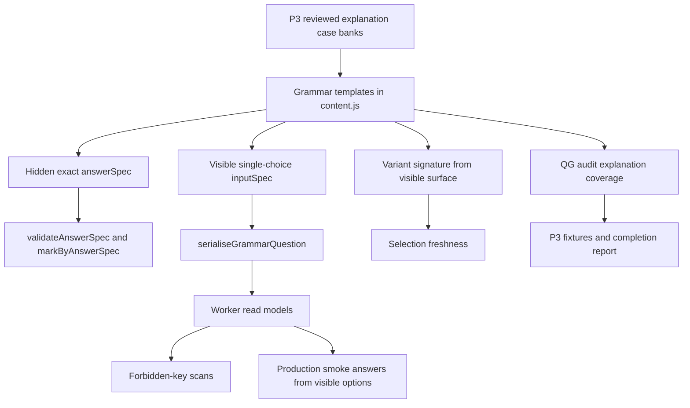
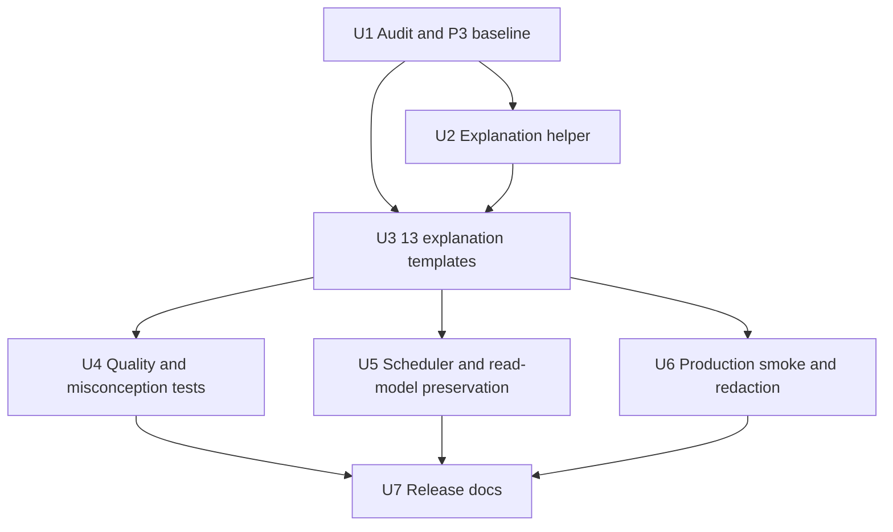

# feat: Grammar QG P3 explanation-depth expansion

## Summary

Grammar QG P3 expands deterministic explanation coverage across the Grammar question bank now that QG P1 stabilised generated-template governance and QG P2 closed the constructed-response marking migration. The implementation should add selected-response `explain` templates for the 13 concepts that still lack explanation coverage, prove those templates through the existing answer-spec, audit, fixture, selector, redaction, and production-smoke seams, and record the final release denominator.

This is a content-depth release, not another marking-refactor release. The safest shape is teacher-authored selected-response explanation questions with `answerSpecKind: 'exact'`, so learners practise grammar reasoning without the platform pretending that free-form explanation marking is deterministic.

---

## Problem Frame

QG P2 made Grammar's marking contract honest, but it did not expand catalogue depth. The next product-value gap is reasoning coverage: learners can often recognise or fix grammar features, but many concepts still lack a deterministic way to ask "why is this grammar choice correct?".

The QG P2 baseline has `explain` coverage for `adverbials`, `standard_english`, `boundary_punctuation`, `modal_verbs`, and `hyphen_ambiguity`. The remaining 13 Grammar concepts need at least one safe, reviewed explanation template so secure Grammar evidence is not dominated by recognise, choose, fix, rewrite, or classify tasks alone.

---

## Requirements

- R1. Preserve the QG P2 governance baseline unless a P3 release note explicitly records an intentional denominator change: 18 concepts, 57 starting templates, 20 constructed-response templates, zero legacy constructed-response adapters, four manual-review-only templates, zero invalid answer specs, zero missing answer specs, zero thin-pool concepts, and zero single-question-type concepts.
- R2. Add one deterministic selected-response `explain` template for each of the 13 concepts that lacks explanation coverage after QG P2.
- R3. Make the expected full P3 denominator explicit: 70 templates, 50 selected-response templates, 20 constructed-response templates, 44 generated templates, 26 fixed templates, 39 answer-spec templates, and 18/18 concepts with `explain` coverage.
- R4. Give every new P3 template `requiresAnswerSpec: true`, `answerSpecKind: 'exact'`, a hidden Worker-private `answerSpec`, a stable `generatorFamilyId`, and an answer-safe generated variant signature.
- R5. Keep score-bearing Grammar marking deterministic and non-AI; runtime AI must not generate questions, answer keys, explanations for scoring, marks, mastery evidence, Stars, or reward progress.
- R6. Preserve QG P2 manual-review-only semantics unchanged: manual-review-only attempts remain non-scored and do not mutate mastery, retries, misconceptions, Star evidence, reward progress, Parent Hub mistake counts, confidence analytics, or SATS mini-test scoring.
- R7. Keep learner-facing read models redacted: no `answerSpec`, accepted answers, golden/near-miss data, correctness flags, generated variant signatures, generator family ids, or hidden answer metadata may leak through start, feedback, summary, mini-test, support, AI-enrichment, adult, or admin-visible models.
- R8. Extend the question-generator audit so explanation coverage is visible by concept and the P3 release gate can name missing concepts, not only counts.
- R9. Add P3 fixtures alongside P1 and P2 fixtures; do not overwrite prior-release baselines.
- R10. Ensure the selected-response explanation helper, if added, reduces repetition without hiding the content meaning from review.
- R11. Add quality coverage proving P3 explanations are grammar-reasoning items, not vocabulary labels or obvious-option exercises.
- R12. Preserve smart-practice, focus-mode, mini-pack, SATS mini-test, generated freshness, and question-type weakness behaviour while increasing the `explain` pool.
- R13. Preserve production Grammar smoke as an API-contract gate that derives answers from production-visible option data rather than hidden local answer specs.
- R14. Record final counts, skipped/deferred templates if any, production-smoke status, generated-variant status, and residual risks in the P3 completion report.
- R15. Avoid client bundle growth from Worker-only content, answer-spec helpers, or hidden marking data.

---

## Scope Boundaries

- Do not add runtime AI generation, runtime answer-key generation, or AI marking.
- Do not add open free-text explanation marking unless the item is explicitly `manualReviewOnly`; this is not the default P3 route.
- Do not broaden QG P2 deterministic markers to accept vague explanations.
- Do not change Star, Mega, monster, reward, Parent Hub, or confidence semantics.
- Do not convert manual-review-only templates into score-bearing prompts in this phase.
- Do not introduce a new Grammar mode, dashboard, CMS, admin authoring surface, or client-side content editor.
- Do not expose hidden marking data, accepted answers, generated signatures, generator family ids, or correctness flags to learner-facing read models.
- Do not treat surface-variant count as the main learning denominator; reviewed template families and concept/question-type coverage remain the honest denominator.

### Deferred to Follow-Up Work

- Deterministic generator-depth and mixed-transfer expansion: QG P4 should address richer case banks, legacy repeated-variant families, and transfer tasks after P3 lands explanation breadth.
- Production-smoke automation in CI/deploy: keep P3 smoke current and documented, but automate it in a later release-gate phase.
- Redesigning manual-review-only prompts into constrained score-bearing prompts: separate content-review slice if product value justifies it.
- Open written explanation marking: separate product and technical review before any score-bearing implementation.

---

## Context & Research

### Current Verified Baseline After QG P2

| Measure | Current QG P2 state | Expected full QG P3 state |
| --- | ---: | ---: |
| Content release id | `grammar-qg-p2-2026-04-28` | `grammar-qg-p3-2026-04-28` |
| Concepts | 18 | 18 |
| Templates | 57 | 70 |
| Selected-response templates | 37 | 50 |
| Constructed-response templates | 20 | 20 |
| Generated templates | 31 | 44 |
| Fixed templates | 26 | 26 |
| Answer-spec templates | 26 | 39 |
| Constructed-response answer-spec templates | 20 / 20 | 20 / 20 |
| Legacy constructed-response adapter templates | 0 | 0 |
| Manual-review-only templates | 4 | 4 |
| Concepts with `explain` coverage | 5 / 18 | 18 / 18 |
| Thin-pool concepts | 0 | 0 |
| Single-question-type concepts | 0 | 0 |
| Invalid answer specs | 0 | 0 |
| Templates missing answer specs | 0 | 0 |

If implementation deliberately lands fewer than 13 new templates, the completion report must state why, update the denominator, and mark the release as partial rather than silently claiming full P3 coverage.

### Relevant Code and Patterns

- `worker/src/subjects/grammar/content.js` is the Grammar template source of truth. Existing `qg_modal_verb_explain` and `qg_hyphen_ambiguity_explain` show the closest selected-response explanation pattern: reviewed cases, `questionType: 'explain'`, `isSelectedResponse: true`, `generative: true`, `requiresAnswerSpec: true`, `answerSpecKind: 'exact'`, hidden `answerSpec`, deterministic option shuffle, and `markByAnswerSpec`.
- `worker/src/subjects/grammar/content.js` also owns `exactAnswerSpec`, `buildChoiceOptions`, `grammarQuestionVariantSignature`, `serialiseGrammarQuestion`, `GRAMMAR_CONTENT_RELEASE_ID`, and `GRAMMAR_TEMPLATE_METADATA`. P3 should extend these local seams rather than introduce a new content framework.
- `worker/src/subjects/grammar/answer-spec.js` defines the marker and validator contract. P3 should keep selected-response explanations on the existing `exact` path.
- `scripts/audit-grammar-question-generator.mjs` already reports inventory counts, concept coverage, generated signature collisions, repeated generated variants, answer-spec coverage, P2 migration completeness, and invalid/missing answer specs. P3 should extend this script for explanation coverage.
- `tests/grammar-question-generator-audit.test.js` pins inventory, answer-spec, and generated-signature invariants.
- `tests/grammar-functionality-completeness.test.js` pins QG P1 and QG P2 baselines and can carry the P3 fixture reader/denominator assertions.
- `tests/helpers/grammar-legacy-oracle.js` already exposes separate QG P1 and QG P2 fixture readers; P3 should add a third reader instead of repointing prior fixtures.
- `worker/src/subjects/grammar/selection.js` owns smart-practice queueing, mini-pack selection, question-type weakness, SATS filtering, manual-review exclusion, focus handling, and generated-variant freshness.
- `scripts/grammar-production-smoke.mjs` and `tests/grammar-production-smoke.test.js` are the production-visible-data smoke pattern. They derive answers from visible option sets, cover every answer-spec family, and scan forbidden keys across start, feedback, summary, mini-test, support, and AI-enrichment models.
- `tests/helpers/forbidden-keys.mjs` is the shared redaction oracle for Grammar server-only fields.

### Institutional Learnings

- Production Grammar smoke should behave like an API-contract test: derive answers from production-visible options and scan forbidden keys across start, feedback, and summary models, not only the initial current item.
- Grammar reward and Star display work is sensitive to false evidence. Manual-review-only and non-scored paths must not emit secure concept evidence, Star evidence, or reward progress.
- Tests that assert collection-wide invariants must guard against empty fixtures first; `[].every(...)` style assertions can pass with zero signal.
- Content-release changes are production-sensitive: release ids, oracle fixtures, stale-attempt handling, mastery keys, and production smoke expectations must move together.
- Generated variant signatures must stay answer-safe. Freshness should depend on visible prompt/input surface, not hidden answer specs or correctness flags.

### External References

- No external research was used. The repo already has direct patterns for deterministic Grammar templates, answer-spec validation, audit fixtures, redaction, production smoke, and selector freshness.

---

## Key Technical Decisions

- **Use selected-response explanations for P3:** P3 explanation means "choose the best grammar reason", not "write a free-form explanation that the platform marks". This satisfies reasoning practice while preserving deterministic scoring and avoiding false mastery from permissive text matching.
- **Extend the existing `exact` answer-spec path:** New explanation templates should emit hidden `exact` specs and delegate scoring to `markByAnswerSpec`. A new marker kind or local equality checker would duplicate the QG P2 governance surface and make redaction harder to audit.
- **Keep the helper local and transparent:** A small local helper in `content.js` is acceptable if it standardises exact selected-response explanation shape, but it must not become a broad DSL that hides prompt, distractor, feedback, or misconception review.
- **Make explanation coverage executable before adding content:** Add audit fields and fixture support first so P3 can prove the 5/18 to 18/18 movement and name any missing concepts during implementation.
- **Treat content quality as a testable release property:** P3 should test that explanations contain grammar reasons, distractors are unique after normalisation, and option sets have exactly one correct answer. These tests protect against shallow vocabulary quizzes.
- **Do not rebalance the scheduler unless evidence shows distortion:** The larger `explain` pool should enter the existing smart-practice and question-type weakness machinery. Weight changes are deferred unless the current selector cannot surface or diversify explanation items safely.
- **Production smoke stays visible-data only:** Even if a local regenerated question has an `answerSpec`, smoke should answer from the production-visible option set and then compare that set to the regenerated visible surface. Hidden specs remain unavailable to the answer derivation path.
- **Release documentation is part of the feature:** The P3 denominator and caveats are the evidence that this content-depth release is complete, partial, or blocked.

---

## Open Questions

### Resolved During Planning

- **Should P3 use free-text explanation marking?** No. P3 uses selected-response explanation prompts with exact answer specs. Free-text explanation marking would require a separate product and scoring review.
- **Should P3 change manual-review-only behaviour?** No. P2 manual-review-only semantics remain unchanged and protected.
- **Should P3 add a new Grammar UI mode or admin authoring surface?** No. The scope is question-generator content depth and release evidence.
- **Should P3 update P2 fixtures in place?** No. P3 adds separate fixtures so P1 and P2 remain historical baselines.
- **Should the scheduler be rewritten for explanation coverage?** No. Start by preserving the existing selector and adding focused tests around explain weakness/due behaviour; only small selector adjustments are in scope if tests reveal real distortion.
- **Should production smoke become an automated deploy gate in P3?** No. P3 keeps it current and records run status, but automation is follow-up release-gate work.

### Deferred to Implementation

- Exact P3 content release id string: choose the landing date when implementation ships.
- Exact helper name and shape: extract only if it reduces real repetition across the 13 templates without hiding content review.
- Final case-bank size per concept: target at least six reviewed cases where practical; document any hard-minimum four-case exception in the completion report.
- Whether the production smoke needs a dedicated P3 explanation probe: add it only if it increases release confidence beyond the existing `exact` family probe.
- Whether any legacy repeated generated variants remain advisory after P3: report final status rather than widening the P3 scope to fix unrelated legacy families.

---

## High-Level Technical Design

> *This illustrates the intended approach and is directional guidance for review, not implementation specification. The implementing agent should treat it as context, not code to reproduce.*

The key boundary is that the same generated question may carry hidden answer-spec data inside the Worker and visible option data in the read model. P3 must prove both sides: hidden specs are valid and used for scoring, while visible models contain enough option data for a learner and smoke test to answer without exposing answer keys.

---

## Implementation Units

- U1. **Audit and P3 Baseline Contract**

**Goal:** Make explanation coverage an executable release field before adding the P3 templates.

**Requirements:** R1, R3, R8, R9, R14

**Dependencies:** None

**Files:**
- Modify: `scripts/audit-grammar-question-generator.mjs`
- Modify: `tests/grammar-question-generator-audit.test.js`
- Modify: `tests/grammar-functionality-completeness.test.js`
- Modify: `tests/helpers/grammar-legacy-oracle.js`

**Approach:**
- Extend the audit with `explainTemplateCount`, `conceptsWithExplainCoverage`, `conceptsMissingExplainCoverage`, `explainCoverageByConcept`, and `p3ExplanationComplete`.
- Count explanation coverage per concept from `GRAMMAR_TEMPLATE_METADATA`, not from hand-maintained lists.
- Keep QG P1 and QG P2 fixture readers immutable; add or prepare P3 reader support as a separate path without requiring the final P3 fixture until the templates land in U3.
- Gate full P3 completion on 18/18 concepts with `explain` coverage, while keeping the pre-template audit state diagnostic rather than falsely release-complete.
- Keep audit output diagnostic: missing concepts should be named with concept ids and current question types.

**Execution note:** Start with characterisation coverage for the QG P2 baseline before tightening the P3 release gate.

**Patterns to follow:**
- `scripts/audit-grammar-question-generator.mjs` existing concept coverage, signature audit, and answer-spec audit structure.
- `tests/grammar-question-generator-audit.test.js` current inventory and answer-spec assertions.
- `tests/helpers/grammar-legacy-oracle.js` separate QG P1/QG P2 fixture reader pattern.

**Test scenarios:**
- Happy path: current QG P2 audit reports five concepts with `explain` coverage and names the 13 missing concepts before P3 templates are added.
- Happy path: pre-template P3 audit reports `p3ExplanationComplete: false` and keeps QG P2 denominator counts unchanged.
- Edge case: a concept with multiple `explain` templates counts once in `conceptsWithExplainCoverage` but contributes all templates to `explainTemplateCount`.
- Error path: a release-complete assertion with non-empty `conceptsMissingExplainCoverage` fails with concept ids in the assertion message.
- Integration: QG P1 and QG P2 fixture readers still return their frozen historical denominators after the P3 reader path is prepared.
- Integration: generated signature and answer-spec audit fields remain present in the same JSON object as explanation coverage.

**Verification:**
- The audit can show the before/after movement from partial explanation coverage to full concept explanation coverage.
- Prior release fixtures are still readable and unchanged.

---

- U2. **Shared P3 Explanation Template Helper**

**Goal:** Add a small, readable helper pattern for selected-response explanation templates without creating a broad DSL.

**Requirements:** R4, R7, R10, R11, R15

**Dependencies:** U1

**Files:**
- Modify: `worker/src/subjects/grammar/content.js`
- Test: `tests/grammar-answer-spec.test.js`
- Test: `tests/grammar-production-smoke.test.js`
- Modify: `tests/helpers/forbidden-keys.mjs` if the helper introduces a new hidden-key leak pattern

**Approach:**
- Keep any helper local to Grammar content and limited to exact selected-response explanation shape.
- Generate visible `inputSpec` options containing only `value` and `label`.
- Shuffle option order deterministically by seed using existing content helpers.
- Emit hidden `answerSpec` with kind `exact` and route scoring through `markByAnswerSpec`.
- Keep variant signatures answer-safe by relying on the existing visible-surface signature path.
- Avoid pushing content, answer-spec helpers, or hidden answer metadata into client bundles.

**Patterns to follow:**
- Existing `qg_modal_verb_explain` and `qg_hyphen_ambiguity_explain` template shape.
- Existing `exactAnswerSpec`, `buildChoiceOptions`, and `serialiseGrammarQuestion` behaviour in `content.js`.
- `tests/grammar-production-smoke.test.js` option-field leak checks.

**Test scenarios:**
- Happy path: a helper-built explanation question emits a Worker-private `answerSpec.kind === 'exact'` and evaluates the correct visible option as correct.
- Happy path: the serialised learner item exposes the prompt and single-choice options but omits `answerSpec`, `golden`, `nearMiss`, `correct`, `generatorFamilyId`, and `variantSignature`.
- Edge case: two seeds that produce the same case but different shuffle order have the same answer-safe variant signature.
- Error path: a helper-built option with an extra hidden field is rejected by the forbidden-key or smoke option-field test.
- Integration: helper-built templates are included in `GRAMMAR_TEMPLATE_METADATA` with `requiresAnswerSpec: true`, `answerSpecKind: 'exact'`, and stable generator family metadata.

**Verification:**
- The helper reduces repetition while leaving prompt, options, misconception, and feedback content obvious in code review.
- Hidden answer data remains Worker-private.

---

- U3. **Add the 13 P3 Explanation Templates**

**Goal:** Add one deterministic explanation template for every concept that lacks `explain` coverage after QG P2.

**Requirements:** R2, R3, R4, R5, R11, R14

**Dependencies:** U1, U2

**Files:**
- Modify: `worker/src/subjects/grammar/content.js`
- Test: `tests/grammar-question-generator-audit.test.js`
- Test: `tests/grammar-functionality-completeness.test.js`
- Test: `tests/grammar-qg-p3-explanation.test.js`
- Create: `tests/fixtures/grammar-legacy-oracle/grammar-qg-p3-baseline.json`
- Create: `tests/fixtures/grammar-functionality-completeness/grammar-qg-p3-baseline.json`

**Approach:**
- Add the 13 target templates listed in the target table below.
- Mark every new template as selected response, `questionType: 'explain'`, `generative: true`, `requiresAnswerSpec: true`, and `answerSpecKind: 'exact'`.
- Use small reviewed case banks or deterministic case generators. Target at least six reviewed cases per template where practical, with a hard minimum of four only when the grammar domain has a narrow safe pool.
- Include one correct grammar reason and at least three plausible distractors for each generated item.
- Align distractors to real misconceptions where possible, not random wrong statements.
- Keep prompt language short, concrete, and KS2-appropriate.
- Use `satsFriendly: true` only where the item genuinely matches KS2 GPS-style reasoning.

**Target templates:**

| Concept | Current QG P2 question types | Proposed P3 template id | Purpose |
| --- | --- | --- | --- |
| `sentence_functions` | `choose`, `classify`, `identify` | `qg_p3_sentence_functions_explain` | Explain why a sentence is a statement, question, command, or exclamation. |
| `word_classes` | `choose`, `identify` | `qg_p3_word_classes_explain` | Explain why an underlined word has a specific grammatical job in context. |
| `noun_phrases` | `build`, `choose` | `qg_p3_noun_phrases_explain` | Explain why a phrase is, or is not, an expanded noun phrase. |
| `clauses` | `identify`, `rewrite` | `qg_p3_clauses_explain` | Explain why a clause is subordinate or why a conjunction joins the meaning correctly. |
| `relative_clauses` | `build`, `choose`, `identify` | `qg_p3_relative_clauses_explain` | Explain how a relative clause gives information about a noun. |
| `tense_aspect` | `fill`, `rewrite` | `qg_p3_tense_aspect_explain` | Explain why a verb phrase shows tense or aspect. |
| `pronouns_cohesion` | `choose`, `identify` | `qg_p3_pronouns_cohesion_explain` | Explain why a pronoun makes cohesion clear or unclear. |
| `formality` | `choose`, `classify` | `qg_p3_formality_explain` | Explain why an option is more formal or informal in context. |
| `active_passive` | `choose`, `rewrite` | `qg_p3_active_passive_explain` | Explain why a sentence is active or passive and what has been foregrounded. |
| `subject_object` | `classify`, `identify` | `qg_p3_subject_object_explain` | Explain why a noun phrase is the subject or object of the verb. |
| `parenthesis_commas` | `choose`, `fix` | `qg_p3_parenthesis_commas_explain` | Explain why commas, brackets, or dashes mark parenthesis. |
| `speech_punctuation` | `fix`, `identify` | `qg_p3_speech_punctuation_explain` | Explain why punctuation belongs inside or outside direct speech marks. |
| `apostrophes_possession` | `choose`, `rewrite` | `qg_p3_apostrophe_possession_explain` | Explain singular and plural possession using apostrophe placement. |

Naming may be adjusted during implementation, but concept coverage and question-type intent should not drift without an explicit release note.

**Patterns to follow:**
- Existing selected-response exact templates in `content.js`.
- Existing generated case-bank style in `qg_modal_verb_explain`, `qg_hyphen_ambiguity_explain`, and adjacent QG P1 generated templates.
- Existing answer-safe variant signature path.

**Test scenarios:**
- Happy path: every target concept has at least one template whose metadata includes `questionType: 'explain'`.
- Happy path: every new P3 template produces valid `exact` answer specs across representative seeds.
- Happy path: every new P3 option set has exactly one correct option and at least three incorrect options.
- Happy path: full P3 audit reports 18/18 concepts with `explain` coverage, 70 templates, 50 selected-response templates, 44 generated templates, and 39 answer-spec templates.
- Edge case: option labels remain unique after punctuation, case, and whitespace normalisation.
- Edge case: case-bank selection across seeds does not depend on runtime AI, wall-clock time, or external state.
- Error path: a new template with `requiresAnswerSpec: true` but no emitted `answerSpec` fails with template id and seed.
- Error path: a new template whose answer spec kind differs from `answerSpecKind` fails validation.
- Integration: P3 fixture readers return the full P3 denominator while QG P1 and QG P2 fixture readers remain unchanged.

**Verification:**
- All 13 target concepts gain deterministic explanation coverage.
- The final template denominator matches the P3 target or the completion report explicitly explains any partial denominator.

---

- U4. **Explanation Quality and Misconception Tests**

**Goal:** Prevent explanation templates from becoming weak vocabulary quizzes or easy longest-option guesses.

**Requirements:** R5, R11, R14

**Dependencies:** U3

**Files:**
- Test: `tests/grammar-qg-p3-explanation.test.js`
- Test: `tests/grammar-question-generator-audit.test.js`
- Modify: `tests/helpers/forbidden-keys.mjs` if quality coverage discovers a new server-only field that must be globally forbidden

**Approach:**
- Add content-quality tests that sample every new P3 template.
- Check at least one correct response and one wrong response per new template.
- Assert that correct explanations name the grammar feature or relationship being tested rather than restating only the label.
- Assert that distractors are unique after normalisation and include misconception-aligned wrong reasons where the concept has natural misconceptions.
- Check `feedbackLong` or solution copy teaches the grammar reason after marking without leaking the answer before marking.
- Add non-empty guards before collection-wide assertions so tests cannot pass vacuously.

**Patterns to follow:**
- `tests/grammar-answer-spec.test.js` marker-level positive and negative coverage.
- `tests/grammar-production-smoke.test.js` visible-option correctness and forbidden-key checks.
- `docs/solutions/best-practices/p3-stability-capacity-multi-learner-patterns-2026-04-27.md` guidance on non-empty guards for collection assertions.

**Test scenarios:**
- Happy path: a correct response for each P3 template returns `correct: true`, score 1, and teaching feedback.
- Happy path: a wrong response for each P3 template returns `correct: false`, score 0, and a misconception where one is declared.
- Edge case: every sampled option set has exactly four or more visible options and no duplicate normalised labels.
- Edge case: correct explanations include grammar-reason language appropriate to the concept, such as role, clause relation, ownership number, subject/object relation, or punctuation function.
- Error path: an option set with only labels such as "it sounds better" or with no grammar relationship is flagged by the quality oracle.
- Error path: an empty sampled-template list fails before any `.every()` or aggregate quality assertion can pass.
- Integration: quality tests run against generated questions rather than static metadata only.

**Verification:**
- P3 content is reviewable as teaching content, not only as answerable multiple choice.
- A learner cannot reliably pass P3 by choosing the longest or most technical-looking option.

---

- U5. **Scheduler and Read-Model Preservation**

**Goal:** Add explanation depth without distorting smart practice, SATS mini-tests, generated freshness, or read-model redaction.

**Requirements:** R6, R7, R12, R15

**Dependencies:** U3

**Files:**
- Modify: `worker/src/subjects/grammar/selection.js`
- Test: `tests/grammar-selection.test.js`
- Test: `tests/grammar-engine.test.js`
- Modify: `worker/src/subjects/grammar/read-models.js`
- Test: `tests/grammar-ui-model.test.js`

**Approach:**
- Preserve current selector behaviour unless focused tests show that the expanded `explain` pool cannot appear or over-dominates.
- Keep question-type weakness able to boost `explain` when explanation practice is weak or due.
- Keep focus-mode and mini-pack selection stable after the pool grows.
- Preserve SATS mini-test exclusion of manual-review-only templates.
- Keep generated variant freshness tied to answer-safe visible signatures.
- Avoid adding answer-spec or generator metadata to learner-facing read models or analytics.

**Patterns to follow:**
- `worker/src/subjects/grammar/selection.js` `questionTypeWeakness`, `variantFreshTemplates`, `focusAwarePool`, and SATS filtering.
- `tests/grammar-selection.test.js` existing question-type weakness and generated freshness tests.
- `tests/grammar-engine.test.js` read-model redaction and attempt metadata boundary tests.

**Test scenarios:**
- Happy path: smart practice can select a P3 explain template when `questionTypes.explain` is weak.
- Happy path: smart practice can still select non-explain templates when other concepts or question types are weaker.
- Edge case: a focused concept with only a small number of templates still broadens correctly to fill a queue without losing the focus bias.
- Edge case: generated variant freshness penalises repeated visible variants for P3 templates without storing hidden answers in read models.
- Error path: SATS mini-test selection still excludes manual-review-only templates after the selected-response pool grows.
- Error path: learner-facing analytics do not expose `variantSignature`, `generatorFamilyId`, `answerSpec`, or hidden correctness metadata for P3 attempts.
- Integration: mini-pack question-type quota continues to diversify question types rather than collapsing into explain-only practice.

**Verification:**
- P3 explanation items surface naturally without creating an explanation-only queue.
- Existing manual-review-only and redaction invariants remain unchanged.

---

- U6. **Production Smoke and Redaction Safety**

**Goal:** Keep the QG P2 production-visible-data discipline intact after adding more selected-response explanation templates.

**Requirements:** R5, R7, R13, R15

**Dependencies:** U3

**Files:**
- Modify: `scripts/grammar-production-smoke.mjs`
- Test: `tests/grammar-production-smoke.test.js`
- Modify: `tests/helpers/forbidden-keys.mjs` if P3 exposes a new category of server-only Grammar metadata

**Approach:**
- Preserve the existing answer-spec family probes for `exact`, `multiField`, `normalisedText`, `punctuationPattern`, `acceptedSet`, and `manualReviewOnly`.
- Add a P3 explanation probe only if it improves confidence beyond the existing exact-family explanation probe.
- Keep smoke answer derivation based on production-visible options or visible prompt structure.
- Continue comparing visible production option sets to regenerated visible option sets before choosing an answer.
- Scan forbidden keys across start, feedback, summary, mini-test, support, AI-enrichment, adult, and admin-visible models where applicable.

**Patterns to follow:**
- `scripts/grammar-production-smoke.mjs` `correctResponseFor`, `incorrectResponseFor`, `visibleResponseForAnswerSpecFamily`, and `assertNoForbiddenGrammarReadModelKeys`.
- `tests/grammar-production-smoke.test.js` option-set mismatch and extra-option-field rejection tests.
- `tests/helpers/forbidden-keys.mjs` shared forbidden-key lists.

**Test scenarios:**
- Happy path: a P3 explanation item can be answered correctly using only visible option values from the read model.
- Happy path: an incorrect visible option can be selected for repair-path coverage without hidden answer data.
- Edge case: shuffled visible options still match the regenerated visible surface exactly for the chosen seed.
- Error path: a production item whose visible option set differs from the regenerated visible surface fails before an answer is derived.
- Error path: an option carrying `correct`, `answerSpec`, `golden`, or another hidden field fails the smoke test.
- Integration: forbidden-key scans continue to cover start, feedback, summary, mini-test, support, and AI-enrichment models after P3 templates are added.

**Verification:**
- Production smoke still proves selected-response explanation questions are answerable from production-visible data only.
- No P3 content leaks hidden answer metadata.

---

- U7. **Release Docs and Operational Handoff**

**Goal:** Produce a clear P3 completion report recording the shipped denominator, evidence, and residual risks.

**Requirements:** R1, R3, R8, R9, R13, R14

**Dependencies:** U4, U5, U6

**Files:**
- Modify: `docs/plans/james/grammar/questions-generator/grammar-qg-p3.md`
- Create: `docs/plans/james/grammar/questions-generator/grammar-qg-p3-completion-report.md`
- Create: `docs/plans/james/grammar/questions-generator/grammar-qg-p3-final-completion-report-YYYY-MM-DD.md`
- Modify: `docs/full-lockdown-runtime.md` if the production-smoke release checklist needs a P3-specific note
- Modify: `docs/grammar-functionality-completeness.md` if the manual Grammar smoke gate wording changes

**Approach:**
- Record final release id, PR, merge commit, template counts, selected/constructed split, generated/fixed split, answer-spec counts, explain coverage, missing concepts, invalid specs, and repeated-variant status.
- Record whether P3 shipped full 13-template coverage or a documented partial slice.
- Record production-smoke status and whether it was run after deployment.
- Record bundle-budget impact if any client assets changed.
- Keep the report honest about the denominator: reviewed template families and concept/question-type coverage, not theoretical generated surface variants.

**Patterns to follow:**
- `docs/plans/james/grammar/questions-generator/grammar-qg-p2-final-completion-report-2026-04-28.md` final completion report structure.
- QG P1/P2 plan and fixture naming conventions.
- Existing release-note language that distinguishes operational smoke from automated deploy gates.

**Test scenarios:**
- Happy path: completion report states 18/18 concepts with explanation coverage when the full target ships.
- Happy path: completion report includes final audit counts and answer-spec kind distribution.
- Edge case: if fewer than 13 templates ship, report marks P3 as partial and lists skipped concepts with reasons.
- Error path: report does not claim production smoke passed unless post-deploy smoke actually ran.
- Integration: release docs reference the P3 fixtures and active content release id consistently.

**Verification:**
- A reviewer can tell whether P3 is complete, partial, or blocked without rerunning the full audit.
- Operational handoff preserves the manual production-smoke gate and any caveats.

---

## Content Authoring Guidance

Each new P3 explanation template should include:

- A visible prompt that asks for the best grammar reason, not merely the correct answer.
- One correct explanation that names the grammar feature and explains the relevant relationship.
- At least three plausible distractors.
- Distractors mapped to real misconceptions where possible.
- Concise `feedbackLong` or solution copy that teaches the correct grammar reason after marking.
- A stable `generatorFamilyId`.
- A stable, answer-safe generated variant signature.
- `satsFriendly: true` only when the item genuinely matches KS2 GPS-style reasoning.
- `requiresAnswerSpec: true` and `answerSpecKind: 'exact'`.
- A hidden `answerSpec` emitted by the generated question object.
- No hidden answer data in the serialised learner item.

Concept-specific guidance:

- `sentence_functions`: separate grammar function from final punctuation alone; include reported questions and commands where punctuation is not the only clue.
- `word_classes`: use short contexts where the same-looking word can have different jobs; avoid obscure terminology.
- `noun_phrases`: test noun-centred structure, not any long string.
- `clauses`: test dependence, meaning, and subordinate/main clause contrast.
- `relative_clauses`: test attachment to a noun using `who`, `which`, `that`, `where`, or `whose`.
- `tense_aspect`: test verb form, not time-word guessing.
- `pronouns_cohesion`: test clarity of reference and ambiguity, not blanket pronoun replacement.
- `formality`: test suitability for formal written Standard English without treating dialect as wrong.
- `active_passive`: test doer/receiver roles and foregrounding, not past tense.
- `subject_object`: test relationship to the verb, including fronted adverbials and expanded noun phrases.
- `parenthesis_commas`: test removable extra information and distinguish parenthesis punctuation from list or fronted-adverbial commas.
- `speech_punctuation`: use the existing house style for direct speech and test where spoken words begin/end.
- `apostrophes_possession`: test owner number and apostrophe position; avoid mixing contractions unless the question explicitly contrasts them.

---

## System-Wide Impact

- **Interaction graph:** P3 touches content generation, metadata, audit fixtures, selection, Worker serialization, production smoke, and release documentation. It should not require client UI changes except where safe content statistics are already displayed.
- **Error propagation:** Invalid P3 answer specs should fail audit/tests by template id and seed. Production smoke option mismatch should fail before deriving an answer. Redaction failures should identify the read-model path.
- **State lifecycle risks:** Content release id changes can strand stale active sessions if the engine expects current-release attempts. Implementation should follow the existing QG P2 stale-release handling pattern if a release id bump affects active sessions.
- **API surface parity:** Start, feedback, summary, mini-test, support, AI-enrichment, adult, and admin-visible read models must preserve the same forbidden-key boundary.
- **Integration coverage:** Unit tests prove content and marker correctness; audit fixtures prove release denominator; selector tests prove practice behaviour; production smoke proves production-visible answerability and redaction.
- **Unchanged invariants:** Runtime AI remains non-scoring, manual-review-only remains non-scored, SATS mini-tests exclude manual-review-only templates, reward/Star semantics do not change, and generated signatures remain answer-safe.

---

## Risks & Dependencies

| Risk | Mitigation |
| --- | --- |
| Explanation distractors are too obvious, creating false depth. | Add quality tests and manual content review for correct explanations, distractor uniqueness, and misconception alignment. |
| Selected-response explanations are still guessable. | Use varied case banks, plausible distractors, and later consider constrained written explanations as a separate phase. |
| Audit passes on empty or stale sampled collections. | Add non-empty guards and fixture reader assertions before aggregate quality checks. |
| New helper hides content meaning from review. | Keep helper local and narrow; leave prompt, option, misconception, and feedback content visible at template sites. |
| More `explain` templates distort scheduler behaviour. | Add targeted selector tests for explain weakness/due behaviour and mini-pack diversity before changing weights. |
| Hidden answer data leaks through a new selected-response path. | Reuse `serialiseGrammarQuestion`, extend forbidden-key scans, and keep production smoke option-field strictness. |
| P3 fixture overwrites P2 evidence. | Add P3 fixture paths and helper readers; assert P1/P2 baselines remain frozen. |
| Production smoke remains manual. | Keep smoke current, document run status in the final report, and defer automation to release-gate hardening. |
| Bundle budget regresses from accidental client import of content helpers. | Keep P3 implementation Worker-side and run bundle audit before release sign-off. |
| Completion report overclaims generated variant breadth. | Report reviewed template families, concept/question-type coverage, and repeated-variant status separately. |

---

## Documentation / Operational Notes

- The final report should be the source of truth for whether P3 shipped full 13-template coverage or a partial slice.
- Production Grammar smoke remains an operational release gate unless a separate release-process slice wires it into CI or deploy automation.
- The implementation should record post-deploy smoke status after deployment when this change affects production-visible Grammar flows.
- Any content-release id bump must be reflected consistently in audit fixtures, docs, and stale-session handling evidence.

---

## Alternative Approaches Considered

- **Open free-text explanation scoring:** Rejected for P3. It would create false confidence unless the platform gained a reviewed deterministic rubric or explicit manual-review-only flow.
- **Broad new explanation DSL:** Rejected for now. The first P3 goal is reviewed content coverage; a broad DSL would hide content review and expand scope.
- **Scheduler weight redesign before content lands:** Deferred. Existing question-type weakness and freshness mechanisms should be tested first; redesign only if P3 evidence shows distortion.
- **Client-visible content diagnostics dashboard:** Deferred. Audit and completion reports are enough for this release; a dashboard/admin surface would be a separate product slice.
- **Production-smoke automation in P3:** Deferred. P3 keeps smoke current and visible-data-safe, while automation belongs to release-gate hardening.

---

## Success Metrics

- All 18 Grammar concepts have `explain` coverage in the audit.
- All 13 new P3 templates emit valid exact answer specs across representative seeds.
- No P3 template leaks hidden answer metadata into learner-facing read models.
- Smart practice can select explanation items without collapsing into explanation-only practice.
- Production smoke remains visible-data based and redaction safe.
- The completion report clearly states final denominator, evidence, caveats, and post-deploy smoke status.

---

## Sources & References

- **Origin document:** [docs/plans/james/grammar/questions-generator/grammar-qg-p2-final-completion-report-2026-04-28.md](docs/plans/james/grammar/questions-generator/grammar-qg-p2-final-completion-report-2026-04-28.md)
- Previous plan: [docs/plans/james/grammar/questions-generator/grammar-qg-p2.md](docs/plans/james/grammar/questions-generator/grammar-qg-p2.md)
- Related code: [worker/src/subjects/grammar/content.js](worker/src/subjects/grammar/content.js)
- Related code: [worker/src/subjects/grammar/answer-spec.js](worker/src/subjects/grammar/answer-spec.js)
- Related code: [worker/src/subjects/grammar/selection.js](worker/src/subjects/grammar/selection.js)
- Related audit: [scripts/audit-grammar-question-generator.mjs](scripts/audit-grammar-question-generator.mjs)
- Related smoke: [scripts/grammar-production-smoke.mjs](scripts/grammar-production-smoke.mjs)
- Related tests: [tests/grammar-question-generator-audit.test.js](tests/grammar-question-generator-audit.test.js)
- Related tests: [tests/grammar-functionality-completeness.test.js](tests/grammar-functionality-completeness.test.js)
- Related tests: [tests/grammar-production-smoke.test.js](tests/grammar-production-smoke.test.js)
- Institutional learning: [docs/solutions/architecture-patterns/grammar-p5-100-star-evidence-curve-and-autonomous-sdlc-2026-04-27.md](docs/solutions/architecture-patterns/grammar-p5-100-star-evidence-curve-and-autonomous-sdlc-2026-04-27.md)
- Institutional learning: [docs/solutions/architecture-patterns/grammar-p6-star-derivation-trust-and-server-owned-persistence-2026-04-27.md](docs/solutions/architecture-patterns/grammar-p6-star-derivation-trust-and-server-owned-persistence-2026-04-27.md)
- Institutional learning: [docs/solutions/architecture-patterns/grammar-p7-quality-trust-consolidation-and-autonomous-sdlc-2026-04-27.md](docs/solutions/architecture-patterns/grammar-p7-quality-trust-consolidation-and-autonomous-sdlc-2026-04-27.md)
- Institutional learning: [docs/solutions/best-practices/p3-stability-capacity-multi-learner-patterns-2026-04-27.md](docs/solutions/best-practices/p3-stability-capacity-multi-learner-patterns-2026-04-27.md)
