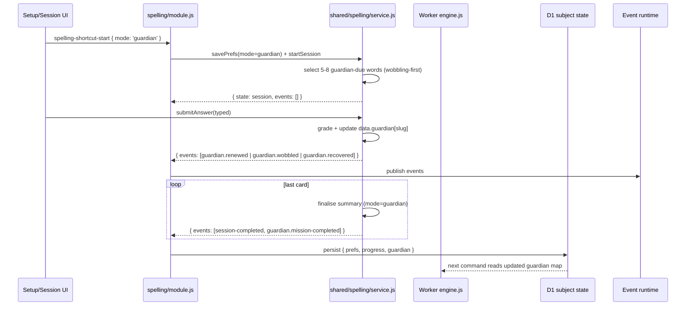
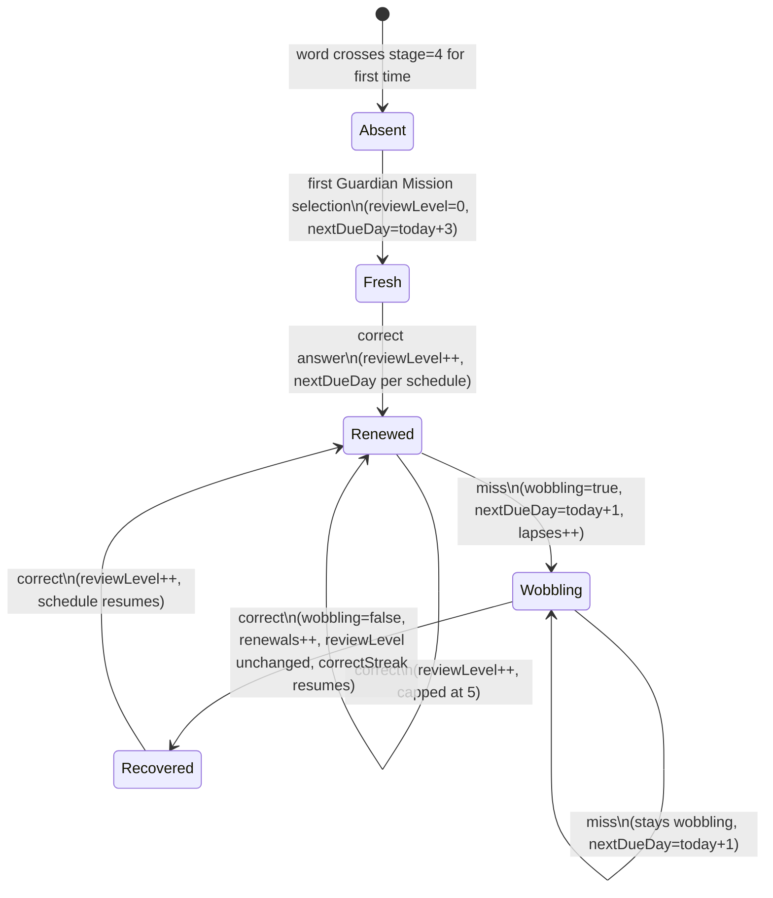

# feat: Post-Mega Spelling Guardian MVP

## Overview

Once a learner has **all core-pool spelling words secure** (legacy "Mega" = `stage >= 4`), the current app still shows Smart Review with a "you still have words to learn" framing — which feels hollow. This plan introduces the **Spelling Guardian** layer: a parallel, long-term maintenance sub-object on each secured word, a new `guardian` session mode, a post-Mega setup dashboard, matching summary and Word Bank surfaces, and four new `spelling.guardian.*` domain events.

The core invariant, carried verbatim from the origin brainstorm, is: **Mega is never revoked.** A secured word can become "wobbling" (needs review soon) via a Guardian mechanic, but `stage >= 4` and the resulting Codex monster state remain permanent. This separates *competence preservation* (legacy SRS) from *long-term maintenance* (Guardian), and it unblocks future Pattern Quests / Boss Dictation / Story Missions work without further state-shape churn.

This is **MVP-only**. Pattern Quests, Boss Dictation, Word Detective, Story Missions, Seasonal expeditions, and Teach-the-Monster mode are explicitly deferred to later plans (`post-mega-spelling-p2+`).

---

## Problem Frame

When `progressSnapshot.secureWords === progressSnapshot.totalPublishedWords` for the core pool, the learner has finished the statutory KS2 spelling list. The setup scene still shows Smart Review / Trouble Drill / SATs Test cards with the regular "due" / "weak" framing, and the summary scene still tells them how many words "landed" out of the current round. Neither surface acknowledges that they have nothing *new* to learn.

The brainstorm document established the product intent clearly: reframe this state as **graduation into a Guardian role**, where the daily job becomes protecting a Word Vault, and mistakes produce a transient "wobbling" state rather than demotion. Learners get 5-8 words per day of spaced-retrieval practice on words they already know, without the app contradicting the Mega badge it just awarded.

Science rationale carried from origin: retrieval practice (Learning Scientists) + desirable difficulties (Bjork) + autonomy/competence/relatedness (SDT) + KS2 National Curriculum morphology focus. See `docs/plans/james/post-mega-spelling/post-mega-spelling-p1.md` for the full rationale.

---

## Requirements Trace

- R1. When a learner has all core-pool words secure, the Spelling setup scene shows a **post-Mega dashboard** with Guardian Mission as the primary action (plus disabled/placeholder cards for Boss Dictation, Word Detective, Story Challenge to preview the later P2+ roadmap). (See origin: "Phase 5: update the UI")
- R2. A new read-model selector `getSpellingPostMasteryState` exposes `allWordsMega`, `guardianDueCount`, `wobblingCount`, `recommendedWords`, `nextGuardianDueDay` — computed from the current `data.progress` + `data.guardian` maps, never replayed from events. (See origin: "Phase 1")
- R3. Each secured word has a **sibling `guardian` record** alongside its `progress` record, with schedule fields: `reviewLevel` (0-5), `lastReviewedDay`, `nextDueDay`, `correctStreak`, `lapses`, `renewals`, `wobbling`. Guardian records are created lazily the first time a word crosses into `stage >= 4`. (See origin: "Phase 2")
- R4. A new spelling mode `guardian` is available in `SPELLING_MODES`. Round selection prioritises wobbling-due → oldest-due → small random long-not-seen Mega word. Round size is 5-8 words (10-12 when boss mission lands in P2). (See origin: "Phase 3")
- R5. Four new domain events are emitted by the spelling service: `spelling.guardian.renewed`, `spelling.guardian.wobbled`, `spelling.guardian.recovered`, `spelling.guardian.mission-completed`. Guardian events travel through the existing platform runtime and are available to reward subscribers without coupling the spelling service to reward code. (See origin: "Phase 4")
- R6. The spelling summary scene shows Guardian-specific cards when the completed round had `mode === 'guardian'`: words renewed, words wobbling, next Guardian check (relative day). Regular-mode summaries are unchanged. (See origin: "Phase 5")
- R7. The Word Bank gains four new filter IDs: `guardianDue`, `wobbling`, `renewedRecently`, `neverRenewed`. Existing filters (`all` / `due` / `weak` / `learning` / `secure` / `unseen`) remain behaviourally unchanged. (See origin: "Phase 6")
- R8. Guardian scheduling is: first success → due in **3 days**, then 7 → 14 → 30 → 60 → 90 days. A miss marks `wobbling: true` and sets `nextDueDay = todayDay() + 1`; a second consecutive miss keeps wobbling and returns in 1 day. Guardian never mutates `progress.stage` or `progress.dueDay`. (See origin: "Phase 2")
- R9. Guardian Mission is a **regular** (non-practiceOnly) session: it emits `SPELLING_EVENT_TYPES.SESSION_COMPLETED` for streak/analytics parity, *and* emits `spelling.guardian.mission-completed` with Guardian-specific metadata. (Resolved during planning — see Open Questions.)
- R10. A new keyboard shortcut **Alt+4** starts a Guardian Mission when `allWordsMega === true` (gated). Alt+1/2/3 continue to map to smart/trouble/test. (Resolved during planning — see Open Questions.)

**Origin actors:** no A-IDs in origin; implied actors — `Learner` (post-Mega KS2 child), `Parent/Teacher` (reads summaries/codex), `Reward Subscriber` (monster system, toast overlay).
**Origin flows:** no F-IDs in origin; implied flows — `F1` Setup → Guardian Mission → Summary (the new MVP loop); `F2` Word Bank → Guardian-filtered browse.
**Origin acceptance examples:** no AE-IDs in origin. AE-style assertions are inline in R1–R10 above; test scenarios in each implementation unit are finer-grained.

---

## Scope Boundaries

- Pattern Quest metadata, pattern registry, Pattern Mastery badges — deferred to `post-mega-spelling-p2`.
- Boss Dictation mode (short one-shot 8-12 word challenges) — P2. (Card shell with disabled state ships in MVP so the post-Mega dashboard communicates the full roadmap.)
- Word Detective missions ("what went wrong?" misspelling analysis) — P3.
- Use-It / Story Missions (spelling → writing transfer) — P3.
- Teach-the-Monster mode — P3+.
- Seasonal expedition cosmetics (Space / Dragon / Ancient Egypt wrappers) — P3+.
- Extra-pool graduation: this MVP defines `allWordsMega` strictly against the **core** pool. Extra-pool completion does not itself trigger Guardian.
- New reward monsters or reward system changes — monster evolution stays driven by `WORD_SECURED` only. Guardian events do not catch, evolve, or mega-tier any monster in MVP; a dedicated Guardian reward subscriber can ship in P2 if we want renewal-specific toasts.
- No changes to `REPO_SCHEMA_VERSION` (that is platform-generic). This work bumps `SPELLING_SERVICE_STATE_VERSION` and `SPELLING_CONTENT_MODEL_VERSION` stays the same (content data unchanged).
- No dictation audio changes. No TTS provider changes.

### Deferred to Follow-Up Work

- Guardian-specific reward subscriber (renewal toasts, wobbling recovery celebration): `post-mega-spelling-p2` — low-risk additive work, easier to design once the events are live and we have real learner telemetry.
- Worker-side Guardian-selection tests against D1 repository (integration-scope): `post-mega-spelling-p2` — MVP covers the in-memory service path comprehensively; end-to-end D1 behaviour already has parity tests that extend naturally once Guardian ships.

---

## Context & Research

### Relevant Code and Patterns

- `src/subjects/spelling/service-contract.js` — `SPELLING_SERVICE_STATE_VERSION`, `SPELLING_MODES`, `createInitialSpellingState`, normaliser suite. Guardian adds `'guardian'` to `SPELLING_MODES`, bumps `SPELLING_SERVICE_STATE_VERSION` from 1 to 2.
- `src/subjects/spelling/events.js` — `SPELLING_EVENT_TYPES` registry + event-factory pattern (`createSpellingRetryClearedEvent`, etc.). New guardian factories mirror this exactly, including `spellingPool` + `wordFields` enrichment and the `eventId(type, parts)` dedupe key convention.
- `src/subjects/spelling/event-hooks.js` — reward-subscriber pattern. Guardian events pass through untouched in MVP (no reward reaction).
- `src/subjects/spelling/read-model.js` — `buildSpellingLearnerReadModel` already computes `progressSnapshot.totalPublishedWords` + `secureWords`. `allWordsMega` is a pure derived boolean on top of this. The new selector extends the same read-model output shape rather than creating a parallel module.
- `src/subjects/spelling/repository.js` — subject-state record shape `{ prefs, progress }` under `data`. Guardian adds a sibling `guardian` map: `{ prefs, progress, guardian }`.
- `src/subjects/spelling/module.js` — `handleAction` routing. New action `spelling-shortcut-start` already supports arbitrary modes; `WORD_BANK_FILTER_IDS` guard in the status-filter handler (line 188-198) is the single place to add new filter IDs.
- `src/subjects/spelling/components/spelling-view-model.js` — `MODE_CARDS`, `WORD_BANK_FILTER_IDS`, `wordBankFilterMatchesStatus`, `wordBankAggregateStats`, `summaryModeLabel`. Guardian cards, filter predicates, and summary labels land here.
- `src/subjects/spelling/components/SpellingSetupScene.jsx` — current mode-card rendering. Post-Mega dashboard branch lives here, gated by `allWordsMega` from the read-model.
- `src/subjects/spelling/components/SpellingSummaryScene.jsx` — post-session card layout. Guardian extra cards append to the existing grid when `summary.mode === 'guardian'`.
- `src/subjects/spelling/components/SpellingWordBankScene.jsx` — Word Bank UI; reads `spellingAnalyticsStatusFilter` from `transientUi`. New filter chips added alongside existing ones.
- `shared/spelling/service.js` (wrapped as `createSpellingService`) — canonical service that both the browser and Worker use. This is where Guardian selection, scheduling, and event emission must live so both runtimes stay in sync.
- `shared/spelling/legacy-engine.js` — legacy port: `STAGE_INTERVALS = [0,1,3,7,14,30,60]`, `SECURE_STAGE = 4`, `MODES` registry (line 48), `filteredWords(yearFilter)`, `scoreForSmart`, `todayDay()`. Guardian mirrors the `todayDay()` arithmetic and the lazy-backfill pattern at load time (lines 188-200).
- `worker/src/subjects/spelling/engine.js` — `createServerSpellingEngine` wraps `createSpellingService` with Worker persistence. Guardian logic rides through untouched because it lives in `shared/spelling/service.js`. `normaliseServerSpellingData` is the single place Worker-side normalisation of the new `guardian` sub-object must land.
- `worker/src/subjects/spelling/commands.js` — Worker command handler. Guardian does not add new commands; `start-session` already forwards arbitrary `mode` through `startOptionsFromPayload`.
- `tests/spelling.test.js` — canonical service-test harness, including `continueUntilSummary(service, learnerId, state, answer)` helper and `makeSeededRandom(seed)`. Guardian unit tests follow this pattern.
- `tests/spelling-parity.test.js` — legacy-vs-rebuild parity guard. Guardian must not regress any assertion in this file.

### Institutional Learnings

- `docs/spelling-service.md` — Public contract (e.g., resume-safe `initState`, single-attempt invariant for test mode, single-attempt-per-word in test mode). Guardian respects these.
- `docs/state-integrity.md` — Subject-level normalisation owns its own `data` contract. Guardian backfill lives in the spelling service, not in the platform repository layer. "Prefer replacing malformed state with a smaller valid shape over trying to preserve every broken field" → if a persisted `guardian[slug]` fails to normalise, reset that entry to a fresh default, keep other slugs intact, do not crash.
- `docs/events.md` — "Subject decides, reward reacts." Guardian events are emitted by the spelling service only. Reward reactions are deferred to P2 (see Deferred to Follow-Up Work) — in MVP, guardian events are first-class but no subscriber consumes them beyond `eventLog` persistence.
- `docs/mutation-policy.md` — The Worker is authoritative. `start-session` with `mode: 'guardian'` is a normal learner-scoped subject command. Idempotency receipts + compare-and-swap apply unchanged. Replayed commands must not double-count renewals or re-emit guardian events — the engine is pure with respect to input state, so idempotency falls out naturally.
- `docs/plans/2026-04-22-002-feat-spelling-extra-expansion-plan.md` — Most recent precedent for adding a first-class field to spelling state (`spellingPool`) with backward-compatible reads and version-safe normalisation. Guardian mirrors its shape: add fields via `normaliseServerSpellingData` on the Worker side + `service-contract.js` normaliser on the client side, bump the version, back-fill missing fields on `initState` load.
- `docs/spelling-parity.md` — Listed behaviours that previously regressed (hidden-family on live card, auto-advance timing, confirm-before-end, Alt+1/2/3 shortcut set, SATs core-only). Guardian keeps all of these. Alt+4 is additive; it does not remap Alt+1/2/3.

### External References

- No external research needed for MVP. The brainstorm document cites peer-reviewed sources (Learning Scientists on retrieval practice, Bjork on desirable difficulties, SDT on autonomy/competence/relatedness, KS2 National Curriculum spelling appendix) and the product decisions (3/7/14/30/60/90 schedule, 5-8 words/day, Mega-never-revoked invariant) all follow from those. No fresh external research needed to land MVP.

---

## Key Technical Decisions

- **Guardian data shape is a sibling map, not a per-word field extension.** `subjectStateRecord.data = { prefs, progress, guardian }`. Rationale: keeps the `progress` record shape 100% unchanged (zero risk to legacy SRS, zero churn to dashboards that read `progress.stage`), makes Guardian state trivially removable if we ever need to roll back, and makes it easy to normalise or reset a subset of guardian entries without touching progress.
- **Day arithmetic uses integer `dueDay` / `lastReviewedDay`**, not ISO strings. Rationale: consistent with `legacy-engine.js:86` (`dueDay: todayDay()`) and `read-model.js:30` (`todayDay()` helper). The origin brainstorm used ISO timestamps informally — we translate to integer days on the way in. `dueLabel(progress)` in `spelling-view-model.js:283-295` already formats integer-day deltas; the Guardian label function reuses this shape.
- **State version bumps from 1 to 2.** `createInitialSpellingState` remains unchanged (top-level session shape is stable); the bump is a marker for `initState` to trigger the back-fill of `data.guardian = {}` on load for learners whose persisted state still has no guardian map.
- **Guardian creation is lazy.** A guardian record is not created when a word first crosses `stage = 4`; it is created on demand the first time the word is selected for a Guardian Mission round (at which point its very first due-day is "today"). Rationale: no retroactive migration needed for learners who are already Mega on existing words — their guardian records appear naturally as they begin using the new mode.
- **`allWordsMega` is defined against the core pool only.** Formally: `allWordsMega = coreProgressSnapshot.secureWords === coreProgressSnapshot.totalPublishedWords`. Rationale: "Mega" is a KS2-statutory concept; Extra pool is enrichment and shouldn't block graduation. (User-confirmed during planning.)
- **Guardian schedule: 3 → 7 → 14 → 30 → 60 → 90 days**, capped at reviewLevel 5. A miss sets `wobbling = true` and `nextDueDay = todayDay() + 1`, resets `correctStreak = 0`, increments `lapses`. A correct review on a wobbling word clears `wobbling = false`, increments `correctStreak` (and `renewals` once per lifetime clear), and **resumes the existing `reviewLevel`** (does not advance). First *successful* non-wobbling review bumps `reviewLevel` by 1. Rationale: prevents one-miss from erasing all spaced-practice history, matches origin spec, preserves Mega emotionally. (User-confirmed during planning.)
- **Guardian Mission is a non-practice-only session.** It emits both `SPELLING_EVENT_TYPES.SESSION_COMPLETED` (for streak parity and existing analytics) *and* the new `SPELLING_EVENT_TYPES.GUARDIAN_MISSION_COMPLETED`. Rationale: we want Guardian rounds to count for "practice streak" telemetry so kids don't feel their Guardian sessions are "worthless" compared to Smart Review. (User-confirmed during planning.)
- **Alt+4 is the Guardian shortcut**, gated on `allWordsMega`. Rationale: additive; no regression to the Alt+1/2/3 parity contract. (User-confirmed during planning.)
- **Guardian does not touch reward/codex state in MVP.** The existing `rewardEventsFromSpellingEvents` subscriber only handles `WORD_SECURED`; guardian events flow through the runtime but produce no reward reaction. Rationale: keeps blast radius small, honours "subject decides, reward reacts", lets us design the right reward vocabulary for renewal/wobbling in P2 with real telemetry in hand.

---

## Open Questions

### Resolved During Planning

- **What is the canonical pool for "Mega"?** → core pool only (Years 3-4 + Years 5-6 statutory). Extra pool does not block.
- **Which schedule: origin 3/7/14/30/60/90 or legacy-SRS continuation 7/14/30/60/90?** → origin 3/7/14/30/60/90, starting fresh at reviewLevel 0 = due-in-3-days on first Guardian interaction.
- **Practice-only or regular session?** → regular; emits both `SESSION_COMPLETED` and `GUARDIAN_MISSION_COMPLETED`.
- **Keyboard shortcut?** → additive Alt+4, gated on `allWordsMega`.

### Deferred to Implementation

- **Exact `MODE_CARDS` copy for disabled Boss Dictation / Word Detective / Story Challenge placeholders** — we want empathetic microcopy, and the right words will emerge during UI implementation once the card shells are rendered. Placeholder text is fine for plan; not worth a planning-time decision.
- **Exact selection weights for "oldest-due → small random long-not-seen" tie-breaking** — the selection function is small and self-contained; best tuned against real test data in the unit-test pass rather than pre-specified here.
- **Whether the post-Mega dashboard should auto-select the Guardian card** on first render vs requiring an explicit click — UX judgment call, easier to decide after the first render is in a browser.

---

## Output Structure

    docs/plans/james/post-mega-spelling/
    ├── post-mega-spelling-p1.md                 # origin brainstorm (unchanged)
    └── 2026-04-25-003-feat-post-mega-spelling-mvp-plan.md  # this plan

    src/subjects/spelling/
    ├── service-contract.js                      # MODIFIED: add 'guardian' to SPELLING_MODES, bump version, add normaliseGuardianMap + normaliseGuardianRecord
    ├── events.js                                # MODIFIED: add 4 guardian event types + 4 factories
    ├── read-model.js                            # MODIFIED: add getSpellingPostMasteryState + extend buildSpellingLearnerReadModel output
    └── components/
        ├── spelling-view-model.js               # MODIFIED: MODE_CARDS append guardian + disabled placeholders; WORD_BANK_FILTER_IDS += 4; new predicates + labels
        ├── SpellingSetupScene.jsx               # MODIFIED: post-Mega dashboard branch when allWordsMega
        ├── SpellingSummaryScene.jsx             # MODIFIED: guardian-mode summary cards
        └── SpellingWordBankScene.jsx            # MODIFIED: new filter chips

    shared/spelling/
    └── service.js                               # MODIFIED: guardian selection + scheduler + event emission wired into startSession/submitAnswer/continueSession

    worker/src/subjects/spelling/
    └── engine.js                                # MODIFIED: normaliseServerSpellingData tolerates + persists data.guardian

    tests/
    ├── spelling-guardian.test.js                # NEW: Guardian service + scheduler + event unit tests
    ├── spelling-view-model.test.js              # MODIFIED: new filter/label tests
    └── spelling.test.js                         # MODIFIED: a couple of Guardian-path regression assertions

---

## High-Level Technical Design

> *This illustrates the intended approach and is directional guidance for review, not implementation specification. The implementing agent should treat it as context, not code to reproduce.*

### Data flow: a single Guardian round end-to-end



### Guardian record lifecycle



**Note:** `progress.stage` and `progress.dueDay` are never written by any Guardian transition. The legacy SRS loop and the Guardian loop are independent scheduling systems over the same vocabulary of slugs.

### Guardian record shape

```txt
data.guardian[slug] = {
  reviewLevel: 0..5,           // index into [3, 7, 14, 30, 60, 90]
  lastReviewedDay: number|null,// integer day (Math.floor(ts/DAY_MS))
  nextDueDay: number,          // integer day; <= todayDay means due
  correctStreak: number,       // consecutive non-wobbling successes
  lapses: number,              // lifetime miss count
  renewals: number,            // lifetime wobbling->recovered count
  wobbling: boolean,
}
```

---

## Implementation Units

- U1. **Extend service contract: SPELLING_MODES, state version, guardian normalisers**

**Goal:** Land the type-level + normalisation surface changes that every subsequent unit relies on. Nothing in this unit changes runtime behaviour yet.

**Requirements:** R3, R8 (partial — shape only, scheduler in U3)

**Dependencies:** None (first unit)

**Files:**
- Modify: `src/subjects/spelling/service-contract.js`
- Modify: `worker/src/subjects/spelling/engine.js` (just the `normaliseServerSpellingData` helper)
- Test: `tests/spelling-guardian.test.js` (new file — contract + normaliser tests only in this unit)

**Approach:**
- Append `'guardian'` to `SPELLING_MODES` via a new frozen const; re-freeze.
- Bump `SPELLING_SERVICE_STATE_VERSION` from `1` to `2`.
- Add `normaliseGuardianRecord(rawValue)` that produces the canonical shape from any input, defaulting all missing fields, and returning `null` if the input is garbage.
- Add `normaliseGuardianMap(rawValue)` that maps-and-filters across slugs; silently drops entries that normalise to `null`; preserves slugs whose records normalise cleanly.
- Export both from `service-contract.js`.
- In `worker/src/subjects/spelling/engine.js::normaliseServerSpellingData`, add `guardian: normaliseGuardianMap(raw.guardian)` to the returned shape.

**Patterns to follow:**
- `normaliseNonNegativeInteger`, `normaliseBoolean`, `normaliseOptionalString` in the same file — same defensive style.
- `normaliseServerSpellingData` in `worker/src/subjects/spelling/engine.js:33-39` — the paired client/Worker normalisation pattern.

**Test scenarios:**
- Happy path: `normaliseGuardianRecord({reviewLevel: 2, lastReviewedDay: 18000, nextDueDay: 18014, correctStreak: 3, lapses: 1, renewals: 0, wobbling: false})` returns a clean record.
- Edge case: empty input `normaliseGuardianRecord({})` returns default `{reviewLevel: 0, lastReviewedDay: null, nextDueDay: <todayDay>, correctStreak: 0, lapses: 0, renewals: 0, wobbling: false}`.
- Edge case: `reviewLevel > 5` clamps to `5`; negative values clamp to `0`.
- Edge case: `wobbling: "yes"` coerces to `false` (only `true`/`false` valid).
- Error path: `normaliseGuardianRecord(null)` returns a default record, not `null` (because callers guard at the map level).
- Error path: `normaliseGuardianRecord("garbage")` returns a default record.
- Integration: `normaliseGuardianMap({a: {...valid}, b: null, c: {...garbage}, "": {...valid}})` returns `{a: <normalised>, c: <normalised-defaults>}` — empty-string slugs dropped, `null` dropped.
- Integration: `SPELLING_MODES.includes('guardian')` is true. Old consumers calling `normaliseMode('guardian')` return `'guardian'` (not the fallback).
- Integration: `SPELLING_SERVICE_STATE_VERSION === 2`.
- Integration: Worker `normaliseServerSpellingData({prefs: {...}, progress: {...}})` (no `guardian` key) returns an object with `guardian: {}` — back-fill works for legacy records.

**Verification:**
- `SPELLING_MODES` length increments by exactly 1; no existing IDs renamed.
- No existing consumer of `SPELLING_SERVICE_STATE_VERSION` crashes (grep for usages, confirm only normaliser/initState read it).
- `normaliseServerSpellingData` round-trips any legacy input to a shape with `guardian: {}`.

---

- U2. **Add 4 guardian domain events and factories**

**Goal:** Event vocabulary that the scheduler (U3) and UI (U5/U6) will reference.

**Requirements:** R5

**Dependencies:** U1 (needs new state version so event createdAt is comparable across runs — soft dependency only, can run in parallel but sequencing simplifies review)

**Files:**
- Modify: `src/subjects/spelling/events.js`
- Test: `tests/spelling-guardian.test.js` (extend the file from U1)

**Approach:**
- Add 4 entries to `SPELLING_EVENT_TYPES`:
  - `GUARDIAN_RENEWED: 'spelling.guardian.renewed'`
  - `GUARDIAN_WOBBLED: 'spelling.guardian.wobbled'`
  - `GUARDIAN_RECOVERED: 'spelling.guardian.recovered'`
  - `GUARDIAN_MISSION_COMPLETED: 'spelling.guardian.mission-completed'`
- Add 4 factory functions mirroring `createSpellingWordSecuredEvent`. Each enriches with `wordFields(slug, wordMeta)` + `baseSpellingEvent` (session, learnerId, createdAt, dedupe id parts).
- Mission-completed factory does not carry a slug — its id parts are `[learnerId, sessionId]` + a `renewalCount` / `wobbledCount` payload.

**Patterns to follow:**
- `createSpellingWordSecuredEvent` in `events.js:63-76` — same factory signature, same null-return-on-missing-word.
- `createSpellingSessionCompletedEvent` in `events.js:93-105` — session-level event shape.

**Test scenarios:**
- Happy path: each factory returns a well-formed event with `type`, `subjectId: 'spelling'`, `learnerId`, `sessionId`, `mode: 'guardian'`, `createdAt`, `wordSlug`, `word`, `family`, `yearBand`, `spellingPool`.
- Edge case: missing `slug` returns `null` (parity with `createSpellingWordSecuredEvent`).
- Edge case: unknown slug (not in `WORD_BY_SLUG`) returns `null`.
- Edge case: `createdAt = -1` falls back to `Date.now()` (via `safeTimestamp`).
- Integration: event ids are deterministic and de-duplicable — `createSpellingGuardianRenewedEvent({...sameInputs})` produces the same `id` twice.
- Integration: `SPELLING_EVENT_TYPES` now has exactly 4 new entries; all 8 entries have unique values.

**Verification:**
- `SPELLING_EVENT_TYPES` count increases by 4, no key collisions.
- All 4 factories return `null` on missing slug/word, matching existing convention.

---

- U3. **Guardian selection + scheduler in shared service**

**Goal:** Pure logic that picks the 5-8 words for a Guardian round and updates a guardian record after each answer. Events are emitted by this unit (service-level); no UI surfaces or reward subscribers are wired here — those come in U5/U6 and are explicitly deferred to `post-mega-spelling-p2+` respectively.

**Requirements:** R3, R4, R8

**Dependencies:** U1

**Files:**
- Modify: `shared/spelling/service.js` — add Guardian helpers and wire into `startSession` / answer-grading path
- Test: `tests/spelling-guardian.test.js` (extend)

**Approach:**
- Introduce a module-local `GUARDIAN_INTERVALS = [3, 7, 14, 30, 60, 90]` (frozen array). `reviewLevel` indexes into this.
- `selectGuardianWords({guardianMap, progressMap, wordBySlug, todayDay, length, random})` picks words according to: wobbling-due → oldest-due non-wobbling → small random "long-not-seen" Mega word that has no guardian record yet (this is how lazy creation starts). Deterministic tie-breaking by slug alphabetical.
- `advanceGuardianOnCorrect(record, todayDay)` — if `wobbling`, clear wobbling and bump `renewals`; else bump `reviewLevel` (capped at 5) and `correctStreak`; set `lastReviewedDay = todayDay`, `nextDueDay = todayDay + GUARDIAN_INTERVALS[nextLevel]`.
- `advanceGuardianOnWrong(record, todayDay)` — set `wobbling: true`, `lapses++`, `correctStreak = 0`, `lastReviewedDay = todayDay`, `nextDueDay = todayDay + 1`. `reviewLevel` unchanged.
- `ensureGuardianRecord(guardianMap, slug, todayDay)` — idempotent lazy-create when a word is first selected; returns the record.
- `startSession` gains a branch: when `mode === 'guardian'`, route to `selectGuardianWords` instead of the legacy selection, using the length option (default 8, clamped 5-8 in MVP; hard error for `mode === 'guardian'` when `allWordsMega === false` — fall back to dashboard with `feedback: {kind: 'warn', headline: 'Guardian Mission unlocks after every core word is secure'}`).
- Grading path: when `session.mode === 'guardian'`, after the legacy grade runs, apply `advance*` to the guardian record instead of mutating `progress`. Emit the appropriate `GUARDIAN_*` event. (`progress.correct` / `progress.wrong` / `progress.attempts` are still updated — we want the Word Bank accuracy stats to reflect live recall, including in Guardian rounds.)

**Execution note:** Write the selection/scheduler pure functions test-first. Wiring into `startSession` + grading can come after, but not before each pure helper has assertions.

**Technical design:** *(optional — keep high-level, implementation details left to the agent)*

Selection order:
1. Wobbling + due (`wobbling === true && nextDueDay <= todayDay`), oldest-due first.
2. Non-wobbling + due, oldest-due first.
3. If slots remain: small random sample from Mega words with no guardian record yet (lazy-create).
4. If still under min length (5), top up from longest-since-lastReviewedDay non-due guardians.

**Patterns to follow:**
- `scoreForSmart` + `selectWordsForSmartMode` in `legacy-engine.js` — similar "pure function over progressMap" shape (no side effects; callers wire into session state).
- `todayDay()` usage in `legacy-engine.js:77`, `read-model.js:30` — same integer-day arithmetic.
- `isTroubleProgress` in `read-model.js:40` — short pure predicate style.

**Test scenarios:**
- Happy path: 10 wobbling-due + 20 non-wobbling-due words → selection of length 8 returns all wobbling first, then 2 oldest non-wobbling.
- Happy path: `advanceGuardianOnCorrect({reviewLevel: 0, ..., wobbling: false}, 18000)` → `reviewLevel: 1`, `nextDueDay: 18003`, `correctStreak: 1`.
- Edge case: `advanceGuardianOnCorrect` at `reviewLevel: 5` stays at 5; `nextDueDay = todayDay + 90`.
- Edge case: `advanceGuardianOnCorrect` on a wobbling record clears wobbling, bumps `renewals`, **does not** bump `reviewLevel`, sets `nextDueDay = lastReviewedDay + GUARDIAN_INTERVALS[reviewLevel]`.
- Edge case: `advanceGuardianOnWrong` sets wobbling + `nextDueDay = today + 1`; second consecutive wrong stays wobbling, `nextDueDay = today + 1` again.
- Edge case: `selectGuardianWords` with `length = 5` never returns more than 5; with no due words and no lazy-create candidates, returns an empty array.
- Edge case: `ensureGuardianRecord` called twice with the same slug returns the identical record (no double-initialisation).
- Error path: `startSession({mode: 'guardian'})` when `allWordsMega === false` returns a transition with `ok: false` (or feedback state) and no session.
- Error path: `startSession({mode: 'guardian'})` with zero secure words returns empty-session feedback, doesn't crash.
- Integration: a full Guardian round (5 words, all correct) with `continueUntilSummary` emits exactly 5 `GUARDIAN_RENEWED` events + 1 `GUARDIAN_MISSION_COMPLETED` + 1 `SESSION_COMPLETED`, in the right order.
- Integration: a mixed round (3 correct, 2 wrong, 1 of the wrong was already wobbling from prior session) emits 3× `RENEWED`, 1× `WOBBLED` (new wobbling), 1× `WOBBLED` (still wobbling — still emits because it's the contract for "answered wrong during Guardian"), **and** 0× `RECOVERED` (no wobbling cleared).
- Integration: replaying the same Guardian round command (same requestId, same state) does not double-advance guardian records (Worker idempotency path — drop-in via `docs/mutation-policy.md`).
- Covers AE for R8: "first success → due in 3 days" — assertion on `nextDueDay - todayDay === 3` after fresh `advanceGuardianOnCorrect`.

**Verification:**
- `data.guardian` map grows by exactly the number of words in a Guardian round; no other slugs get touched.
- `data.progress[slug].stage` never mutates during Guardian grading (invariant assertion at end of test round).

---

- U4. **Post-mastery read model selector + `getSpellingPostMasteryState`**

**Goal:** Expose the aggregates the UI needs (`allWordsMega`, `guardianDueCount`, `wobblingCount`, `recommendedWords`, `nextGuardianDueDay`) so Setup/Summary/WordBank scenes can make decisions without reimplementing selection logic.

**Requirements:** R2

**Dependencies:** U1 (normalisers), U3 (uses selection logic)

**Files:**
- Modify: `src/subjects/spelling/read-model.js`
- Test: `tests/spelling-guardian.test.js` (extend)

**Approach:**
- Compute `allWordsMega`: `secureRows.filter(r => r.spellingPool === 'core').length === publishedCoreWordCount`.
- Compute `guardianDueCount` and `wobblingCount` from `stateRecord.data.guardian`, filtering to `nextDueDay <= currentDay`.
- Compute `recommendedWords`: call `selectGuardianWords` (re-exported from shared service; or inline equivalent pure logic here if circular-dep risk) for a preview of length 8.
- Compute `nextGuardianDueDay`: min of all guardian `nextDueDay` values, or `null` if no guardian records exist.
- Export a new top-level function `getSpellingPostMasteryState({subjectStateRecord, runtimeSnapshot, now})` that returns these five fields only — small, composable.
- Extend `buildSpellingLearnerReadModel` output: add a new field `postMastery` that wraps the above plus a `recommendedMode` (`'guardian'` when `allWordsMega && guardianDueCount > 0`, else the existing `currentFocus.recommendedMode`).

**Patterns to follow:**
- Existing structure of `buildSpellingLearnerReadModel` — pure function, deterministic, no side effects, no event-log replay for progress state.
- `progressSnapshot` shape in `read-model.js:323-331`.

**Test scenarios:**
- Happy path: learner with 170 secure core words + 170 published core words → `allWordsMega: true`.
- Edge case: 169/170 secure → `allWordsMega: false`.
- Edge case: 170/170 core secure + 50/80 extra secure → `allWordsMega: true` (extra excluded).
- Edge case: `guardianDueCount` returns 0 when `data.guardian === {}`.
- Edge case: `nextGuardianDueDay` returns `null` when guardian map is empty.
- Edge case: `recommendedWords` length is 0 when `allWordsMega === false` (no-op).
- Edge case: `recommendedMode` is `'guardian'` when `allWordsMega && guardianDueCount > 0`; otherwise inherits from `currentFocus.recommendedMode`.
- Integration: `buildSpellingLearnerReadModel` still returns all legacy fields unchanged (round-trip snapshot test against a fixture).
- Integration: `getSpellingPostMasteryState` produces identical output when called directly vs via `buildSpellingLearnerReadModel(...).postMastery` (single source of truth).

**Verification:**
- No existing read-model consumer breaks (grep for `buildSpellingLearnerReadModel` callers; confirm they only read named fields that are unchanged).
- `postMastery` is always present on the output even when learner has zero secure words (never `undefined`).

---

- U5. **Setup scene post-Mega dashboard branch + Alt+4 shortcut gate**

**Goal:** When `allWordsMega === true`, render the post-Mega dashboard (Guardian Mission card + 3 disabled placeholder cards). Otherwise render the existing setup scene unchanged. Wire the Alt+4 shortcut.

**Requirements:** R1, R10

**Dependencies:** U3 (Guardian mode exists in service), U4 (read-model exposes `allWordsMega`)

**Files:**
- Modify: `src/subjects/spelling/components/spelling-view-model.js` — extend `MODE_CARDS` with conditional guardian entry + 3 placeholder cards; add `summaryModeLabel('guardian')`; add `guardianLabel(record, todayDay)` helper
- Modify: `src/subjects/spelling/components/SpellingSetupScene.jsx` — read `allWordsMega` from passed-down read model; branch render
- Modify: `src/subjects/spelling/module.js` — extend `spelling-shortcut-start` handling so Alt+4 maps to `mode: 'guardian'` only when `allWordsMega === true` (otherwise fall through / no-op)
- Modify: `src/subjects/spelling/shortcuts.js` (inspect; add Alt+4 binding)

**Approach:**
- Define `POST_MEGA_MODE_CARDS` frozen list (Guardian = active, Boss/Detective/Story = disabled with placeholder copy).
- `SpellingSetupScene` receives `postMastery` prop (drilled from the screen container that owns the read model); renders `POST_MEGA_MODE_CARDS` instead of `MODE_CARDS` when `postMastery.allWordsMega`.
- `module.js`: extend `spelling-shortcut-start` so `data.mode === 'guardian'` checks service-side `allWordsMega` (simplest: call `service.getAnalyticsSnapshot` → check aggregate, or pass `postMastery` through the action context). Fall-through return `true` (swallowed) when not unlocked so the shortcut doesn't accidentally start a stale smart round.
- `shortcuts.js`: add `Alt+4` → dispatches `spelling-shortcut-start` with `mode: 'guardian'`. The gate lives in `module.js`, not in the keymap.

**Patterns to follow:**
- Existing `ModeCard` + disabled variant in `SpellingSetupScene.jsx:229-253` — disabled-card rendering pattern already in place for when `trouble` has no words.
- Existing `spelling-shortcut-start` action handler in `module.js:211-227`.

**Test scenarios:**
- Happy path (rendering): when `postMastery.allWordsMega === true`, scene shows 4 cards with Guardian Mission enabled.
- Happy path (rendering): when `postMastery.allWordsMega === false`, scene shows the existing 3 cards (Smart/Trouble/Test).
- Edge case: `allWordsMega === true` but `guardianDueCount === 0` → Guardian Mission card visible but shows "No Guardian duties today — come back tomorrow" copy and is disabled; 3 placeholder cards still disabled.
- Integration (action routing): `spelling-shortcut-start` with `mode: 'guardian'` when `allWordsMega === false` is a no-op (no state change, no TTS stop, no session started).
- Integration: `spelling-shortcut-start` with `mode: 'guardian'` when `allWordsMega === true` calls `savePrefs({mode: 'guardian'})` then `startSession`.
- Covers AE for R1 / R10.

**Verification:**
- Snapshot or assertion-based test that the setup scene renders a Guardian card when post-mastery is true.
- No regression to the existing Smart Review / Trouble Drill / SATs Test rendering when post-mastery is false.

---

- U6. **Summary + Word Bank Guardian surfaces**

**Goal:** After a Guardian round, the summary scene shows renewed/wobbling/next-check cards. The Word Bank has four new filter chips. Regular-mode summaries and existing Word Bank filters are unchanged.

**Requirements:** R6, R7

**Dependencies:** U2 (events produce the counts), U3 (rounds actually finish with guardian outcomes), U4 (post-mastery read model supplies aggregates)

**Files:**
- Modify: `src/subjects/spelling/components/SpellingSummaryScene.jsx` — append Guardian-mode cards when `summary.mode === 'guardian'`
- Modify: `src/subjects/spelling/components/spelling-view-model.js` — extend `WORD_BANK_FILTER_IDS` with `'guardianDue'`, `'wobbling'`, `'renewedRecently'`, `'neverRenewed'`; extend `wordBankFilterMatchesStatus` to route these through a new predicate that consults the guardian record; update `wordBankAggregateStats` / `wordBankAggregateCards` to count guardian-flavoured statuses
- Modify: `src/subjects/spelling/components/SpellingWordBankScene.jsx` — render new filter chips
- Modify: `src/subjects/spelling/module.js` — the status-filter handler already validates against `WORD_BANK_FILTER_IDS`; the Set expansion in the view-model does the work automatically, no handler changes needed

**Approach:**
- Summary cards read directly from `summary.mode` + counts passed through the existing `cards` array (computed during `endSession` in the shared service, so no round-trip to the read model is needed).
- Word Bank filter predicates need access to the learner's `data.guardian` map; the WordBank scene already receives the subject-state record — pass `guardianMap` into `wordBankFilterMatchesStatus` as a second arg.
- `renewedRecently`: `guardian?.lastReviewedDay != null && (todayDay - guardian.lastReviewedDay) <= 7`.
- `neverRenewed`: `!guardian` (secure word with no guardian record yet).

**Patterns to follow:**
- `wordBankAggregateCards` in `spelling-view-model.js:461-470` — same shape for the new cards.
- Existing filter-chip rendering in `SpellingWordBankScene.jsx` (inspect during implementation for the exact prop wiring).

**Test scenarios:**
- Happy path: summary cards are present when `summary.mode === 'guardian'`; absent when `summary.mode === 'smart'`.
- Happy path: `wordBankFilterMatchesStatus('guardianDue', ...)` returns true for a secure word whose guardian record has `nextDueDay <= todayDay`.
- Happy path: `wordBankFilterMatchesStatus('wobbling', ...)` returns true for `guardian.wobbling === true`.
- Edge case: `renewedRecently` with `lastReviewedDay === todayDay - 7` returns true; `lastReviewedDay === todayDay - 8` returns false.
- Edge case: `neverRenewed` returns false for non-secure words.
- Edge case: `WORD_BANK_FILTER_IDS` has exactly 4 new entries; `module.js`'s validation of `spelling-analytics-status-filter` accepts all 4 without code change.
- Integration: a Word Bank rendered with `statusFilter: 'guardianDue'` shows exactly the due words (assertion against a fixture).
- Integration: switching filter from `secure` to `wobbling` does not break any existing behaviour (smoke).
- Covers AE for R7.

**Verification:**
- All 4 new filter IDs are validated by `module.js`'s existing `WORD_BANK_FILTER_IDS.has(raw)` check (passes because the Set expands automatically).
- Summary scene renders identically for `mode: 'smart' | 'trouble' | 'test' | 'single'` (no regressions).

---

## System-Wide Impact

- **Interaction graph:** Spelling service emits new guardian events → `platform/events/runtime.js` publishes them → they land in `event_log` repository. The monster-reward subscriber (`src/subjects/spelling/event-hooks.js:9`) ignores them because its filter is `event.type === SPELLING_EVENT_TYPES.WORD_SECURED`. No other subscriber currently consumes spelling events, so the blast radius is contained by design.
- **Error propagation:** Guardian session-creation errors (`mode: 'guardian'` when `allWordsMega === false`) return `{ok: false}` transitions with a feedback message, reusing the existing transition shape. Nothing throws to the shell. Malformed guardian records on hydrate normalise to defaults rather than crashing (per `docs/state-integrity.md`).
- **State lifecycle risks:** The sibling-map design means a legacy learner with no `data.guardian` key reads as `{}` and never crashes. A learner mid-way through a Guardian round at the exact moment of state-version upgrade is a non-issue because the bump happens on `initState`, which for an in-flight session falls back to the stale persisted shape anyway until the next `start-session`. The `stale_write` / idempotency replay paths in `docs/mutation-policy.md` cover the Worker retry scenario — Guardian advancement is deterministic over input state.
- **API surface parity:** Worker command boundary is unchanged — no new commands. `POST /api/subjects/spelling/command` with `command: 'start-session'` and `payload: {mode: 'guardian'}` is the new invocation. Existing smart/trouble/test session clients are unaffected.
- **Integration coverage:** A Guardian round must complete end-to-end with all correct + all wrong + mixed runs, asserting guardian-record mutations, event emission order, and `SESSION_COMPLETED` co-emission. Mock-only tests cannot prove this; the service-level tests in `tests/spelling-guardian.test.js` drive the real shared service.
- **Unchanged invariants:**
  - `SECURE_STAGE === 4` and `STAGE_INTERVALS = [0,1,3,7,14,30,60]` — legacy SRS untouched.
  - `progress.stage`, `progress.dueDay`, `progress.lastDay`, `progress.lastResult` are never mutated by any Guardian code path.
  - Monster Codex progress is still projected from `progress.stage >= 4`, never from guardian state. No Codex regression possible.
  - SATs Test mode still runs core-only and rejects if `mode === 'test' && yearFilter === 'extra'` (existing behaviour).
  - Alt+1/2/3 mapping preserved. Alt+4 is additive.
  - `docs/spelling-parity.md` assertions all still pass: hidden-family cues on live card, auto-advance, confirm-before-end, retry/correction phase wording.

---

## Risks & Dependencies

| Risk | Mitigation |
|------|------------|
| Guardian record migration lands a malformed shape into persisted state on an older build | Lazy-create pattern means legacy learners simply see `data.guardian = {}` on `initState`; the normaliser is defensive at read time; no retroactive migration touches storage. |
| An implementer mutates `progress.stage` or `progress.dueDay` inside Guardian advancement by accident | Explicit invariant test: end-to-end Guardian round asserts `progress[slug].stage === 4 && progress[slug].dueDay === initialDueDay` for every word touched. |
| Event order regression: `SESSION_COMPLETED` emits before `GUARDIAN_MISSION_COMPLETED` | Emission order is asserted in the round-level integration test; `GUARDIAN_MISSION_COMPLETED` is emitted from the same finalisation path as `SESSION_COMPLETED` so they share the same transition. |
| Worker / shared-service drift: Guardian logic in `shared/spelling/service.js` but Worker persistence expects the shape | Both read from the same `normaliseServerSpellingData` (Worker) + `service-contract.js` normaliser (client); the contract is centralised in `service-contract.js`. Any drift fails `tests/server-spelling-engine-parity.test.js` loudly. |
| Alt+4 collides with a browser shortcut or with another subject's key map | Alt+4 is registered only when spelling is the active surface (same scope as Alt+1/2/3); global inspection required at implementation time. Falls back gracefully — if the browser swallows the key, the user can click the card. |
| `allWordsMega` flickers on fresh word content publishes (adds 10 new statutory words; `allWordsMega` flips `true -> false -> true` over days) | This is correct behaviour, not a bug. The dashboard hides the Guardian card when `allWordsMega === false`. Guardian records persist during that period — they simply don't get reviewed until `allWordsMega` returns. No data loss. |
| Replay idempotency: a retried Guardian round double-emits `RENEWED` events | The engine is pure with respect to `{subjectRecord, command, payload}`; idempotency receipts in `docs/mutation-policy.md` replay the same response bytes rather than re-running the engine. Covered by the existing idempotency tests; Guardian rides through. |

**Dependencies:** None new — all work lands within existing spelling subject + Worker command boundary.

---

## Documentation / Operational Notes

- Update `docs/spelling-service.md` Domain Events section to list the four new event types. Update "Pass 10 parity notes" section with a one-line mention of Alt+4 as an additive shortcut.
- Update `docs/events.md` "Emitted by the Spelling service" list with the four guardian event types.
- No `docs/mutation-policy.md` update needed (no new command kinds; Guardian is a mode on an existing command).
- No release gate / feature flag needed — `allWordsMega` is itself the natural gate. Learners who have not yet graduated simply never see the Guardian surface. For QA, a dev-only helper in `MemoryStorage` or a seeded fixture that pre-secures the core pool is useful for scene tests (already exists via `continueUntilSummaryWithCurrentAnswers` in `tests/spelling.test.js`).
- Post-ship, write a short `docs/solutions/post-mega-spelling-guardian.md` capturing the "parallel maintenance sub-object" pattern — this will be the first non-`secure`-path domain-event family and the first post-mastery state layer in the repo, and it is a reusable pattern for Arithmetic / Reasoning / Grammar when they reach their own "Mega" states.

---

## Sources & References

- **Origin document:** [docs/plans/james/post-mega-spelling/post-mega-spelling-p1.md](./post-mega-spelling-p1.md)
- Spelling service contract: `docs/spelling-service.md`
- Event decoupling contract: `docs/events.md`
- State integrity rules: `docs/state-integrity.md`
- Worker mutation / idempotency policy: `docs/mutation-policy.md`
- Parity contract (no regressions): `docs/spelling-parity.md`
- Prior structural precedent: `docs/plans/2026-04-22-002-feat-spelling-extra-expansion-plan.md`
- Canonical service implementation: `shared/spelling/service.js`, `shared/spelling/legacy-engine.js`
- Worker command handler: `worker/src/subjects/spelling/commands.js`, `worker/src/subjects/spelling/engine.js`
- Read model: `src/subjects/spelling/read-model.js`
- Test harness: `tests/spelling.test.js`, `tests/helpers/memory-storage.js`
